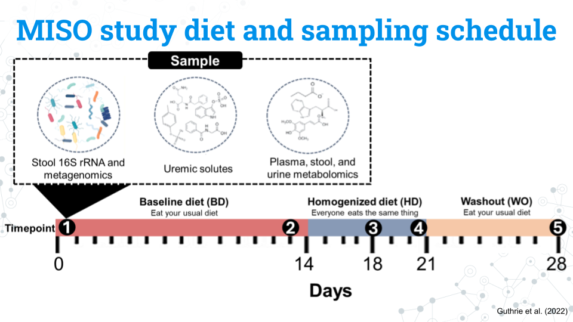
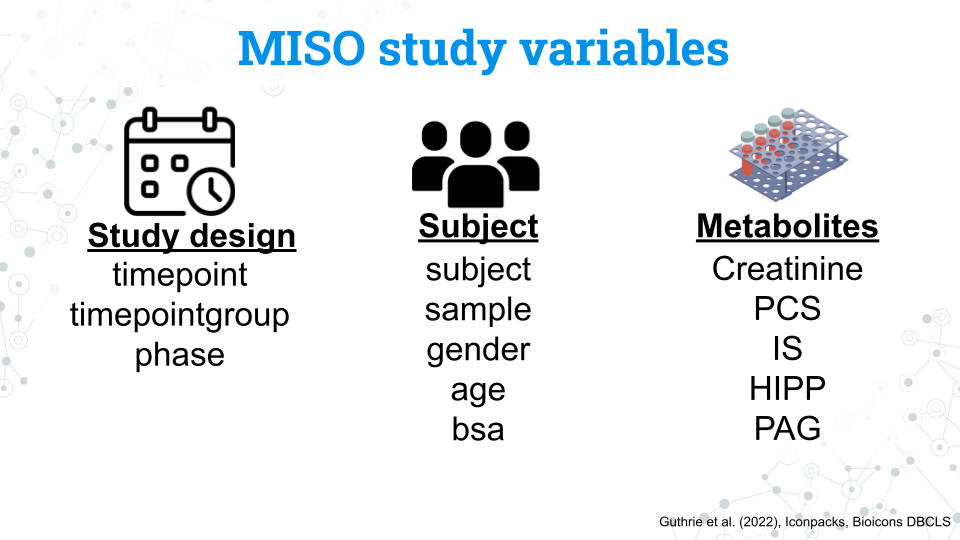
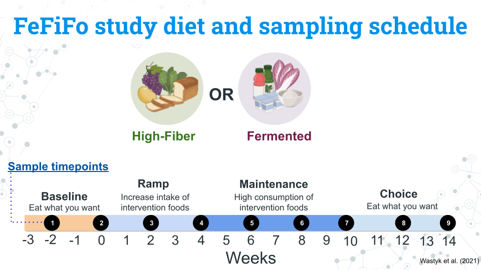
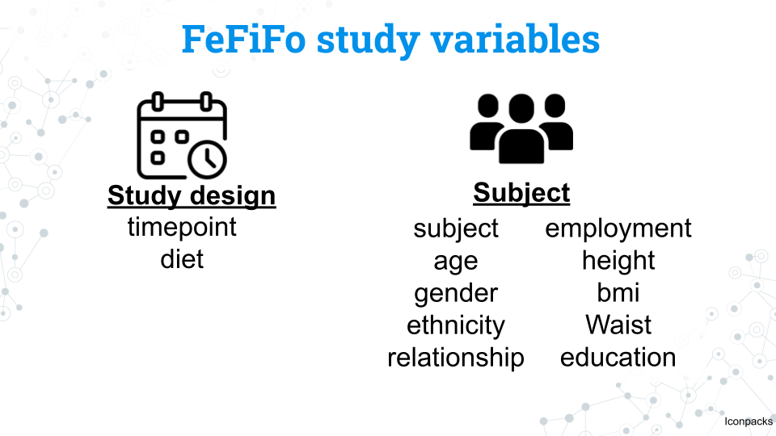
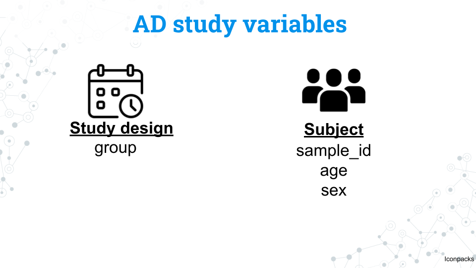
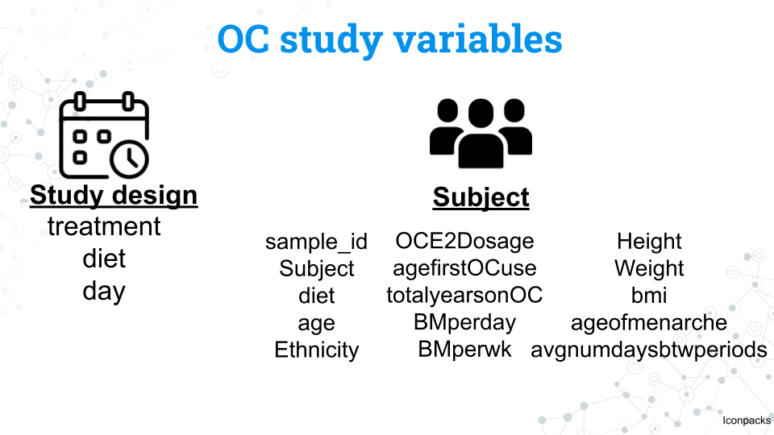

```{r setup, include=FALSE}
#Load learnr
library(learnr)
knitr::opts_chunk$set(echo = FALSE)
tutorial_options(exercise.completion=TRUE) #Uncomment to enable 

#Load libraries
library("tidyverse")
library("phyloseq")
library("DESeq2")

#Uncomment exercise timelimit when deployed
tutorial_options(exercise.timelimit = 360)


#####################################
# #Local paths
# ###################################
# 
 # miso <- readRDS("C:/Users/syork/Desktop/Sayumi/C-MOOR/C-MOOR_DEVELOPMENT/C-MOOR_16S/CMOOR-16S DATA/16S MISO data/MISO_16S.prop.clean.RDS")
 # miso_counts <- readRDS("C:/Users/syork/Desktop/Sayumi/C-MOOR/C-MOOR_DEVELOPMENT/C-MOOR_16S/CMOOR-16S DATA/16S MISO data/MISO_16S.clean.RDS")
# # 
#  fefifo <- readRDS("C:/Users/syork/Desktop/Sayumi/C-MOOR/C-MOOR_DEVELOPMENT/C-MOOR_16S/CMOOR-16S DATA/16S FeFiFo data/fefifo.RDS")
#  fefifo_counts <- readRDS("C:/Users/syork/Desktop/Sayumi/C-MOOR/C-MOOR_DEVELOPMENT/C-MOOR_16S/CMOOR-16S DATA/16S FeFiFo data/fefifo_counts.RDS")
# 
# # 
#  ad <- readRDS("C:/Users/syork/Desktop/Sayumi/C-MOOR/C-MOOR_DEVELOPMENT/C-MOOR_16S/CMOOR-16S DATA/16S Alzheimers/ad.RDS")
#  ad_counts <- readRDS("C:/Users/syork/Desktop/Sayumi/C-MOOR/C-MOOR_DEVELOPMENT/C-MOOR_16S/CMOOR-16S DATA/16S Alzheimers/ad_counts.RDS")
# # 
#  oc<-readRDS("C:/Users/syork/Desktop/Sayumi/C-MOOR/C-MOOR_DEVELOPMENT/C-MOOR_16S/CMOOR-16S DATA/16S Oral Contraceptives/oc.RDS")
#  oc_counts<-readRDS("C:/Users/syork/Desktop/Sayumi/C-MOOR/C-MOOR_DEVELOPMENT/C-MOOR_16S/CMOOR-16S DATA/16S Oral Contraceptives/oc_counts.RDS")
# oc_no948N2_counts<-readRDS("C:/Users/syork/Desktop/Sayumi/C-MOOR/C-MOOR_DEVELOPMENT/C-MOOR_16S/CMOOR-16S DATA/16S Oral Contraceptives/oc_no948N2_counts.RDS")
#  oc_no948N2<-readRDS("C:/Users/syork/Desktop/Sayumi/C-MOOR/C-MOOR_DEVELOPMENT/C-MOOR_16S/CMOOR-16S DATA/16S Oral Contraceptives/oc_no948N2.RDS")
#  oc_dosage_counts<-readRDS("C:/Users/syork/Desktop/Sayumi/C-MOOR/C-MOOR_DEVELOPMENT/C-MOOR_16S/CMOOR-16S DATA/16S Oral Contraceptives/oc_dosage_counts.RDS")
#  oc_dosage<-readRDS("C:/Users/syork/Desktop/Sayumi/C-MOOR/C-MOOR_DEVELOPMENT/C-MOOR_16S/CMOOR-16S DATA/16S Oral Contraceptives/oc_dosage.RDS")


###################################################################
#Cloud paths
###################################################################

#Check if we are on SciServer by seeing if the file path to 16S amplicon data on SciServer is available.
file_path <- "/home/idies/workspace/c_moor_data/16s-amplicon-data/"
if (file.exists(file_path)) {

  # #########################
  # #SciServer paths#
  # ########################
  #Alzheimer's disease
  ad <- readRDS("/home/idies/workspace/c_moor_data/16s-amplicon-data/ad/ad.RDS")
  ad_counts<- readRDS("/home/idies/workspace/c_moor_data/16s-amplicon-data/ad/ad_counts.RDS")
  
  #FeFiFo
  fefifo <- readRDS("/home/idies/workspace/c_moor_data/16s-amplicon-data/fefifo/fefifo.RDS")
  fefifo_counts<- readRDS("/home/idies/workspace/c_moor_data/16s-amplicon-data/fefifo/fefifo_counts.RDS")
  
  #MISO
  miso <- readRDS( "/home/idies/workspace/c_moor_data/16s-amplicon-data/miso/MISO_16S.prop.clean.rds" )
  miso_counts <- readRDS("/home/idies/workspace/c_moor_data/16s-amplicon-data/miso/MISO_16S.clean.rds")
  
  #Oral contraceptives 
  oc <- readRDS( "/home/idies/workspace/c_moor_data/16s-amplicon-data/oc/oc.RDS" )
  oc_counts <- readRDS( "/home/idies/workspace/c_moor_data/16s-amplicon-data/oc/oc_counts.RDS" )
  oc_no948N2 <- readRDS( "/home/idies/workspace/c_moor_data/16s-amplicon-data/oc/oc_no948N2.RDS" )
  oc_no948N2_counts <- readRDS( "/home/idies/workspace/c_moor_data/16s-amplicon-data/oc/oc_no948N2_counts.RDS" )
  oc_dosage <- readRDS( "/home/idies/workspace/c_moor_data/16s-amplicon-data/oc/oc_dosage.RDS" )
  oc_dosage_counts <- readRDS( "/home/idies/workspace/c_moor_data/16s-amplicon-data/oc/oc_dosage_counts.RDS" )
  oc_agefirstOCuse <- readRDS( "/home/idies/workspace/c_moor_data/16s-amplicon-data/oc/oc_agefirstOCuse.RDS" )
  oc_agefirstOCuse_counts <- readRDS( "/home/idies/workspace/c_moor_data/16s-amplicon-data/oc/oc_agefirstOCuse.RDS" )


} else {
  #If not, assume we are on AnVIL and load in the data through packages
  library("GuthrieMisoData")
  library("HumanGutMicrobiomeData")
}


Differential_Abundance <- function(w, x, y, z) {
  
 # Accept the input and give it a human friendly name
  my_counts <- w
  my_DESeq2_object <- x
  my_comparison_list <- y
  my_pvalue <- z
  
  
  #Do the DESeq2 analysis
  my_DESeq2_object <- DESeq(my_DESeq2_object, test="Wald", fitType="parametric")
 
  #Change the contrast section to compare different variables and groups.
  res = results(my_DESeq2_object, cooksCutoff = FALSE, contrast= my_comparison_list)
  
  #Select only abundances with a p-value of z or below
  alpha = my_pvalue
  sigtab = res[which(res$padj < alpha), ]
  sigtab = cbind(as(sigtab, "data.frame"), as(tax_table(my_counts)[rownames(sigtab), ], "matrix"))

  #Let's look at the OTUs that were significantly different between the two tissues. The following makes a nice ggplot2 summary of the results
  theme_set(theme_bw())
  scale_fill_discrete <- function(palname = "Set1", ...) {
    scale_fill_brewer(palette = palname, ...)
  }
  # Phylum order
  x = tapply(sigtab$log2FoldChange, sigtab$Phylum, function(x) max(x))
  x = sort(x, TRUE)
  sigtab$Phylum = factor(as.character(sigtab$Phylum), levels=names(x))
  
  # Class order
  x = tapply(sigtab$log2FoldChange, sigtab$Class, function(x) max(x))
  x = sort(x, TRUE)
  sigtab$Class = factor(as.character(sigtab$Class), levels=names(x))
  
  # Order order
  x = tapply(sigtab$log2FoldChange, sigtab$Order, function(x) max(x))
  x = sort(x, TRUE)
  sigtab$Order = factor(as.character(sigtab$Order), levels=names(x))
  
  # Family order
  x = tapply(sigtab$log2FoldChange, sigtab$Family, function(x) max(x))
  x = sort(x, TRUE)
  sigtab$Family = factor(as.character(sigtab$Family), levels=names(x))
  
  # Genus order
  x = tapply(sigtab$log2FoldChange, sigtab$Genus, function(x) max(x))
  x = sort(x, TRUE)
  sigtab$Genus = factor(as.character(sigtab$Genus), levels=names(x))
  
  # Species order
  x = tapply(sigtab$log2FoldChange, sigtab$Species, function(x) max(x))
  x = sort(x, TRUE)
  sigtab$Species = factor(as.character(sigtab$Species), levels=names(x))

  return(sigtab)
}

# For using a continuous variable during comparisons
# log2foldchange is interpreted as the amount of change for each additional unit of the continuous avriable

Differential_Abundance_Continuous <- function(w, x, y, z) {
  
 # Accept the input and give it a human friendly name
  my_counts <- w
  my_DESeq2_object <- x
  my_name <- y
  my_pvalue <- z
  
  
  #Do the DESeq2 analysis
  my_DESeq2_object <- DESeq(my_DESeq2_object, test="Wald", fitType="parametric")
 
  #Change the contrast section to compare different variables and groups.
  res = results(my_DESeq2_object, cooksCutoff = FALSE, name=my_name)
  
  
  #Select only abundances with a p-value of z or below
  alpha = my_pvalue
  sigtab = res[which(res$padj < alpha), ]
  sigtab = cbind(as(sigtab, "data.frame"), as(tax_table(my_counts)[rownames(sigtab), ], "matrix"))

  #Let's look at the OTUs that were significantly different between the two tissues. The following makes a nice ggplot2 summary of the results
  theme_set(theme_bw())
  scale_fill_discrete <- function(palname = "Set1", ...) {
    scale_fill_brewer(palette = palname, ...)
  }
  # Phylum order
  x = tapply(sigtab$log2FoldChange, sigtab$Phylum, function(x) max(x))
  x = sort(x, TRUE)
  sigtab$Phylum = factor(as.character(sigtab$Phylum), levels=names(x))
  
  # Class order
  x = tapply(sigtab$log2FoldChange, sigtab$Class, function(x) max(x))
  x = sort(x, TRUE)
  sigtab$Class = factor(as.character(sigtab$Class), levels=names(x))
  
  # Order order
  x = tapply(sigtab$log2FoldChange, sigtab$Order, function(x) max(x))
  x = sort(x, TRUE)
  sigtab$Order = factor(as.character(sigtab$Order), levels=names(x))
  
  # Family order
  x = tapply(sigtab$log2FoldChange, sigtab$Family, function(x) max(x))
  x = sort(x, TRUE)
  sigtab$Family = factor(as.character(sigtab$Family), levels=names(x))
  
  # Genus order
  x = tapply(sigtab$log2FoldChange, sigtab$Genus, function(x) max(x))
  x = sort(x, TRUE)
  sigtab$Genus = factor(as.character(sigtab$Genus), levels=names(x))
  
  # Species order
  x = tapply(sigtab$log2FoldChange, sigtab$Species, function(x) max(x))
  x = sort(x, TRUE)
  sigtab$Species = factor(as.character(sigtab$Species), levels=names(x))

  return(sigtab)
}


# For 0-inflated data that gives the error:
# every gene contains at least one zero, cannot compute log geometric means

Differential_Abundance_AltGeo <- function(w, x, y, z) {
  
  # Accept the input and give it a human friendly name
  my_counts <- w
  my_DESeq2_object <- x
  my_comparison_list <- y
  my_pvalue <- z
  
  
  
  #Do the DESeq2 analysis
  
  gm_mean = function(x, na.rm = TRUE){
    exp(sum(log(x[x > 0]), na.rm = na.rm) / length(x))
  }
  
  geoMeans = apply(counts(my_DESeq2_object), 1, gm_mean)
  my_DESeq2_object = estimateSizeFactors(my_DESeq2_object, geoMeans = geoMeans)
  my_DESeq2_object = estimateDispersions(my_DESeq2_object, fitType = "parametric")
  my_DESeq2_object <- nbinomWaldTest(my_DESeq2_object, maxit = 500)
  
  #Change the contrast section to compare different variables and groups.
  res = results(my_DESeq2_object, cooksCutoff = FALSE, contrast= my_comparison_list)
  
  #Select only abundances with a p-value of z or below
  alpha = my_pvalue
  sigtab = res[which(res$padj < alpha), ]
  sigtab = cbind(as(sigtab, "data.frame"), as(tax_table(my_counts)[rownames(sigtab), ], "matrix"))
  
  #Let's look at the OTUs that were significantly different between the two groups. The following makes a nice ggplot2 summary of the results
  theme_set(theme_bw())
  scale_fill_discrete <- function(palname = "Set1", ...) {
    scale_fill_brewer(palette = palname, ...)
  }
  # Phylum order
  x = tapply(sigtab$log2FoldChange, sigtab$Phylum, function(x) max(x))
  x = sort(x, TRUE)
  sigtab$Phylum = factor(as.character(sigtab$Phylum), levels=names(x))
  
  # Class order
  x = tapply(sigtab$log2FoldChange, sigtab$Class, function(x) max(x))
  x = sort(x, TRUE)
  sigtab$Class = factor(as.character(sigtab$Class), levels=names(x))
  
  # Order order
  x = tapply(sigtab$log2FoldChange, sigtab$Order, function(x) max(x))
  x = sort(x, TRUE)
  sigtab$Order = factor(as.character(sigtab$Order), levels=names(x))
  
  # Family order
  x = tapply(sigtab$log2FoldChange, sigtab$Family, function(x) max(x))
  x = sort(x, TRUE)
  sigtab$Family = factor(as.character(sigtab$Family), levels=names(x))
  
  # Genus order
  x = tapply(sigtab$log2FoldChange, sigtab$Genus, function(x) max(x))
  x = sort(x, TRUE)
  sigtab$Genus = factor(as.character(sigtab$Genus), levels=names(x))
  
  # Species order
  x = tapply(sigtab$log2FoldChange, sigtab$Species, function(x) max(x))
  x = sort(x, TRUE)
  sigtab$Species = factor(as.character(sigtab$Species), levels=names(x))
  
  return(sigtab)
}

Differential_Abundance_ContinuousAltGeo <- function(w, x, y, z) {
  
  # Accept the input and give it a human friendly name
  my_counts <- w
  my_DESeq2_object <- x
  my_name <- y
  my_pvalue <- z
  
  
  
  #Do the DESeq2 analysis
  
  gm_mean = function(x, na.rm = TRUE){
    exp(sum(log(x[x > 0]), na.rm = na.rm) / length(x))
  }
  
  geoMeans = apply(counts(my_DESeq2_object), 1, gm_mean)
  my_DESeq2_object = estimateSizeFactors(my_DESeq2_object, geoMeans = geoMeans)
  my_DESeq2_object = estimateDispersions(my_DESeq2_object, fitType = "parametric")
  my_DESeq2_object <- nbinomWaldTest(my_DESeq2_object, maxit=500)
  
  #Change the contrast section to compare different variables and groups.
  res = results(my_DESeq2_object, cooksCutoff = FALSE, name=my_name)
  
  #Select only abundances with a p-value of z or below
  alpha = my_pvalue
  sigtab = res[which(res$padj < alpha), ]
  sigtab = cbind(as(sigtab, "data.frame"), as(tax_table(my_counts)[rownames(sigtab), ], "matrix"))
  
  #Let's look at the OTUs that were significantly different between the two groups. The following makes a nice ggplot2 summary of the results
  theme_set(theme_bw())
  scale_fill_discrete <- function(palname = "Set1", ...) {
    scale_fill_brewer(palette = palname, ...)
  }
  # Phylum order
  x = tapply(sigtab$log2FoldChange, sigtab$Phylum, function(x) max(x))
  x = sort(x, TRUE)
  sigtab$Phylum = factor(as.character(sigtab$Phylum), levels=names(x))
  
  # Class order
  x = tapply(sigtab$log2FoldChange, sigtab$Class, function(x) max(x))
  x = sort(x, TRUE)
  sigtab$Class = factor(as.character(sigtab$Class), levels=names(x))
  
  # Order order
  x = tapply(sigtab$log2FoldChange, sigtab$Order, function(x) max(x))
  x = sort(x, TRUE)
  sigtab$Order = factor(as.character(sigtab$Order), levels=names(x))
  
  # Family order
  x = tapply(sigtab$log2FoldChange, sigtab$Family, function(x) max(x))
  x = sort(x, TRUE)
  sigtab$Family = factor(as.character(sigtab$Family), levels=names(x))
  
  # Genus order
  x = tapply(sigtab$log2FoldChange, sigtab$Genus, function(x) max(x))
  x = sort(x, TRUE)
  sigtab$Genus = factor(as.character(sigtab$Genus), levels=names(x))
  
  # Species order
  x = tapply(sigtab$log2FoldChange, sigtab$Species, function(x) max(x))
  x = sort(x, TRUE)
  sigtab$Species = factor(as.character(sigtab$Species), levels=names(x))
  
  return(sigtab)
}

```


<!---
Don't edit the Welcome page, it will be filled in automatically using the information from the YAML header
Edit the rest of the document as you like
There are some suggested sections to provide a standard order across our tutorials, but they may not all be needed/appropriate for all tutorials.
Section 1. Content 1 has example quizes and exercises
-->

## Welcome {.splashpage}

### `r rmarkdown::metadata$title`

<div class="splashpage-container">
  <figure class="splashpage-image">
  `r rmarkdown::metadata$image`{width=100%}
  <figcaption class="caption">`r rmarkdown::metadata$image_caption`</figcaption>
  </figure>

  `r rmarkdown::metadata$summary`
  

</div>


#### Learning Goals

```{r}
# Extract learning goals from YAML and add HTML tags to make an ordered list
learningGoals <- rmarkdown::metadata$learning_goals
learningGoals <- paste("<li>", learningGoals, "</li>", sep="", collapse="")

```

<ol>
`r learningGoals`
</ol>

#### Authors:

```{r}
# Extract authors from YAML and add HTML tags to make a list
authorList <- rmarkdown::metadata$author
authorList <- paste("<li>", authorList, "</li>", sep="", collapse="")

```

<ul>
`r authorList`
</ul>


```{r}
# Extract the tutorial version from the YAML data and store it so we can print it using inline r code below.  This can't be done directly inline because the code for extracting the YAML data uses backticks
tv <- rmarkdown::metadata$output$`learnr::tutorial`$version
```

#### Version: `r tv`

## Meet MISO
These data are from [**Impact of a 7-day homogeneous diet on interpersonal variation in human gut microbiomes and metabolomes by Guthrie et al. (2022)**](https://www.cell.com/cell-host-microbe/fulltext/S1931-3128(22)00263-3). 

It's difficult to capture the mechanisms and effects of diet on the gut microbiome given the sheer number of variables involved. The microbiome individuality and stability over time (MISO) study aimed to explore the connection between diet, microbiome, and metabolites by looking at the effect of feeding a standardized diet to people over 7 days. 

### MISO study diet and sampling schedule

{width=100%}
<p class=caption> **Experimental design for the MISO study by Guthrie et al. (2022)**: Figure edited by Sayumi York (July 11, 2025).</p>


The figure above shows the study design for the MISO study. You do not need to memorize all these details; feel free to refer to this page throughout the project:

- Participants are free to eat what they want, **baseline diet (BD) for 14 days**
- Participants all eat the same diet, the **homogenized diet (HD), for 7 days**
- Participants return to eating what they want during the **washout (WO) period for 7 days**

Note that there is no guidance given to the participants on what they eat during the BD and WO diet phases. What they eat on any given day may not match what is happening during the other phases or even other days within the same phase. The study lasts a total of 28 days. Samples from the blood, stool, and urine, our metabolite and 16S rRNA data are taken at 5 different timepoints:

- **Timepoint 1:** Day 0 (the start of the study)
- **Timepoint 2:** Day 13
- **Timepoint 3:** Day 17
- **Timepoint 4:** Day 21
- **Timepoint 5:** Day 28


### MISO study variables and factors


{width=100%}
<p class=caption> **Metadata variables for the MISO study by Guthrie et al. (2022)**: Figure edited by Sayumi York (July 11, 2025).</p>

We have a number of variables we can use in our analysis. Notice that the variables for the study and subjects are in lowercase. Remember that R is case sensitive.

### MISO study design variables

<!-- How to align table using this format? -->

|Variable|What is it?|Factors|
|:----|--------------|----:|
|timepoint|The 5 samplings that occur on days 0, 13, 17, 21, and 28 coded as timepoints 1 through 5|1, 2, 3, 4, 5| 
|diet|The diet the subject was on during the sampling|BD, HD, WO|

### MISO subject variables

|Variable|What is it?|Factors|
|:-|----|----:|
|subject|A unique ID given to each subject (participant)|S## (ex. S02 is subject 2. Note that while there are a total of 21 subjects in the study, but their subject numbers are not 1 through 20| 
|sample|A unique ID given to every sample taken during the study that includes the subject and timepoint of the sample|MISO-Subject##-Sample# (ex. MISO1-S02-1 is the sample from subject 2 at timepoint 1)|
|gender|The gender of the subject|M, F. All subjects were cisgender| 
|age|The age in years of the subject|A continuous variable from 23 to 75 years old| 
|bsa|Body surface area; a measure of body size|A continuous variable from 1.6 to 2.8| 

#### MISO metabolite variables

|Variable|What is it?|Factors|
|:----|--------------|----:|
|Creatinine|Creatinine|A continuous variable from 1072 to 3971| 
|PCS|*p*-cresol sulfate|A continuous variable from 2 to 95|
|IS|Indoxyl sulfate|A continuous variable from 3 to 58| 
|HIPP|Hippuric acid|A continuous variable from 16 to 1119| 
|PAG|Phenylacetylglutamine|A continuous variable from 16 to 318| 

### MISO phyloseq objects

```{r miso_objects, exercise=TRUE, echo=FALSE}
#A phyloseq object containing the normalized (proportions) data
miso

#A phyloseq object containing the data as raw counts
miso_counts

```

```{r miso_block1, exercise=TRUE, echo=FALSE}
#Getting a list of unique metadata values for a given variable
unique(data.frame(sample_data(miso)[, "subject"]))

```

```{r miso_block2, exercise=TRUE, echo=FALSE}
#Get counts for ASV 1 in sample 1
otu_table(miso_counts)[1,"ASV1"]
```

```{r miso_block3, exercise=TRUE, echo=FALSE}
#Get counts for ASV50, for samples 1 through 5.
otu_table(miso_counts)[1:5, "ASV50"]

```

```{r miso_block4, exercise=TRUE, echo=FALSE}


```

```{r miso_block5, exercise=TRUE, echo=FALSE}


```

```{r miso_block6, exercise=TRUE, echo=FALSE}


```


### MISO: Barplot template code

```{r miso_barplot, exercise=TRUE, echo=FALSE}
#Barplots for the whole dataset
plot_bar(miso, x="subject", fill = "Phylum", title = "My title") +
  geom_bar(aes(color = Phylum, fill = Phylum), stat = "identity", position = "stack")
```

```{r miso_barplot_subset_taxa, exercise=TRUE, echo=FALSE}
#Subsetting based on a taxa
my_subset <- subset_taxa(miso, Phylum == "Firmicutes")

#Plotting using the new subset
plot_bar(my_subset, x= "subject", fill = "Class", title = "My title") +
  geom_bar(aes(color = Class, fill = Class), stat = "identity", position = "stack")
```

```{r miso_barplot_subset_sample, exercise=TRUE, echo=FALSE}
#Subsetting based on metadata
my_subset <- subset_samples(miso, gender == "F")

#Plotting using the new subset
plot_bar(my_subset, x= "subject", fill = "Class", title = "My title") +
  geom_bar(aes(color = Class, fill = Class), stat = "identity", position = "stack")
```

```{r miso_barplot1, exercise=TRUE, echo=FALSE}

```

```{r miso_barplot2, exercise=TRUE, echo=FALSE}

```

```{r miso_barplot3, exercise=TRUE, echo=FALSE}
```

### MISO: Alpha diversity template code


```{r miso_try_it_plot_richness_end, exercise=TRUE, echo=FALSE}
# Plot richness for the entire dataset
plot_richness(miso_counts, x="subject", 
              color="diet", 
              shape="diet", 
          	  title ="My title",
              measures="Simpson")

```

```{r miso_Try_it_plot_richness_taxa_subset, exercise=TRUE, echo=FALSE}
# Plot richness for a subset (by taxa)
my_subset <- subset_taxa(miso_counts, Phylum == "Firmicutes")

plot_richness(my_subset, x="timepoint", 
              color="subject", 
              shape="diet",
          	  title ="My title", 
              measures= "Simpson")

```

```{r miso_Try_it_plot_richness_metadata_subset, exercise=TRUE, echo=FALSE}
# Plot richness for a subset (by metadata)
my_subset <- subset_samples(miso_counts, gender == "F")

plot_richness(my_subset, x="timepoint", 
              color="subject", 
              shape="diet",
          	  title ="My title", 
              measures= "Simpson")
```


```{r miso_alpha_div_1, exercise=TRUE, echo=FALSE}

```
```{r miso_alpha_div_2, exercise=TRUE, echo=FALSE}

```
```{r miso_alpha_div_3, exercise=TRUE, echo=FALSE}

```

### MISO: Multidimensional analysis template code


```{r miso_Try_it_PCoA_end, exercise=TRUE, echo=FALSE}
miso.pcoa <- ordinate(miso, method="PCoA", distance="bray")

plot_ordination(miso, miso.pcoa, 
        color = "subject", 
        shape = "diet", 
        title="My Title")
```

```{r miso_Try_it_PCoA_blank1, exercise=TRUE, echo=FALSE}
#Subset by taxa
miso_subset <- subset_taxa(miso, Phylum == "Firmicutes")

#Ordinate based on your subset
miso.pcoa.subset <- ordinate(miso_subset, method="PCoA", distance="bray")

#Plot the new subsetted ordination with the subsetted phyloseq object
plot_ordination(miso_subset, miso.pcoa.subset, 
        color = "subject", 
        shape = "diet", 
        title="My Title")
```

```{r miso_Try_it_PCoA_subset_metadata, exercise=TRUE, echo=FALSE}
#Subset by metadata
miso_subset <- subset_samples(miso, gender == "F")

#Ordinate based on your subset
miso.pcoa.subset <- ordinate(miso_subset, method="PCoA", distance="bray")

#Plot the new subsetted ordination with the subsetted phyloseq object
plot_ordination(miso_subset, miso.pcoa.subset, 
        color = "subject", 
        shape = "diet", 
        title="My Title")
```


```{r miso_pcoa_1, exercise=TRUE, echo=FALSE}

```
```{r miso_pcoa_2, exercise=TRUE, echo=FALSE}

```
```{r miso_pcoa_3, exercise=TRUE, echo=FALSE}

```

### MISO: Differential abundance template code

#### Differential abundance for a categorical variable in the MISO dataset

```{r miso_DESeq2_example, exercise=TRUE, echo=TRUE}
# Differential abundance for a categorical variable
# STEP 1: Convert the phyloseq object to a DESeq2 object and tell R the experimental design 
my_miso_DESeq2 <- phyloseq_to_deseq2(miso_counts, design = ~ diet)

# STEP 2: Select the groups to compare
my_comparison <-c("diet", "WO", "BD")

# STEP 3: Run the differential abundance analysis at the chosen p-value
Significant_DEseq2_ASVs<-Differential_Abundance(miso_counts, my_miso_DESeq2, my_comparison, 0.05)

# STEP 4: Retrieve the list of ASVs with a significant difference in abundance between the chosen groups
Significant_DEseq2_ASVs

# STEP 5: Plot the results with your chosen x axis and legend
ggplot(Significant_DEseq2_ASVs, aes(x = Phylum, y=log2FoldChange, color= Class, shape = Order)) + geom_point(size=3, position = "jitter") +
  theme(axis.text.x = element_text(angle = -90, hjust = 0, vjust=0.5))+
  ggtitle("my title here")

```

#### Differential abundance for a continuous variable in the MISO dataset

```{r miso_Try_it_DA_continuous, exercise=TRUE, echo=FALSE}
# Differential abundance for a continuous variable
# STEP 1: Convert the phyloseq object to a DESeq2 object and tell R the experimental design
my_miso_DESeq2 <- phyloseq_to_deseq2(miso_counts, design = ~ age)

# STEP 2: Select the groups to compare
name_for_comparison <-"age"

# STEP 3: Run the differential abundance analysis at the chosen p-value
Significant_DEseq2_ASVs<-Differential_Abundance_Continuous(miso_counts, my_miso_DESeq2, name_for_comparison, 0.05)

# STEP 4: Retrieve the list of ASVs with a significant difference in abundance between the chosen groups
Significant_DEseq2_ASVs

# STEP 5: Plot the results with your chosen x axis and legend
ggplot(Significant_DEseq2_ASVs, aes(x = Phylum, y=log2FoldChange, color= Class, shape = Order)) + geom_point(size=3, position = "jitter") +
  theme(axis.text.x = element_text(angle = -90, hjust = 0, vjust=0.5))+
  ggtitle("my title here")

```

```{r miso_da_1, exercise=TRUE, echo=FALSE}

```
```{r miso_da_2, exercise=TRUE, echo=FALSE}

```
```{r miso_da_3, exercise=TRUE, echo=FALSE}

```

## Meet FeFiFo

These data are from [**Gut-microbiota-targeted diets modulate human immune status by Wastyk et al. (2021)**](https://pubmed.ncbi.nlm.nih.gov/34256014/). We call this the FeFiFo study because the experimental design includes *fe*rmented and *fi*ber-rich *fo*od treatment groups!

This study looked at the effect of either high fiber or fermented foods. Rather than controlling diet entirely through standardized portions, participants were allowed to select what foods they ate so long as these foods were high in fiber or were fermented. These less restrictive guidelines are meant to reflect life more realistically than the MISO study, as given the choice, most people will decide to have more variety in their diets. Additional metadata was collected from participants including ethnicity, relationship status, employment status, and education level.


### FeFiFo study diet and sampling schedule

{width=100%}
<p class=caption> **Experimental design for the FeFiFo study by Wastyk et al. (2021)**: Figure edited by Sayumi York (July 11, 2025).</p>

The figure above shows the study design for the FeFiFo study. You do not need to memorize all these details; feel free to refer to this page throughout the project:

- Participants eat their usual, **baseline diet for 3 weeks**
- Participants slowly increase their intake of intervention (fiber or fermented, not both!) foods, in the **ramp for 4 weeks**
- Participants maintain their intervention during a **maintenance period of 6 weeks**
- Participants can choose to eat what they want, including any intervention foods during the **choice period of 4 weeks**

The study lasts a total of 17 weeks. Samples from the gut microbiota (among other blood samples) at **9 different timepoints** across all phases of the experiment. Unlike the MISO study, these timepoints are not assigned to distinct phases as some of them were taken during the transition periods between phases.

### FeFiFo study design variables


{width=100%}
<p class=caption> **Metadata variables for the FeFiFo study by Guthrie et al. (2022)**: Figure edited by Sayumi York (July 11, 2025)</p>

We have a number of variables we can use in our analysis. Notice that the variables for the study and subjects are in lowercase. Recall that R is case sensitive.

### FeFiFo study design variables

|Variable|What is it?|Factors|
|:----|--------------|----:|
|timepoint|The 9 samplings that occur throughout the experiment|1-9| 
|diet|The diet the subject was on during the sampling|Fiber, Fermented|

### FeFiFo subject variables

|Variable|What is it?|Factors|
|:----|--------------|----:|
|subject|a unique id given to the participant|A number between 8001 and 8041|
|age|The age in years of the subject|26.1-74.5|
|gender|The gender of the subject|Male, Female. All subjects were cisgender| 
|ethnicity|The ethnicity of the subject|Asian, White.|
|relationship|The relationship status of the subject|Single/Never married, Married/Partnered, Divorced|
|education|The education of the subject|Some college, College graduate ,Some post-graduate school, Post-graduate degree|
|employment|The employment status of the subject|Unemployed, Working part-time, Working full-time, Retired|
|height|The height of the subject (meters)|1.52-1.87|
|weight|The height of the subject (kg)|44.3-100.6|
|bmi|The bmi of the subject|17.71-31.68|
|waist|The waist measurement of the subject (cm) |27.56-46.85|

### Some research ideas to get you started

- How variable is the change of microbiome composition and alpha diversity across individuals? Do all individuals change the same amount or are there some individuals much more sensitive to their chosen food group?
- What are the most abundant microbes in each treatment (fiber, fermented)? Are they similar taxa or different?
- Is there any relationship between ethnicity, education, employment, relationship status and microbiome composition and/or alpha diversity?
- Are the subject's microbiomes at a given timepoint similar to each other? Similar to other samples from the same subject no matter the timepoint?

### FeFiFo phyloseq objects

#### What's different here?

The MISO dataset has each ASV identified with a unique ID (example: ASV1). The FeFiFo ASVs are identified by their unique nucleotide sequence. We retained this format from the original research article; adding new unique identifiers creates another layer of translation between studies. You can certainly give them new unique IDs if you'd like, but be careful not to mix IDs between studies. For example, "ASV1" already refers to an ASV from the MISO study so if you're including multiple datasets on your poster be careful to discriminate which ASV you're referring to.

```{r fefifo_objects, exercise=TRUE, echo=FALSE}
#A phyloseq object containing the normalized (proportions) data
fefifo

#A phyloseq object containing the data as raw counts
fefifo_counts

```

```{r fefifo_block1, exercise=TRUE, echo=FALSE}
#Getting a list of unique metadata values for a given variable
unique(data.frame(sample_data(fefifo)[, "subject"]))

```

```{r fefifo_block2, exercise=TRUE, echo=FALSE}
#Get counts for a single ASV in sample 1
otu_table(fefifo_counts)[1,"TACGTAGGGAGCGAGCGTTGTCCGGAATTACTGGGTGTAAAGGGAGCGTAGGCGGGAAAGCAAGTTGGAAGTGAAATGCATGGGCTTAACCCATGAGCTGCTTTCAAAACTGTTTTTCTTGAGTGAAGTAGAGGCAGGCGGAATTCCTAGTGTAGCGGTGAAATGCGTAGATATTAGGAGGAACACCAGTGGCGAAGGCGGCCTGCTGGGCTTTAACTGACGCTGAGGCTCGAAAGCGTG"]
```

```{r fefifo_block3, exercise=TRUE, echo=FALSE}
#Get counts for an ASV, for samples 1 through 5.
otu_table(fefifo_counts)[1:5, "TACGTAGGGAGCGAGCGTTGTCCGGAATTACTGGGTGTAAAGGGAGCGTAGGCGGGAAAGCAAGTTGGAAGTGAAATGCATGGGCTTAACCCATGAGCTGCTTTCAAAACTGTTTTTCTTGAGTGAAGTAGAGGCAGGCGGAATTCCTAGTGTAGCGGTGAAATGCGTAGATATTAGGAGGAACACCAGTGGCGAAGGCGGCCTGCTGGGCTTTAACTGACGCTGAGGCTCGAAAGCGTG"]

```

```{r fefifo_block4, exercise=TRUE, echo=FALSE}
```

```{r fefifo_block5, exercise=TRUE, echo=FALSE}
```

```{r fefifo_block6, exercise=TRUE, echo=FALSE}
```


### FeFiFo: Barplot template code

```{r fefifo_barplot, exercise=TRUE, echo=FALSE}
#Barplots for the whole dataset
plot_bar(fefifo, x="subject", fill = "Phylum", title = "My title") +
  geom_bar(aes(color = Phylum, fill = Phylum), stat = "identity", position = "stack")
```

```{r fefifo_barplot_subset_taxa, exercise=TRUE, echo=FALSE}
#Subsetting based on a taxa
my_subset <- subset_taxa(fefifo, Phylum == "Firmicutes")

#Plotting using the new subset
plot_bar(my_subset, x= "subject", fill = "Class", title = "My title") +
  geom_bar(aes(color = Class, fill = Class), stat = "identity", position = "stack")
```

```{r fefifo_barplot_subset_sample, exercise=TRUE, echo=FALSE}
#Subsetting based on metadata
my_subset <- subset_samples(fefifo, gender == "Female")

#Plotting using the new subset
plot_bar(my_subset, x= "subject", fill = "Class", title = "My title") +
  geom_bar(aes(color = Class, fill = Class), stat = "identity", position = "stack")
```

```{r fefifo_barplot1, exercise=TRUE, echo=FALSE}

```

```{r fefifo_barplot2, exercise=TRUE, echo=FALSE}

```

```{r fefifo_barplot3, exercise=TRUE, echo=FALSE}
```

### FeFiFo: Alpha diversity template code


```{r fefifo_try_it_plot_richness_end, exercise=TRUE, echo=FALSE}
# Plot richness for the entire dataset
plot_richness(fefifo_counts, x="subject", 
              color="diet", 
              shape="diet", 
          	  title ="My title",
              measures="Simpson")

```

```{r fefifo_Try_it_plot_richness_taxa_subset, exercise=TRUE, echo=FALSE}
# Plot richness for a subset (by taxa)
my_subset <- subset_taxa(fefifo_counts, Phylum == "Firmicutes")

plot_richness(my_subset, x="timepoint", 
              color="subject", 
              shape="diet",
          	  title ="My title", 
              measures= "Simpson")

```

```{r fefifo_Try_it_plot_richness_metadata_subset, exercise=TRUE, echo=FALSE}
# Plot richness for a subset (by metadata)
my_subset <- subset_samples(fefifo_counts, gender == "Female")

plot_richness(my_subset, x="timepoint", 
              color="subject", 
              shape="diet",
          	  title ="My title", 
              measures= "Simpson")
```


```{r fefifo_alpha_div_1, exercise=TRUE, echo=FALSE}

```
```{r fefifo_alpha_div_2, exercise=TRUE, echo=FALSE}

```
```{r fefifo_alpha_div_3, exercise=TRUE, echo=FALSE}

```

### FeFiFo: Multidimensional analysis template code


```{r fefifo_Try_it_PCoA_end, exercise=TRUE, echo=FALSE}
fefifo.pcoa <- ordinate(fefifo, method="PCoA", distance="bray")

plot_ordination(fefifo, fefifo.pcoa, 
        color = "subject", 
        shape = "diet", 
        title="My Title")
```

```{r fefifo_Try_it_PCoA_blank1, exercise=TRUE, echo=FALSE}
#Subset by taxa
fefifo_subset <- subset_taxa(fefifo, Phylum == "Firmicutes")

#Ordinate based on your subset
fefifo.pcoa.subset <- ordinate(fefifo_subset, method="PCoA", distance="bray")

#Plot the new subsetted ordination with the subsetted phyloseq object
plot_ordination(fefifo_subset, fefifo.pcoa.subset, 
        color = "subject", 
        shape = "diet", 
        title="My Title")
```

```{r fefifo_Try_it_PCoA_subset_metadata, exercise=TRUE, echo=FALSE}
#Subset by metadata
fefifo_subset <- subset_samples(fefifo, gender == "Female")

#Ordinate based on your subset
fefifo.pcoa.subset <- ordinate(fefifo_subset, method="PCoA", distance="bray")

#Plot the new subsetted ordination with the subsetted phyloseq object
plot_ordination(fefifo_subset, fefifo.pcoa.subset, 
        color = "subject", 
        shape = "diet", 
        title="My Title")
```


```{r fefifo_pcoa_1, exercise=TRUE, echo=FALSE}

```
```{r fefifo_pcoa_2, exercise=TRUE, echo=FALSE}

```
```{r fefifo_pcoa_3, exercise=TRUE, echo=FALSE}

```

### FeFiFo: Differential abundance template code

#### What's different here?

These code chunks have had some slight modifications as the FeFiFo dataset is zero-inflated. When more zeros are included in a dataset than normal, we have to handle the statistics differently. We have taken care of all the important changes for you here so you don't have to worry about them!

#### Differential abundance for a categorical variable (zero-inflated)

```{r fefifo_DESeq2_example, exercise=TRUE, echo=TRUE}
# Differential expression for a categorical data in the 0-inflated FeFiFo dataset

# STEP 1: Convert the phyloseq object to a DESeq2 object and tell R the experimental design 
my_DESeq2 <- phyloseq_to_deseq2(fefifo_counts, design = ~diet)

# STEP 2: Select the groups to compare
my_comparison <- c("diet", "Fermented", "Fiber")

# STEP 3: Run the differential abundance analysis at the chosen p-value
Significant_DEseq2_ASVs <- Differential_Abundance_AltGeo(fefifo_counts, my_DESeq2, my_comparison, 0.05)

# STEP 4: Retrieve the list of ASVs with a significant difference in abundance between the chosen groups
Significant_DEseq2_ASVs

# STEP 5: Plot the results with your chosen x axis and legend
ggplot(Significant_DEseq2_ASVs, aes(x = Phylum, y=log2FoldChange, color= Class)) + geom_point(size=3, position = "jitter") +
  theme(axis.text.x = element_text(angle = -90, hjust = 0, vjust=0.5))+
  ggtitle("my title here")
```

```{r fefifo_da_1, exercise=TRUE, echo=FALSE}

```
```{r fefifo_da_2, exercise=TRUE, echo=FALSE}
```

#### Differential abundance for a continuous variable (zero-inflated)

```{r fefifo_Try_it_DA_continuous, exercise=TRUE, echo=FALSE}
# Differential expression for continuous data in the 0-inflated FeFiFo dataset

# STEP 1: Convert the phyloseq object to a DESeq2 object and tell R the experimental design
my_DESeq2 <- phyloseq_to_deseq2(fefifo_counts, design = ~ age)

# STEP 2: Select the groups to compare
name_for_comparison <-"age"

# STEP 3: Run the differential abundance analysis at the chosen p-value
Significant_DEseq2_ASVs<-Differential_Abundance_ContinuousAltGeo(fefifo_counts, my_DESeq2, name_for_comparison, 0.05)

# STEP 4: Retrieve the list of ASVs with a significant difference in abundance between the chosen groups
Significant_DEseq2_ASVs

# STEP 5: Plot the results with your chosen x axis and legend
ggplot(Significant_DEseq2_ASVs, aes(x = Phylum, y=log2FoldChange, color= Class)) + geom_point(size=3, position = "jitter") +
  theme(axis.text.x = element_text(angle = -90, hjust = 0, vjust=0.5))+
  ggtitle("my title here")

```

```{r fefifo_da_3, exercise=TRUE, echo=FALSE}

```
```{r fefifo_da_4, exercise=TRUE, echo=FALSE}

```


## Meet the Alzheimer's study

These data are from [**Gut microbiota is altered in patients with Alzheimer’s disease by Zhuang et al. (2018)**](https://journals.sagepub.com/doi/abs/10.3233/JAD-180176). For convenience's sake we will refer to it as the AD (Alzheimer's disease) study.

This study compares the gut microbiomes of subjects with a clinical diagnosis of Alzheimer’s disease with "healthy" age and sex matched individuals. While we can't control for all health conditions, the study attempted to limit the "healthy" subjects to participants who match all the following:

1. Have no family history of dementia
2. Have no other diagnosis of a neurodegenerative disease
3. Have no other severe conditions such as cancer
4. Have no chronic mental illness
5. Have no history of antibiotic use within the last 6 months
6. Have no gastrointestinal disease (ex. IBS)

The study design was very simple. Fecal samples were taken from subjects - no timeline or intervention included!

### AD study variables

{width=100%}

<p class=caption> **Metadata variables for the AD study by Zhuang et al. (2018)**: Figure edited by Sayumi York (July 11, 2025)</p>

We have a number of variables we can use in our analysis. Notice that the variables for the study and subjects are in lowercase. Recall that R is case sensitive.

|Variable|What is it?|Factors|
|:----|--------------|----:|
|sample_id|a unique id given to the participant|Begins with either AD or CON (Control)|
|age|The age in years of the subject|55-85|
|sex|The gender of the subject|male, female| 
|group|Whether the subject was in the AD group or control group|AD, control.|

### Some research ideas to get you started

- How similar are microbiomes between healthy and AD individuals in composition and/or alpha diversity?
- Looking at other published research studies, are the microbial taxa associated with AD also found in this study?
- Select a microbial taxa of interest (perhaps from the idea above) and explore it at increasing levels of resolution up to the level of species. Looking at other published research studies, what functions are these taxa associated with? Do they have any relation to AD or other neurodegenerative diseases?


### AD objects 

#### What's different here?

The MISO dataset has each ASV identified with a unique ID (example: ASV1). The AD ASVs are identified by their unique nucleotide sequence. You can certainly give them new unique IDs if you'd like, but be careful not to mix IDs between studies. For example, "ASV1" already refers to an ASV from the MISO study so if you're using data from both, you need to discriminate between them.

Although you have fewer variables to play around with here, the dataset is much larger, so be patient if it seems like the figures are taking a long time to load!


```{r ad_objects, exercise=TRUE, echo=FALSE}
#A phyloseq object containing the normalized (proportions) data
ad

#A phyloseq object containing the data as raw counts
ad_counts

```

```{r ad_block1, exercise=TRUE, echo=FALSE}
#Getting a list of unique metadata values for a given variable
unique(data.frame(sample_data(ad)[, "sample_id"]))

```

```{r ad_block2, exercise=TRUE, echo=FALSE}
#Get counts for an ASV in sample 1
otu_table(ad_counts)[1,"GTACTTACTCCTACGGGAGGCAGCAGTGAGGAATATTGGTCAATGGACGAGAGTCTGAACCAGCCAAGTAGCGTGAAGGATGACTGCCCTATGGGTTGTAAACTTCTTTTATATGGGAATAAAGTGAGCCACGTGTGGCTTTTTGTATGTACCATACGAATAAGGATCGGCTAACTCCGTGCCAGCAGCCGCGGTAATACGGAGGATCCGAGCGTTATCCGGATTTATTGGGTTTAAAGGGAGCGTAGGCGGATTGTTAAGTCAGTTGTGAAAGTTTGCGGCTCAACCGTAAAATTGCAGTTGATACTGGCAGTCTTGAGTGCAGTAGAGGTGGGCGGAATTCGTGGTGTAGCGGTGAAATGCTTAGATATCACGAAGAACTCCGATTGCGAAGGCAGCTCACTGGAGTGTAACTGACGCTGATGCTCGAAAGTGTGGGTATCAAACAGGATTAGAAACCCCTGTAGTCCAGCTGG"]
```

```{r ad_block3, exercise=TRUE, echo=FALSE}
#Get counts for an ASV, for samples 1 through 5.
otu_table(ad_counts)[1:5, "GTACTTACTCCTACGGGAGGCAGCAGTGAGGAATATTGGTCAATGGACGAGAGTCTGAACCAGCCAAGTAGCGTGAAGGATGACTGCCCTATGGGTTGTAAACTTCTTTTATATGGGAATAAAGTGAGCCACGTGTGGCTTTTTGTATGTACCATACGAATAAGGATCGGCTAACTCCGTGCCAGCAGCCGCGGTAATACGGAGGATCCGAGCGTTATCCGGATTTATTGGGTTTAAAGGGAGCGTAGGCGGATTGTTAAGTCAGTTGTGAAAGTTTGCGGCTCAACCGTAAAATTGCAGTTGATACTGGCAGTCTTGAGTGCAGTAGAGGTGGGCGGAATTCGTGGTGTAGCGGTGAAATGCTTAGATATCACGAAGAACTCCGATTGCGAAGGCAGCTCACTGGAGTGTAACTGACGCTGATGCTCGAAAGTGTGGGTATCAAACAGGATTAGAAACCCCTGTAGTCCAGCTGG"]

```

```{r ad_block4, exercise=TRUE, echo=FALSE}


```
```{r ad_block5, exercise=TRUE, echo=FALSE}


```
```{r ad_block6, exercise=TRUE, echo=FALSE}


```

### AD: Barplot template code

```{r ad_barplot, exercise=TRUE, echo=FALSE}
#Barplots for the whole dataset
plot_bar(ad, x="group", fill = "Phylum", title = "My title") +
  geom_bar(aes(color = Phylum, fill = Phylum), stat = "identity", position = "stack")
```

```{r ad_barplot_subset_taxa, exercise=TRUE, echo=FALSE}
#Subsetting based on a taxa
my_subset <- subset_taxa(ad, Phylum == "Pseudomonadota")

#Plotting using the new subset
plot_bar(my_subset, x= "group", fill = "Class", title = "My title") +
  geom_bar(aes(color = Class, fill = Class), stat = "identity", position = "stack")
```

```{r ad_barplot_subset_sample, exercise=TRUE, echo=FALSE}
#Subsetting based on metadata
my_subset <- subset_samples(ad, group == "AD")

#Plotting using the new subset
plot_bar(my_subset, x= "sex", fill = "Class", title = "My title") +
  geom_bar(aes(color = Class, fill = Class), stat = "identity", position = "stack")
```

```{r ad_barplot1, exercise=TRUE, echo=FALSE}

```

```{r ad_barplot2, exercise=TRUE, echo=FALSE}

```

```{r ad_barplot3, exercise=TRUE, echo=FALSE}
```

### AD: Alpha diversity template code


```{r ad_try_it_plot_richness_end, exercise=TRUE, echo=FALSE}
# Plot richness for the entire dataset
plot_richness(ad_counts, x="group", 
              color="age", 
              shape="sex", 
          	  title ="My title",
              measures="Simpson")

```

```{r ad_Try_it_plot_richness_taxa_subset, exercise=TRUE, echo=FALSE}
# Plot richness for a subset (by taxa)
my_subset <- subset_taxa(ad_counts, Phylum == "Pseudomonadota")

plot_richness(my_subset, x="group", 
              color="age", 
              shape="sex",
          	  title ="My title", 
              measures= "Simpson")

```


```{r ad_Try_it_plot_richness_metadata_subset, exercise=TRUE, echo=FALSE}
# Plot richness for a subset (by metadata)
my_subset <- subset_samples(ad_counts, sex == "female")

plot_richness(my_subset, x="group", 
              color="age", 
              shape="group",
          	  title ="My title", 
              measures= "Simpson")
```


```{r ad_alpha_div_1, exercise=TRUE, echo=FALSE}

```
```{r ad_alpha_div_2, exercise=TRUE, echo=FALSE}

```
```{r ad_alpha_div_3, exercise=TRUE, echo=FALSE}

```

### AD: Multidimensional analysis template code


```{r ad_Try_it_PCoA_end, exercise=TRUE, echo=FALSE}
ad.pcoa <- ordinate(ad, method="PCoA", distance="bray")

plot_ordination(ad, ad.pcoa, 
        color = "sex", 
        shape = "group", 
        title="My Title")
```

```{r ad_Try_it_PCoA_blank1, exercise=TRUE, echo=FALSE}
#Subset by taxa
ad_subset <- subset_taxa(ad, Phylum == "Pseudomonadota")

#Ordinate based on your subset
ad.pcoa.subset <- ordinate(ad_subset, method="PCoA", distance="bray")

#Plot the new subsetted ordination with the subsetted phyloseq object
plot_ordination(ad_subset, ad.pcoa.subset, 
        color = "age", 
        shape = "group", 
        title="My Title")
```

```{r ad_Try_it_PCoA_subset_metadata, exercise=TRUE, echo=FALSE}
#Subset by metadata
ad_subset <- subset_samples(ad, group == "AD")

#Ordinate based on your subset
ad.pcoa.subset <- ordinate(ad_subset, method="PCoA", distance="bray")

#Plot the new subsetted ordination with the subsetted phyloseq object
plot_ordination(ad_subset, ad.pcoa.subset, 
        color = "age", 
        shape = "sex", 
        title="My Title")
```


```{r ad_pcoa_1, exercise=TRUE, echo=FALSE}

```
```{r ad_pcoa_2, exercise=TRUE, echo=FALSE}

```
```{r ad_pcoa_3, exercise=TRUE, echo=FALSE}

```

### AD: Differential abundance template code

#### What's different here?

These code chunks have had some slight modifications as the AD dataset is zero-inflated. When more zeros are included in a dataset than normal, we have to handle the statistics differently. We have taken care of all the important changes for you here so you don't have to worry about them!

#### Differential abundance for a categorical variable (zero-inflated)

```{r ad_DESeq2_example, exercise=TRUE, echo=TRUE}
# Differential expression for a categorical data in the 0-inflated AD dataset

# STEP 1: Convert the phyloseq object to a DESeq2 object and tell R the experimental design 
my_DESeq2 <- phyloseq_to_deseq2(ad_counts, design = ~ group)

# STEP 2: Select the groups to compare
my_comparison <- c("group", "control", "AD")

# STEP 3: Run the differential abundance analysis at the chosen p-value
Significant_DEseq2_ASVs <- Differential_Abundance_AltGeo(ad_counts, my_DESeq2, my_comparison, 0.05)

# STEP 4: Retrieve the list of ASVs with a significant difference in abundance between the chosen groups
Significant_DEseq2_ASVs

# STEP 5: Plot the results with your chosen x axis and legend
ggplot(Significant_DEseq2_ASVs, aes(x = Phylum, y=log2FoldChange, color= Class)) + geom_point(size=3, position = "jitter") +
  theme(axis.text.x = element_text(angle = -90, hjust = 0, vjust=0.5))+
  ggtitle("my title here")
```

```{r ad_da_1, exercise=TRUE, echo=FALSE}

```
```{r ad_da_2, exercise=TRUE, echo=FALSE}
```


#### Differential abundance for a continuous variable (zero-inflated)

:::{.attention_box_pause}
:::{.attention_header_box_pause}
:::{.attention_title}
#### **Getting an error?**
:::
:::
::: {.attention_content}

If you see this:

<span style="color: red;">
Error in dimnames(x) <- dn : length of 'dimnames' [1] not equal to array extent
</span>

It means 0 ASVs were found to be significantly differentially abundant! You can try to push that p-adj filter of 0.05 higher, but these ASVs will have an increased chance of being attributed to pure chance. Still, we've left this code here so you can see for yourself how changing that filter changes your results...how high do you have to push it until you start to see some differentially abundant ASVs and what does that mean for your research question?
:::
:::

```{r ad_Try_it_DA_continuous, exercise=TRUE, echo=FALSE}
# Differential expression for continuous data in the 0-inflated AD dataset

# STEP 1: Convert the phyloseq object to a DESeq2 object and tell R the experimental design
my_DESeq2 <- phyloseq_to_deseq2(ad_counts, design = ~ age)

# STEP 2: Select the groups to compare
name_for_comparison <-"age"

# STEP 3: Run the differential abundance analysis at the chosen p-value

Significant_DEseq2_ASVs<-Differential_Abundance_ContinuousAltGeo(ad_counts, my_DESeq2, name_for_comparison, 0.05)

# STEP 4: Retrieve the list of ASVs with a significant difference in abundance between the chosen groups
Significant_DEseq2_ASVs

# STEP 5: Plot the results with your chosen x axis and legend
ggplot(Significant_DEseq2_ASVs, aes(x = Phylum, y=log2FoldChange, color= Class)) + geom_point(size=3, position = "jitter") +
  theme(axis.text.x = element_text(angle = -90, hjust = 0, vjust=0.5))+
  ggtitle("my title here")

```


## Meet the OC study


:::{.attention_box_pause}
:::{.attention_header_box_pause}
:::{.attention_title}
#### **A word of caution about this dataset**
:::
:::
::: {.attention_content}

This dataset is more complicated than the others we have available due to the vast number of variables measured and pockets of missing data throughout. We've created a much higher number of objects to work with to try and get around this limitation, but working with this data will remain challenging.

Simultaneously, because there are so many objects and they all differ in how they need to be analyzed, we do not provide template code for each of them. Thank you for your understanding.

Note that here, ASVs take the format ASV_#, rather than the ASV# format that the MISO data used.

:::
:::

  These data are from [**Influence of menstrual cycle and oral contraception on taxonomic composition and gas production in the gut microbiome by Terrazas et al. (2025)**](https://www.microbiologyresearch.org/content/journal/jmm/10.1099/jmm.0.001987). For convenience's sake we will refer to it as our OC (oral contraceptives) study.

This study compared the microbiomes of women who were on OC and those who were not (a history of at least 3 months without taking an OC). 

### OC study variables 

{width=100%}

<p class=caption> **Metadata variables for the OC study by Terrazas et al. (2025)**: Figure edited by Sayumi York (July 11, 2025)</p>

|Variable|What is it?|Factors|
|:----|--------------|----:|
|sample_id|a unique id given to each sample|Fomatted with subject treatment timepoint (ex.701C2 is subject 701, who is a control, this is the 2nd timepoint sampled|
|subject|a unique id given to the participant|A number between 701 and 990|
|treatment|Whether the subject is on OC or is a control|Control, User|
|diet|Whether the subject's diet contained prunes|Prune, No Prune|
|day|Days into the study the sample was collected|Day 1, Day 21|
|age|The age in years of the subject|18-24|
|ethnicity|The ethnicity of the subject|Asian, White, Hispanic, Black, NA|
|height|The height of the subject (cm)|149.86-177.8|
|weight|The height of the subject (kg)|44.6-96.9|
|bmi|The bmi of the subject|17.86-32.20|
|ageofmenarche|The age of the subject at menarche (first menstrual cycle)|10-15|
|avgnumdaysbtwperiods|The average number of days between periods for the subject|20-120|
|OCE2Dosage|The dosage of the oral contracaptive (oestrogen, in mcg)|20, 30, 35|
|agefirstOCuse|Age when starting OC|14-24.5|
|totalyearsonOC|Total years on OC|0.3-9|
|BMperday|Number of bowel movements per day|0.57-4|
|BMperwk|Number of bowel movements per week|4-28|


### Some research ideas to get you started

- Is there any relationship between ethnicity, diet, OCE2dosage, or bowel movements and microbiome composition and/or alpha diversity?
- Create a multidimensional analysis: how do samples cluster? By diet? Age? Subject? Dosage? Treatment?
- How do the microbial compositions of different treatments at increasing levels of resolution (choosing the most abundant group each time)?


### OC objects 

```{r oc_objects, exercise=TRUE, echo=FALSE}
#A phyloseq object containing the normalized (proportions) data
oc

#A phyloseq object containing the data as raw counts
oc_counts

#A phyloseq object containing the normalized (proportions) data without the outlier sample (948N2)
oc_no948N2

#A phyloseq object containing the data as raw counts without the outlier sample (948N2)
oc_no948N2_counts

#A phyloseq object containing the normalized (proportions) data of all samples with dosage data (oestrogen level: 20, 30 and 35 mcg))
oc_dosage

#A phyloseq object containing the data as raw counts of all samples with dosage data (oestrogen level: 20, 30 and 35 mcg))
oc_dosage_counts

#A phyloseq object containing the normalized (proportions) data of all samples with agefirstOCuse data
oc_agefirstOCuse

#A phyloseq object containing the data as raw counts of all samples with agefirstOCuse data 
oc_agefirstOCuse_counts

```


```{r oc_block1, exercise=TRUE, echo=FALSE}
#Getting a list of unique metadata values for a given variable
unique(data.frame(sample_data(oc)[, "subject"]))

```

```{r oc_block2, exercise=TRUE, echo=FALSE}
#Get counts for an ASV_1 in sample 1
otu_table(oc_counts)[1,"ASV_1"]
```

```{r oc_block3, exercise=TRUE, echo=FALSE}
#Get counts for an ASV, for samples 1 through 5.
otu_table(oc_counts)[1:5, "ASV_1"]

```

```{r oc_block4, exercise=TRUE, echo=FALSE}


```
```{r oc_block5, exercise=TRUE, echo=FALSE}


```
```{r oc_block6, exercise=TRUE, echo=FALSE}


```

### OC: Barplot template code

```{r oc_barplot, exercise=TRUE, echo=FALSE}
#Barplots for the whole dataset
plot_bar(oc, x="subject", fill = "Phylum", title = "My title") +
  geom_bar(aes(color = Phylum, fill = Phylum), stat = "identity", position = "stack")
```

```{r oc_barplot_subset_taxa, exercise=TRUE, echo=FALSE}
#Subsetting based on a taxa
my_subset <- subset_taxa(oc, Phylum == "Firmicutes")

#Plotting using the new subset
plot_bar(my_subset, x= "subject", fill = "Class", title = "My title") +
  geom_bar(aes(color = Class, fill = Class), stat = "identity", position = "stack")
```

```{r oc_barplot_subset_sample, exercise=TRUE, echo=FALSE}
#Subsetting based on metadata
my_subset <- subset_samples(oc, treatment == "Control")

#Plotting using the new subset
plot_bar(my_subset, x= "subject", fill = "Class", title = "My title") +
  geom_bar(aes(color = Class, fill = Class), stat = "identity", position = "stack")
```

```{r oc_barplot1, exercise=TRUE, echo=FALSE}

```

```{r oc_barplot2, exercise=TRUE, echo=FALSE}

```

```{r oc_barplot3, exercise=TRUE, echo=FALSE}
```

### OC: Alpha diversity template code


```{r oc_try_it_plot_richness_end, exercise=TRUE, echo=FALSE}
# Plot richness for the entire dataset
plot_richness(oc_counts, x="subject", 
              color="treatment", 
              shape="diet", 
          	  title ="My title",
              measures="Simpson")

```

```{r oc_Try_it_plot_richness_taxa_subset, exercise=TRUE, echo=FALSE}
# Plot richness for a subset (by taxa)
my_subset <- subset_taxa(oc_counts, Phylum == "Firmicutes")

plot_richness(my_subset, x="subject", 
              color="ethnicity", 
              shape="diet",
          	  title ="My title", 
              measures= "Simpson")

```

```{r oc_Try_it_plot_richness_metadata_subset, exercise=TRUE, echo=FALSE}
# Plot richness for a subset (by metadata)
my_subset <- subset_samples(oc_counts, treatment == "Control")

plot_richness(my_subset, x="subject", 
              color="ethnicity", 
              shape="diet",
          	  title ="My title", 
              measures= "Simpson")

```

```{r oc_alpha_div_1, exercise=TRUE, echo=FALSE}

```
```{r oc_alpha_div_2, exercise=TRUE, echo=FALSE}

```
```{r oc_alpha_div_3, exercise=TRUE, echo=FALSE}

```

### OC: Multidimensional analysis template code


```{r oc_Try_it_PCoA_end, exercise=TRUE, echo=FALSE}
oc.pcoa <- ordinate(oc, method="PCoA", distance="bray")

plot_ordination(oc, oc.pcoa, 
        color = "treatment", 
        shape = "diet", 
        title="My Title")
```

```{r oc_Try_it_PCoA_blank1, exercise=TRUE, echo=FALSE}
#Subset by taxa
oc_subset <- subset_taxa(oc, Phylum == "Firmicutes")

#Ordinate based on your subset
oc.pcoa.subset <- ordinate(oc_subset, method="PCoA", distance="bray")

#Plot the new subsetted ordination with the subsetted phyloseq object
plot_ordination(oc_subset, oc.pcoa.subset, 
        color = "treatment", 
        shape = "diet", 
        title="My Title")
```

```{r oc_Try_it_PCoA_subset_metadata, exercise=TRUE, echo=FALSE}
#Subset by metadata
oc_subset <- subset_samples(oc, treatment == "Control")

#Ordinate based on your subset
oc.pcoa.subset <- ordinate(oc_subset, method="PCoA", distance="bray")

#Plot the new subsetted ordination with the subsetted phyloseq object
plot_ordination(oc_subset, oc.pcoa.subset, 
        color = "treatment", 
        shape = "diet", 
        title="My Title")
```

```{r oc_pcoa_1, exercise=TRUE, echo=FALSE}

```
```{r oc_pcoa_2, exercise=TRUE, echo=FALSE}

```
```{r oc_pcoa_3, exercise=TRUE, echo=FALSE}

```

### OC: Differential abundance template code

#### What's different here?

These code chunks have had some slight modifications as the OC dataset is zero-inflated. When more zeros are included in a dataset than normal, we have to handle the statistics differently. We have taken care of all the important changes for you here so you don't have to worry about them!

#### Differential abundance for a categorical variable (zero-inflated)

```{r OC_DESeq2_example, exercise=TRUE, echo=TRUE}
# Differential expression for a categorical data in the 0-inflated OC dataset

# STEP 1: Convert the phyloseq object to a DESeq2 object and tell R the experimental design 
my_DESeq2 <- phyloseq_to_deseq2(oc_counts, design = ~ treatment)

# STEP 2: Select the groups to compare
my_comparison <- c("treatment", "Control", "User")

# STEP 3: Run the differential abundance analysis at the chosen p-value
Significant_DEseq2_ASVs <- Differential_Abundance_AltGeo(oc_counts, my_DESeq2, my_comparison, 0.05)

# STEP 4: Retrieve the list of ASVs with a significant difference in abundance between the chosen groups
Significant_DEseq2_ASVs

# STEP 5: Plot the results with your chosen x axis and legend
ggplot(Significant_DEseq2_ASVs, aes(x = Phylum, y=log2FoldChange, color= Class)) + geom_point(size=3, position = "jitter") +
  theme(axis.text.x = element_text(angle = -90, hjust = 0, vjust=0.5))+
  ggtitle("my title here")
```

```{r oc_da_categorical, exercise=TRUE, echo=FALSE}

```

#### Differential abundance for a continuous variable (zero-inflated)

```{r OC_Try_it_DA_continuous0inf, exercise=TRUE, echo=FALSE}
# STEP 1: Convert the phyloseq object to a DESeq2 object and tell R the experimental design
my_DESeq2 <- phyloseq_to_deseq2(oc_dosage_counts, design = ~ totalyearsonOC)

# STEP 2: Select the groups to compare
name_for_comparison <-"totalyearsonOC"

# STEP 3: Run the differential abundance analysis at the chosen p-value
Significant_DEseq2_ASVs<-Differential_Abundance_ContinuousAltGeo(oc_dosage_counts, my_DESeq2, name_for_comparison, 0.05)

# STEP 4: Retrieve the list of ASVs with a significant difference in abundance between the chosen groups
Significant_DEseq2_ASVs

# STEP 5: Plot the results with your chosen x axis and legend
ggplot(Significant_DEseq2_ASVs, aes(x = Phylum, y=log2FoldChange, color= Class)) + geom_point(size=3, position = "jitter") +
  theme(axis.text.x = element_text(angle = -90, hjust = 0, vjust=0.5))+
  ggtitle("my title here")
```

```{r oc_da_continuous, exercise=TRUE, echo=FALSE}

```

## Bar plots
- **Objective**: Vizualize the microbial composition of samples
- **Best for questions like**: What microbial taxa are dominant across samples? What drives differences in microbial composition between conditions?
- **Example question**: How does the microbial composition differ between patients on their typical diet and a high fiber diet?
- **Data format**: To make it easy to understand and visualize the data we will use data that has been normalized by proportions. 


### Bar plot code template

### MISO: Barplot template code

```{r barplottab_miso_barplot, exercise=TRUE, echo=FALSE}
#Barplots for the whole dataset
plot_bar(miso, x="subject", fill = "Phylum", title = "My title") +
  geom_bar(aes(color = Phylum, fill = Phylum), stat = "identity", position = "stack")
```

```{r barplottab_miso_barplot_subset_taxa, exercise=TRUE, echo=FALSE}
#Subsetting based on a taxa
my_subset <- subset_taxa(miso, Phylum == "Firmicutes")

#Plotting using the new subset
plot_bar(my_subset, x= "subject", fill = "Class", title = "My title") +
  geom_bar(aes(color = Class, fill = Class), stat = "identity", position = "stack")
```

```{r barplottab_miso_barplot_subset_sample, exercise=TRUE, echo=FALSE}
#Subsetting based on metadata
my_subset <- subset_samples(miso, gender == "F")

#Plotting using the new subset
plot_bar(my_subset, x= "subject", fill = "Class", title = "My title") +
  geom_bar(aes(color = Class, fill = Class), stat = "identity", position = "stack")
```

```{r barplottab_try_it_out_barplot_miso, exercise=TRUE, echo=FALSE}

```

### FeFiFo: Barplot template code

```{r barplottab_fefifo_barplot, exercise=TRUE, echo=FALSE}
#Barplots for the whole dataset
plot_bar(fefifo, x="subject", fill = "Phylum", title = "My title") +
  geom_bar(aes(color = Phylum, fill = Phylum), stat = "identity", position = "stack")
```

```{r barplottab_fefifo_barplot_subset_taxa, exercise=TRUE, echo=FALSE}
#Subsetting based on a taxa
my_subset <- subset_taxa(fefifo, Phylum == "Firmicutes")

#Plotting using the new subset
plot_bar(my_subset, x= "subject", fill = "Class", title = "My title") +
  geom_bar(aes(color = Class, fill = Class), stat = "identity", position = "stack")
```

```{r barplottab_fefifo_barplot_subset_sample, exercise=TRUE, echo=FALSE}
#Subsetting based on metadata
my_subset <- subset_samples(fefifo, gender == "Female")

#Plotting using the new subset
plot_bar(my_subset, x= "subject", fill = "Class", title = "My title") +
  geom_bar(aes(color = Class, fill = Class), stat = "identity", position = "stack")
```

```{r try_it_out_barplot4, exercise=TRUE, echo=FALSE}

```

### AD: Barplot template code

```{r barplottab_ad_barplot, exercise=TRUE, echo=FALSE}
#Barplots for the whole dataset
plot_bar(ad, x="group", fill = "Phylum", title = "My title") +
  geom_bar(aes(color = Phylum, fill = Phylum), stat = "identity", position = "stack")
```

```{r barplottab_ad_barplot_subset_taxa, exercise=TRUE, echo=FALSE}
#Subsetting based on a taxa
my_subset <- subset_taxa(ad, Phylum == "Pseudomonadota")

#Plotting using the new subset
plot_bar(my_subset, x= "group", fill = "Class", title = "My title") +
  geom_bar(aes(color = Class, fill = Class), stat = "identity", position = "stack")
```

```{r barplottab_ad_barplot_subset_sample, exercise=TRUE, echo=FALSE}
#Subsetting based on metadata
my_subset <- subset_samples(ad, group == "AD")

#Plotting using the new subset
plot_bar(my_subset, x= "sex", fill = "Class", title = "My title") +
  geom_bar(aes(color = Class, fill = Class), stat = "identity", position = "stack")
```

```{r try_it_out_barplot5, exercise=TRUE, echo=FALSE}

```

### OC: Barplot template code

```{r barplottab_oc_barplot, exercise=TRUE, echo=FALSE}
#Barplots for the whole dataset
plot_bar(oc, x="subject", fill = "Phylum", title = "My title") +
  geom_bar(aes(color = Phylum, fill = Phylum), stat = "identity", position = "stack")
```

```{r barplottab_oc_barplot_subset_taxa, exercise=TRUE, echo=FALSE}
#Subsetting based on a taxa
my_subset <- subset_taxa(oc, Phylum == "Firmicutes")

#Plotting using the new subset
plot_bar(my_subset, x= "subject", fill = "Class", title = "My title") +
  geom_bar(aes(color = Class, fill = Class), stat = "identity", position = "stack")
```

```{r barplottab_oc_barplot_subset_sample, exercise=TRUE, echo=FALSE}
#Subsetting based on metadata
my_subset <- subset_samples(oc, treatment == "Control")

#Plotting using the new subset
plot_bar(my_subset, x= "subject", fill = "Class", title = "My title") +
  geom_bar(aes(color = Class, fill = Class), stat = "identity", position = "stack")
```
```{r try_it_out_barplot6, exercise=TRUE, echo=FALSE}

```

## Alpha diversity
<!-- Uses raw count data -->

- **Objective**: Compare the biodiversity (richness and evenness) between samples/groups
- **Best for questions like**: How variable or stable is the microbial community over time or space?
- **Example question**: Does changing the diet reduce biodiversity in the human gut? Are male microbiomes more diverse than female microbiomes?
- **Data format**: Because we want to include rare species in our analysis, we will use our raw data, which is in counts.


### MISO: Alpha diversity template code


```{r alphatab_miso_try_it_plot_richness_end, exercise=TRUE, echo=FALSE}
# Plot richness for the entire dataset
plot_richness(miso_counts, x="subject", 
              color="diet", 
              shape="diet", 
              title ="My title",
              measures="Simpson")

```


```{r alphatab_miso_Try_it_plot_richness_taxa_subset, exercise=TRUE, echo=FALSE}
# Plot richness for a subset (by taxa)
my_subset <- subset_taxa(miso_counts, Phylum == "Firmicutes")

plot_richness(my_subset, x="timepoint", 
              color="subject", 
              shape="diet",
              title ="My title", 
              measures= "Simpson")

```

```{r alphatab_miso_Try_it_plot_richness_metadata_subset, exercise=TRUE, echo=FALSE}
# Plot richness for a subset (by metadata)
my_subset <- subset_samples(miso_counts, gender == "F")

plot_richness(my_subset, x="timepoint", 
              color="subject", 
              shape="diet",
              title ="My title", 
              measures= "Simpson")
```

```{r alphatab_miso_alpha_div_1, exercise=TRUE, echo=FALSE}

```


### FeFiFo: Alpha diversity template code


```{r alphatab_fefifo_try_it_plot_richness_end, exercise=TRUE, echo=FALSE}
# Plot richness for the entire dataset
plot_richness(fefifo_counts, x="subject", 
              color="diet", 
              shape="diet", 
              title ="My title",
              measures="Simpson")

```

```{r alphatab_fefifo_Try_it_plot_richness_taxa_subset, exercise=TRUE, echo=FALSE}
# Plot richness for a subset (by taxa)
my_subset <- subset_taxa(fefifo_counts, Phylum == "Firmicutes")

plot_richness(my_subset, x="timepoint", 
              color="subject", 
              shape="diet",
              title ="My title", 
              measures= "Simpson")

```

```{r alphatab_fefifo_Try_it_plot_richness_metadata_subset, exercise=TRUE, echo=FALSE}
# Plot richness for a subset (by metadata)
my_subset <- subset_samples(fefifo_counts, gender == "Female")

plot_richness(my_subset, x="timepoint", 
              color="subject", 
              shape="diet",
              title ="My title", 
              measures= "Simpson")
```
```{r alphatab_fefifo_alpha_div_1, exercise=TRUE, echo=FALSE}

```

### AD: Alpha diversity template code


```{r alphatab_ad_try_it_plot_richness_end, exercise=TRUE, echo=FALSE}
# Plot richness for the entire dataset
plot_richness(ad_counts, x="group", 
              color="age", 
              shape="sex", 
              title ="My title",
              measures="Simpson")

```


```{r alphatab_ad_Try_it_plot_richness_taxa_subset, exercise=TRUE, echo=FALSE}
# Plot richness for a subset (by taxa)
my_subset <- subset_taxa(ad_counts, Phylum == "Pseudomonadota")

plot_richness(my_subset, x="group", 
              color="age", 
              shape="sex",
              title ="My title", 
              measures= "Simpson")

```


```{r alphatab_ad_Try_it_plot_richness_metadata_subset, exercise=TRUE, echo=FALSE}
# Plot richness for a subset (by metadata)
my_subset <- subset_samples(ad_counts, sex == "female")

plot_richness(my_subset, x="group", 
              color="age", 
              shape="group",
              title ="My title", 
              measures= "Simpson")
```

```{r alphatab_ad_alpha_div_1, exercise=TRUE, echo=FALSE}

```


### OC: Alpha diversity template code


```{r alphatab_oc_try_it_plot_richness_end, exercise=TRUE, echo=FALSE}
# Plot richness for the entire dataset
plot_richness(oc_counts, x="subject", 
              color="treatment", 
              shape="diet", 
              title ="My title",
              measures="Simpson")

```

```{r alphatab_oc_Try_it_plot_richness_taxa_subset, exercise=TRUE, echo=FALSE}
# Plot richness for a subset (by taxa)
my_subset <- subset_taxa(oc_counts, Phylum == "Firmicutes")

plot_richness(my_subset, x="subject", 
              color="ethnicity", 
              shape="diet",
              title ="My title", 
              measures= "Simpson")

```


```{r alphatab_oc_Try_it_plot_richness_metadata_subset, exercise=TRUE, echo=FALSE}
# Plot richness for a subset (by metadata)
my_subset <- subset_samples(oc_counts, treatment == "Control")

plot_richness(my_subset, x="subject", 
              color="ethnicity", 
              shape="diet",
              title ="My title", 
              measures= "Simpson")
```


```{r alphatab_oc_alpha_div_1, exercise=TRUE, echo=FALSE}

```

## Multidimensional analysis

### PCoA

- **Objective**: Comparing how similar samples are to one another
- **Best for questions like**: How much variability is there within a given condition? What samples are most similar to each other?
- **Example question**: Are male and female samples grouped together? Do samples group together by a given metabolite? How similar are samples within each diet?
- **Data format**: We will use normalized counts (proportions) to be able to make comparisons between samples.

### How to interpret

* Samples that cluster together have more in common than samples that are farther apart. 
* Each axis has a percent value that relates to what percent of variance in the dataset is explained by the relationships sored in those principal comonents.


### MISO: Multidimensional analysis template code


```{r multidimtab_miso_Try_it_PCoA_end, exercise=TRUE, echo=FALSE}
miso.pcoa <- ordinate(miso, method="PCoA", distance="bray")

plot_ordination(miso, miso.pcoa, 
                color = "subject", 
                shape = "diet", 
                title="My Title")
```


```{r multidimtab_miso_Try_it_PCoA_blank1, exercise=TRUE, echo=FALSE}
#Subset by taxa
miso_subset <- subset_taxa(miso, Phylum == "Firmicutes")

#Ordinate based on your subset
miso.pcoa.subset <- ordinate(miso_subset, method="PCoA", distance="bray")

#Plot the new subsetted ordination with the subsetted phyloseq object
plot_ordination(miso_subset, miso.pcoa.subset, 
                color = "subject", 
                shape = "diet", 
                title="My Title")
```


```{r multidimtab_miso_Try_it_PCoA_subset_metadata, exercise=TRUE, echo=FALSE}
#Subset by metadata
miso_subset <- subset_samples(miso, gender == "F")

#Ordinate based on your subset
miso.pcoa.subset <- ordinate(miso_subset, method="PCoA", distance="bray")

#Plot the new subsetted ordination with the subsetted phyloseq object
plot_ordination(miso_subset, miso.pcoa.subset, 
                color = "subject", 
                shape = "diet", 
                title="My Title")
```

```{r multidimtab_miso_pcoa_1, exercise=TRUE, echo=FALSE}

```


### FeFiFo: Multidimensional analysis template code


```{r multidimtab_fefifo_Try_it_PCoA_end, exercise=TRUE, echo=FALSE}
fefifo.pcoa <- ordinate(fefifo, method="PCoA", distance="bray")

plot_ordination(fefifo, fefifo.pcoa, 
                color = "subject", 
                shape = "diet", 
                title="My Title")
```


```{r multidimtab_fefifo_Try_it_PCoA_blank1, exercise=TRUE, echo=FALSE}
#Subset by taxa
fefifo_subset <- subset_taxa(fefifo, Phylum == "Firmicutes")

#Ordinate based on your subset
fefifo.pcoa.subset <- ordinate(fefifo_subset, method="PCoA", distance="bray")

#Plot the new subsetted ordination with the subsetted phyloseq object
plot_ordination(fefifo_subset, fefifo.pcoa.subset, 
                color = "subject", 
                shape = "diet", 
                title="My Title")
```

```{r multidimtab_fefifo_Try_it_PCoA_subset_metadata, exercise=TRUE, echo=FALSE}
#Subset by metadata
fefifo_subset <- subset_samples(fefifo, gender == "Female")

#Ordinate based on your subset
fefifo.pcoa.subset <- ordinate(fefifo_subset, method="PCoA", distance="bray")

#Plot the new subsetted ordination with the subsetted phyloseq object
plot_ordination(fefifo_subset, fefifo.pcoa.subset, 
                color = "subject", 
                shape = "diet", 
                title="My Title")
```
```{r multidimtab_fefifo_pcoa_1, exercise=TRUE, echo=FALSE}

```

### AD: Multidimensional analysis template code


```{r multidimtab_ad_Try_it_PCoA_end, exercise=TRUE, echo=FALSE}
ad.pcoa <- ordinate(ad, method="PCoA", distance="bray")

plot_ordination(ad, ad.pcoa, 
                color = "sex", 
                shape = "group", 
                title="My Title")
```


```{r multidimtab_ad_Try_it_PCoA_blank1, exercise=TRUE, echo=FALSE}
#Subset by taxa
ad_subset <- subset_taxa(ad, Phylum == "Pseudomonadota")

#Ordinate based on your subset
ad.pcoa.subset <- ordinate(ad_subset, method="PCoA", distance="bray")

#Plot the new subsetted ordination with the subsetted phyloseq object
plot_ordination(ad_subset, ad.pcoa.subset, 
                color = "age", 
                shape = "group", 
                title="My Title")
```

```{r multidimtab_ad_Try_it_PCoA_subset_metadata, exercise=TRUE, echo=FALSE}
#Subset by metadata
ad_subset <- subset_samples(ad, group == "AD")

#Ordinate based on your subset
ad.pcoa.subset <- ordinate(ad_subset, method="PCoA", distance="bray")

#Plot the new subsetted ordination with the subsetted phyloseq object
plot_ordination(ad_subset, ad.pcoa.subset, 
                color = "age", 
                shape = "sex", 
                title="My Title")
```
```{r multidimtab_ad_pcoa_1, exercise=TRUE, echo=FALSE}

```


### OC: Multidimensional analysis template code


```{r multidimtab_oc_Try_it_PCoA_end, exercise=TRUE, echo=FALSE}
oc.pcoa <- ordinate(oc, method="PCoA", distance="bray")

plot_ordination(oc, oc.pcoa, 
                color = "treatment", 
                shape = "diet", 
                title="My Title")
```


```{r multidimtab_oc_Try_it_PCoA_blank1, exercise=TRUE, echo=FALSE}
#Subset by taxa
oc_subset <- subset_taxa(oc, Phylum == "Firmicutes")

#Ordinate based on your subset
oc.pcoa.subset <- ordinate(oc_subset, method="PCoA", distance="bray")

#Plot the new subsetted ordination with the subsetted phyloseq object
plot_ordination(oc_subset, oc.pcoa.subset, 
                color = "treatment", 
                shape = "diet", 
                title="My Title")
```


```{r multidimtab_oc_Try_it_PCoA_subset_metadata, exercise=TRUE, echo=FALSE}
#Subset by metadata
oc_subset <- subset_samples(oc, treatment == "User")

#Ordinate based on your subset
oc.pcoa.subset <- ordinate(oc_subset, method="PCoA", distance="bray")

#Plot the new subsetted ordination with the subsetted phyloseq object
plot_ordination(oc_subset, oc.pcoa.subset, 
                color = "ethnicity", 
                shape = "diet", 
                title="My Title")
```

```{r multidimtab_oc_pcoa_1, exercise=TRUE, echo=FALSE}

```


## Differential abundance

- **Objective**: Compare the change in abundance of ASVs between groups (conditions)
- **Best for questions like**: What ASVs showed the most change in abundance between groups (conditions)?
- **Example question**: What ASVs changed the most between timepoint 1 and 2? What trends are there in the change in abundance for a given taxonomic group?
- **Data format**: DESeq2 will normlalize the data for us in the way that best suits it, so we will use our raw count data


### How do we interpret the results?

- **log2FoldChange**:  The latter of the two conditions in our chosen variable is what DESeq2 considers the baseline. For example, the code: *my_comparison <-c("diet", "WO", "BD")*, sets the baseline as BD. Thus, any positive number represents a greater abundance in the former ("WO") condition compared to the latter - baseline ("BD"). The larger the magnitude of the number, the greater the difference in abundance.
- **p-value**: The base p-value, without corrections for multiple comparisons. 
- **p-adj**: The p-value after correcting for multiple comparisions. You should use p-adj when reporting your results.

<br>

:::{.attention_box_pause}
:::{.attention_header_box_pause}
:::{.attention_title}
#### **Differential abundance functions: special cases**
:::
:::
::: {.attention_content}
We have two special cases for our differential expression analysis. 

1. **Differential abundance concerned with a continuous variables** such as age, height, and metabolites: We will use the function Differential_Abundance_Continuous() instead of Differential_Abundance(). 

2. **Differential abundance with 0-inflated data** that gives us the error: *Error in estimateSizeFactorsForMatrix(counts(object), locfunc = locfunc, : every gene contains at least one zero, cannot compute log geometric means*

3. **Differential abundance concerned with a continuous variables in 0-inflated data** for data that meets both conditions outlined above. 

Please refer to the code chunks below with examples for those specific functions. Note that they have some slight differences from the original function!
:::
:::


### MISO: Differential abundance template code

#### Differential abundance for a categorical variable in the MISO dataset

```{r deseqtab_miso_DESeq2_example, exercise=TRUE, echo=TRUE}
# Differential abundance for a categorical variable
# STEP 1: Convert the phyloseq object to a DESeq2 object and tell R the experimental design 
my_miso_DESeq2 <- phyloseq_to_deseq2(miso_counts, design = ~ diet)

# STEP 2: Select the groups to compare
my_comparison <-c("diet", "WO", "BD")

# STEP 3: Run the differential abundance analysis at the chosen p-value
Significant_DEseq2_ASVs<-Differential_Abundance(miso_counts, my_miso_DESeq2, my_comparison, 0.05)

# STEP 4: Retrieve the list of ASVs with a significant difference in abundance between the chosen groups
Significant_DEseq2_ASVs

# STEP 5: Plot the results with your chosen x axis and legend
ggplot(Significant_DEseq2_ASVs, aes(x = Phylum, y=log2FoldChange, color= Class, shape = Order)) + geom_point(size=3, position = "jitter") +
  theme(axis.text.x = element_text(angle = -90, hjust = 0, vjust=0.5))+
  ggtitle("my title here")

```
```{r deseqtab_miso_da_2, exercise=TRUE, echo=FALSE}

```
#### Differential abundance for a continuous variable in the MISO dataset

```{r deseqtab_miso_Try_it_DA_continuous, exercise=TRUE, echo=FALSE}
# Differential abundance for a continuous variable
# STEP 1: Convert the phyloseq object to a DESeq2 object and tell R the experimental design
my_miso_DESeq2 <- phyloseq_to_deseq2(miso_counts, design = ~ age)

# STEP 2: Select the groups to compare
name_for_comparison <-"age"

# STEP 3: Run the differential abundance analysis at the chosen p-value
Significant_DEseq2_ASVs<-Differential_Abundance_Continuous(miso_counts, my_miso_DESeq2, name_for_comparison, 0.05)

# STEP 4: Retrieve the list of ASVs with a significant difference in abundance between the chosen groups
Significant_DEseq2_ASVs

# STEP 5: Plot the results with your chosen x axis and legend
ggplot(Significant_DEseq2_ASVs, aes(x = Phylum, y=log2FoldChange, color= Class, shape = Order)) + geom_point(size=3, position = "jitter") +
  theme(axis.text.x = element_text(angle = -90, hjust = 0, vjust=0.5))+
  ggtitle("my title here")

```

```{r deseqtab_miso_da_1, exercise=TRUE, echo=FALSE}

```

### FeFiFo: Differential abundance template code

#### Differential abundance for a categorical variable (zero-inflated)

```{r deseqtab_fefifo_DESeq2_example, exercise=TRUE, echo=TRUE}
# Differential expression for a categorical data in the 0-inflated FeFiFo dataset

# STEP 1: Convert the phyloseq object to a DESeq2 object and tell R the experimental design 
my_DESeq2 <- phyloseq_to_deseq2(fefifo_counts, design = ~diet)

# STEP 2: Select the groups to compare
my_comparison <- c("diet", "Fermented", "Fiber")

# STEP 3: Run the differential abundance analysis at the chosen p-value
Significant_DEseq2_ASVs <- Differential_Abundance_AltGeo(fefifo_counts, my_DESeq2, my_comparison, 0.05)

# STEP 4: Retrieve the list of ASVs with a significant difference in abundance between the chosen groups
Significant_DEseq2_ASVs

# STEP 5: Plot the results with your chosen x axis and legend
ggplot(Significant_DEseq2_ASVs, aes(x = Phylum, y=log2FoldChange, color= Class)) + geom_point(size=3, position = "jitter") +
  theme(axis.text.x = element_text(angle = -90, hjust = 0, vjust=0.5))+
  ggtitle("my title here")
```

```{r deseqtab_fefifo_da_1, exercise=TRUE, echo=FALSE}

```

#### Differential abundance for a continuous variable (zero-inflated)

```{r deseqtab_fefifo_Try_it_DA_continuous, exercise=TRUE, echo=FALSE}
# Differential expression for continuous data in the 0-inflated FeFiFo dataset

# STEP 1: Convert the phyloseq object to a DESeq2 object and tell R the experimental design
my_DESeq2 <- phyloseq_to_deseq2(fefifo_counts, design = ~ age)

# STEP 2: Select the groups to compare
name_for_comparison <-"age"

# STEP 3: Run the differential abundance analysis at the chosen p-value
Significant_DEseq2_ASVs<-Differential_Abundance_ContinuousAltGeo(fefifo_counts, my_DESeq2, name_for_comparison, 0.05)

# STEP 4: Retrieve the list of ASVs with a significant difference in abundance between the chosen groups
Significant_DEseq2_ASVs

# STEP 5: Plot the results with your chosen x axis and legend
ggplot(Significant_DEseq2_ASVs, aes(x = Phylum, y=log2FoldChange, color= Class)) + geom_point(size=3, position = "jitter") +
  theme(axis.text.x = element_text(angle = -90, hjust = 0, vjust=0.5))+
  ggtitle("my title here")

```

```{r deseqtab_fefifo_da_3, exercise=TRUE, echo=FALSE}

```


### AD: Differential abundance template code

#### Differential abundance for a categorical variable (zero-inflated)

```{r deseqtab_ad_DESeq2_example, exercise=TRUE, echo=TRUE}
# Differential expression for a categorical data in the 0-inflated AD dataset

# STEP 1: Convert the phyloseq object to a DESeq2 object and tell R the experimental design 
my_DESeq2 <- phyloseq_to_deseq2(ad_counts, design = ~ group)

# STEP 2: Select the groups to compare
my_comparison <- c("group", "control", "AD")

# STEP 3: Run the differential abundance analysis at the chosen p-value
Significant_DEseq2_ASVs <- Differential_Abundance_AltGeo(ad_counts, my_DESeq2, my_comparison, 0.05)

# STEP 4: Retrieve the list of ASVs with a significant difference in abundance between the chosen groups
Significant_DEseq2_ASVs

# STEP 5: Plot the results with your chosen x axis and legend
ggplot(Significant_DEseq2_ASVs, aes(x = Phylum, y=log2FoldChange, color= Class)) + geom_point(size=3, position = "jitter") +
  theme(axis.text.x = element_text(angle = -90, hjust = 0, vjust=0.5))+
  ggtitle("my title here")
```

```{r deseqtab_ad_da_1, exercise=TRUE, echo=FALSE}

```


#### Differential abundance for a continuous variable (zero-inflated)

:::{.attention_box_pause}
:::{.attention_header_box_pause}
:::{.attention_title}
#### **Getting an error?**
:::
:::
::: {.attention_content}

If you see this:

<span style="color: red;">
Error in dimnames(x) <- dn : length of 'dimnames' [1] not equal to array extent
</span>

It means 0 ASVs were found to be significantly differentially abundant! You can try to push that p-adj filter of 0.05 higher, but these ASVs will have an increased chance of being attributed to pure chance. Still, we've left this code here so you can see for yourself how changing that filter changes your results...how high do you have to push it until you start to see some differentially abundant ASVs?

What does this mean for your research question?
:::
:::
  
```{r deseqtab_ad_Try_it_DA_continuous, exercise=TRUE, echo=FALSE}
# Differential expression for continuous data in the 0-inflated AD dataset

# STEP 1: Convert the phyloseq object to a DESeq2 object and tell R the experimental design
my_DESeq2 <- phyloseq_to_deseq2(ad_counts, design = ~ age)

# STEP 2: Select the groups to compare
name_for_comparison <-"age"

# STEP 3: Run the differential abundance analysis at the chosen p-value

Significant_DEseq2_ASVs<-Differential_Abundance_ContinuousAltGeo(ad_counts, my_DESeq2, name_for_comparison, 0.05)

# STEP 4: Retrieve the list of ASVs with a significant difference in abundance between the chosen groups
Significant_DEseq2_ASVs

# STEP 5: Plot the results with your chosen x axis and legend
ggplot(Significant_DEseq2_ASVs, aes(x = Phylum, y=log2FoldChange, color= Class)) + geom_point(size=3, position = "jitter") +
  theme(axis.text.x = element_text(angle = -90, hjust = 0, vjust=0.5))+
  ggtitle("my title here")

```
```{r deseqtab_ad_da_2, exercise=TRUE, echo=FALSE}

```

### OC: Differential abundance template code

#### Differential abundance for a categorical variable (zero-inflated)

```{r deseqtab_OC_DESeq2_example, exercise=TRUE, echo=TRUE}
# Differential expression for a categorical data in the 0-inflated OC dataset

# STEP 1: Convert the phyloseq object to a DESeq2 object and tell R the experimental design 
my_DESeq2 <- phyloseq_to_deseq2(oc_counts, design = ~ treatment)

# STEP 2: Select the groups to compare
my_comparison <- c("treatment", "Control", "User")

# STEP 3: Run the differential abundance analysis at the chosen p-value
Significant_DEseq2_ASVs <- Differential_Abundance_AltGeo(oc_counts, my_DESeq2, my_comparison, 0.05)

# STEP 4: Retrieve the list of ASVs with a significant difference in abundance between the chosen groups
Significant_DEseq2_ASVs

# STEP 5: Plot the results with your chosen x axis and legend
ggplot(Significant_DEseq2_ASVs, aes(x = Phylum, y=log2FoldChange, color= Class)) + geom_point(size=3, position = "jitter") +
  theme(axis.text.x = element_text(angle = -90, hjust = 0, vjust=0.5))+
  ggtitle("my title here")
```
```{r deseqtab_oc_da_1, exercise=TRUE, echo=FALSE}

```
#### Differential abundance for a continuous variable (zero-inflated)

```{r deseqtab_OC_Try_it_DA_continuous0inf, exercise=TRUE, echo=FALSE}
# STEP 1: Convert the phyloseq object to a DESeq2 object and tell R the experimental design
my_DESeq2 <- phyloseq_to_deseq2(oc_dosage_counts, design = ~ totalyearsonOC)

# STEP 2: Select the groups to compare
name_for_comparison <-"totalyearsonOC"

# STEP 3: Run the differential abundance analysis at the chosen p-value
Significant_DEseq2_ASVs<-Differential_Abundance_ContinuousAltGeo(oc_dosage_counts, my_DESeq2, name_for_comparison, 0.05)

# STEP 4: Retrieve the list of ASVs with a significant difference in abundance between the chosen groups
Significant_DEseq2_ASVs

# STEP 5: Plot the results with your chosen x axis and legend
ggplot(Significant_DEseq2_ASVs, aes(x = Phylum, y=log2FoldChange, color= Class)) + geom_point(size=3, position = "jitter") +
  theme(axis.text.x = element_text(angle = -90, hjust = 0, vjust=0.5))+
  ggtitle("my title here")
```
```{r deseqtab_oc_da_2, exercise=TRUE, echo=FALSE}

```

## Common errors

* **Every gene contains at least one zero, cannot compute log geometric means:** This can be one of two issues. First the, dataset has an overabundance of zeroes which can complicate statistical processing, so the typical differential abundance code cannot be used. Use one of the differential abundance templates for zero-inflated data. Second, converting the phyloseq object to a DESeq2 object has introduced many zeros. DESeq2 expects count data and converts non-count data to integers. If you are trying to use an object that has proportion data (Example: miso), all those values under 0.5 will be set to zero! To fix this, confirm you are using count data (Example: miso_counts)

* **Error in dimnames(x) <- dn : length of 'dimnames' [1] not equal to array extent:** 0 ASVs were found to be significantly differentially abundant! You can try to push that p-adj filter of 0.05 higher, but these ASVs will have an increased chance of being attributed to pure chance. Still, we've left this code here so you can see for yourself how changing that filter changes your results...how high do you have to push it until you start to see some differentially abundant ASVs? What does this mean for your research question?

## Works cited

- Aden-Buie G, Schloerke B, Allaire J, Rossell Hayes A (2023). learnr: Interactive Tutorials for R. <https://rstudio.github.io/learnr/>, <https://github.com/rstudio/learnr>

- Evans, Ciaran, Johanna Hardin, and Daniel M. Stoebel. "Selecting between-sample RNA-Seq normalization methods from the perspective of their assumptions." Briefings in bioinformatics 19.5 (2018): 776-792.

- Guthrie, Leah, et al. "Impact of a 7-day homogeneous diet on interpersonal variation in human gut microbiomes and metabolomes." Cell host & microbe 30.6 (2022): 863-874.

- McMurdie, Paul J., and Susan Holmes. "phyloseq: an R package for reproducible interactive analysis and graphics of microbiome census data." PloS one 8.4 (2013): e61217.

- McMurdie, Paul J., and Susan Holmes. "Waste not, want not: why rarefying microbiome data is inadmissible." PLoS computational biology 10.4 (2014): e1003531.

- R Core Team (2024). R: A Language and Environment for Statistical Computing. R Foundation for Statistical Computing, Vienna, Austria.
  <https://www.R-project.org/>.
  
- Stoudt, Sara, Anthony D. Scotina, and Karsten Luebke. "Supporting Statistics and Data Science Education with learnr." Technology Innovations in Statistics Education 14.1 (2022).

- Wickham, Hadley. "ggplot2." Wiley interdisciplinary reviews: computational statistics 3.2 (2011): 180-185.


