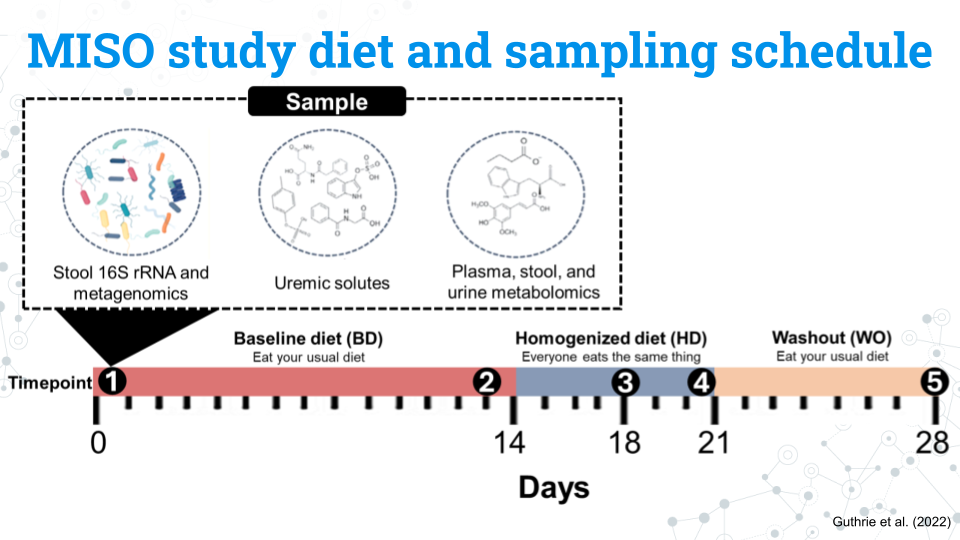

```{r setup, include=FALSE}
#Load learnr
library(learnr)
knitr::opts_chunk$set(echo = FALSE)
tutorial_options(exercise.completion=TRUE) #Uncomment to enable 

#Load libraries
library("tidyverse")
library("phyloseq")
#Uncomment exercise timelimit when deployed
tutorial_options(exercise.timelimit = 360)


###################################################################
#Cloud paths
###################################################################

#Check if we are on SciServer by seeing if the file path to 16S amplicon data on SciServer is available.
file_path <- "/home/idies/workspace/c_moor_data/16s-amplicon-data/"
if (file.exists(file_path)) {

  # #########################
  # #SciServer paths#
  # ########################
  
  #MISO data
  miso <- readRDS( "/home/idies/workspace/c_moor_data/16s-amplicon-data/miso/MISO_16S.prop.clean.rds" )
  miso_counts <- readRDS("/home/idies/workspace/c_moor_data/16s-amplicon-data/miso/MISO_16S.clean.rds")
  
} else {
  #If not, assume we are on AnVIL and load in the data through packages
  library("GuthrieMisoData")
}

```


<!---
Don't edit the Welcome page, it will be filled in automatically using the information from the YAML header
Edit the rest of the document as you like
There are some suggested sections to provide a standard order across our tutorials, but they may not all be needed/appropriate for all tutorials.
Section 1. Content 1 has example quizes and exercises
-->

## Welcome {.splashpage}

### `r rmarkdown::metadata$title`

<div class="splashpage-container">
  <figure class="splashpage-image">
  `r rmarkdown::metadata$image`{width=100%}
  <figcaption class="caption">`r rmarkdown::metadata$image_caption`</figcaption>
  </figure>

  `r rmarkdown::metadata$summary`
  

</div>


#### Learning Goals

```{r}
# Extract learning goals from YAML and add HTML tags to make an ordered list
learningGoals <- rmarkdown::metadata$learning_goals
learningGoals <- paste("<li>", learningGoals, "</li>", sep="", collapse="")

```

<ol>
`r learningGoals`
</ol>

#### Authors:

```{r}
# Extract authors from YAML and add HTML tags to make a list
authorList <- rmarkdown::metadata$author
authorList <- paste("<li>", authorList, "</li>", sep="", collapse="")

```

<ul>
`r authorList`
</ul>


```{r}
# Extract the tutorial version from the YAML data and store it so we can print it using inline r code below.  This can't be done directly inline because the code for extracting the YAML data uses backticks
tv <- rmarkdown::metadata$output$`learnr::tutorial`$version
```

#### Version: `r tv`

## Introduction

Welcome to the 16S miniCURE sampler! This module showcases key parts of our 16S Human Gut Microbiome miniCURE and highlights the features of learnr tutorials. For a quick summary of the steps, benefits, and applications of 16S metabarcoding, see the video below.

<!-- Original RNA-seq video -->
<!-- {width=75%} -->

{width=75%}

<!-- Alternative 16S videos -->
<!-- {width=75%} -->

## Meet MISO

The dataset used here is the MISO dataset from the *Impact of a 7-day homogeneous diet on interpersonal variation in human gut microbiomes and metabolomes* by Guthrie et al. (2022). The MISO data is featured during the tutorial modules and is available for students to choose for their research projects, among other datasets. 

### MISO study diet and sampling schedule

{width=100%}
<p class=caption> **Experimental design for the MISO study by Guthrie et al. (2022)**: Figure edited by Sayumi York (July 11, 2025).</p>

The figure above shows the study design for the MISO study.

- Participants eat their usual, **baseline diet (BD) for 14 days**
- Participants all eat the same diet, the **homogenized diet (HD), for 7 days**
- Participants return to their usual diet during the **washout (WO) period for 7 days**

The study lasts a total of 28 days. Samples from the blood, stool, and urine, our metabolite and 16S rRNA data are taken at 5 different timepoints:

- **Timepoint 1:** Day 0 (the start of the study)
- **Timepoint 2:** Day 13
- **Timepoint 3:** Day 17
- **Timepoint 4:** Day 21
- **Timepoint 5:** Day 28

Ultimately, the MISO study asked: *How does diet impact the gut microbiome?* by standardizing peoples' diets. They also investigated other variables such as age that are suspected to play a role in the human gut microbiome.


## Exercise 1: Exploring metadata

### MISO study variables

We have a number of variables we can use in our analysis, not all of which are included below. Notice that the variables for the study and subjects are in lowercase. R is case sensitive so we must access the variables using the same pattern of capitalization they use. 

|Variable|What is it?|Factors|
|:----|--------------|----:|
|subject|A unique ID given to each subject (participant)|S##| 
|timepoint|The 5 samplings that occur on days 0, 13, 17, 21, and 28 coded as timepoints 1 through 5|1, 2, 3, 4, 5| 
|diet|The diet the subject was on during the sampling|BD, HD, WO|
|age|The age in years of the subject|A continuous variable from 23 to 75 years old| 

```{r 16S_Sampler_Introduction}
quiz(caption = "Knowledge check: About variables in R",

  question("R is case sensitive, so we need to make sure our capitalization matches when we swap out code.",
    answer("True", correct=TRUE),
    answer("False"),
    allow_retry = TRUE,
    random_answer_order = FALSE
  )
)
```

To get a better understanding of the data and get some experience running some code, let's try and explore MISO study's metadata. The code below lists all the unique subjects (study participants) in the dataset. To look at other variables, replace "subject" with another variable's name.

Make sure you keep the double quotations (") and that your variable is in all lowercase to match the original code.

```{r miso_objects, exercise=TRUE, echo=FALSE}

unique(data.frame(sample_data(miso)[, "subject"]))

```

```{r metadata_sample_table_quiz}
quiz(caption="Knowledge check: MISO metadata",

  question("How many subjects are in the dataset? HINT: Each row represents a unique subject",
    answer("5"),
    answer("16"),
    answer("21", correct=TRUE),
    answer("32"),
    answer("105"),
    allow_retry = TRUE
  ),
  
    question("How many unique ages are there in the dataset?",
    answer("5"),
    answer("16", correct=TRUE),
    answer("21"),
    answer("32"),
    answer("105"),
    allow_retry = TRUE
  )
)
```

## Exercise 2: Microbiome composition

The code below plots the taxonomy profile of individuals (subjects) based on Phylum.

```{r plot_bar_demo, exercise=TRUE, echo=FALSE}
plot_bar(miso, x="subject", fill = "Phylum",) +
  geom_bar(aes(color = Phylum, fill = Phylum), stat = "identity", position = "stack")
```

Notice that the y-axis currently has "Abundance" on a scale of 1-5. Why is this the case? We are working with proportions, so each sample should add up to 1, which represents 100% of a sample. For each subject we sampled them at 5 different time points. Thus, we have a total of "5" for all time points included.

Try to alter the code to answer the following questions as needed.

```{r barplot_sample_table_quiz}
quiz(caption="Knowledge check: Sample composition",

  question("Which two phylum are most common in the MISO study gut microbiomes?",
    answer("Bacteroidetes", correct=TRUE),
    answer("Firmicutes", correct=TRUE),
    answer("Proteobacteria"),
    answer("Tenericutes"),
    answer("Verrucomicrobia"),
    allow_retry = TRUE
  ),
  
    question("Instead of plotting subjects on the x-axis, try to plot by timepoint. Overall, which timepoint shows the lowest average proportion of Verrucomicrobia?",
    answer("Timepoint 1"),
    answer("Timepoint 2"),
    answer("Timepoint 3"),
    answer("Timepoint 4"),
    answer("Timepoint 5", correct=TRUE),
    allow_retry = TRUE
  ),
  
  question("To view a different taxonomic rank, such as class, swap out all instances of Phylum for Class. Remember that R is case sensitive. You will need to swap out 3 instances of Phylum. How many different known classes are in the dataset?",
    answer("21", correct=TRUE),
    answer("11"),
    answer("13"),
    allow_retry = TRUE,
    random_answer_order = TRUE
  )
)
```

## Exercise 3: Alpha diversity 

Alpha diversity measures biodiversity within a given sample. For this analysis uses Gini-Simpson's index, where a higher alpha diversity measure correlates with higher biodiveristy. Generally, higher biodiveristy is associated with a more stable microbiome.

We have three places in this code we can swap out to ask questions:

1. What is plotted on the x-axis
1. What variable is represented by the color of data points
1. What variabe is represnted by the shape of the data points

Try running the code below and answering the questions.

```{r alpha_diversity_sampler, exercise=TRUE, echo=FALSE}

plot_richness(miso_counts, x="timepoint", 
              color="subject", 
              shape="diet", 
              measures= "Simpson")

```


```{r alpha_diversity_quiz}
quiz(caption="Knowledge check: alpha diversity",
     
  question("Which timepoint has the sample with the lowest alpha diversity?",
    answer("Timepoint 1"),
    answer("Timepoint 2", correct=TRUE),
    answer("Timepoint 3"),
    answer("Timepoint 4"),
    answer("Timepoint 5"),
    allow_retry = TRUE
  ),
  
  question("Which timepoint on average has the highest alpha diversity?",
    answer("Timepoint 1"),
    answer("Timepoint 2"),
    answer("Timepoint 3"),
    answer("Timepoint 4", correct=TRUE),
    answer("Timepoint 5"),
    allow_retry = TRUE
  ),
  
  question("Plot age on the x-axis instead of timepoint. As people get older, does the biodiveristy of their microbiome increase or decrease?",
    answer("Incease"),
    answer("Decrease", correct = TRUE),
    allow_retry = TRUE,
    random_answer_order = FALSE
  )
)
```


## Works cited

- Aden-Buie G, Schloerke B, Allaire J, Rossell Hayes A (2023). learnr: Interactive Tutorials for R. <https://rstudio.github.io/learnr/>, <https://github.com/rstudio/learnr>

- Evans, Ciaran, Johanna Hardin, and Daniel M. Stoebel. "Selecting between-sample RNA-Seq normalization methods from the perspective of their assumptions." Briefings in bioinformatics 19.5 (2018): 776-792.

- Guthrie, Leah, et al. "Impact of a 7-day homogeneous diet on interpersonal variation in human gut microbiomes and metabolomes." Cell host & microbe 30.6 (2022): 863-874.

- McMurdie, Paul J., and Susan Holmes. "phyloseq: an R package for reproducible interactive analysis and graphics of microbiome census data." PloS one 8.4 (2013): e61217.

- McMurdie, Paul J., and Susan Holmes. "Waste not, want not: why rarefying microbiome data is inadmissible." PLoS computational biology 10.4 (2014): e1003531.

- R Core Team (2024). R: A Language and Environment for Statistical Computing. R Foundation for Statistical Computing, Vienna, Austria.
  <https://www.R-project.org/>.
  
- Stoudt, Sara, Anthony D. Scotina, and Karsten Luebke. "Supporting Statistics and Data Science Education with learnr." Technology Innovations in Statistics Education 14.1 (2022).

- Wickham, Hadley. "ggplot2." Wiley interdisciplinary reviews: computational statistics 3.2 (2011): 180-185.


