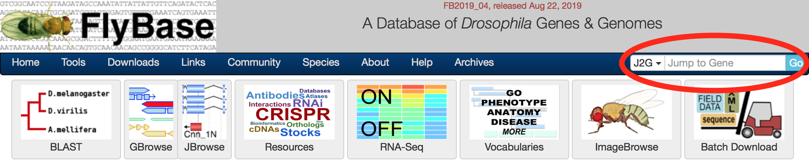
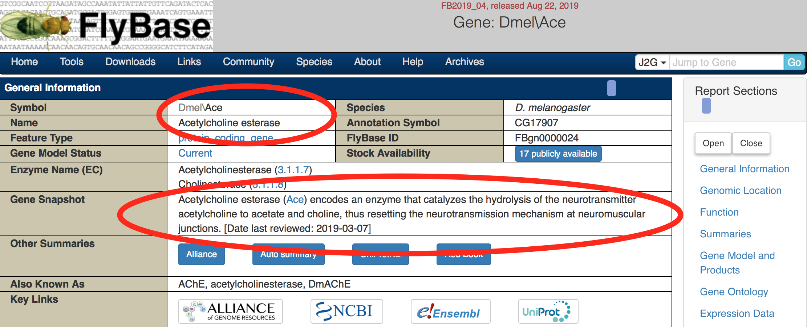
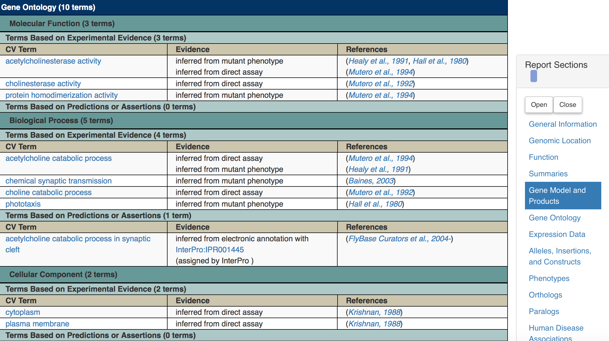
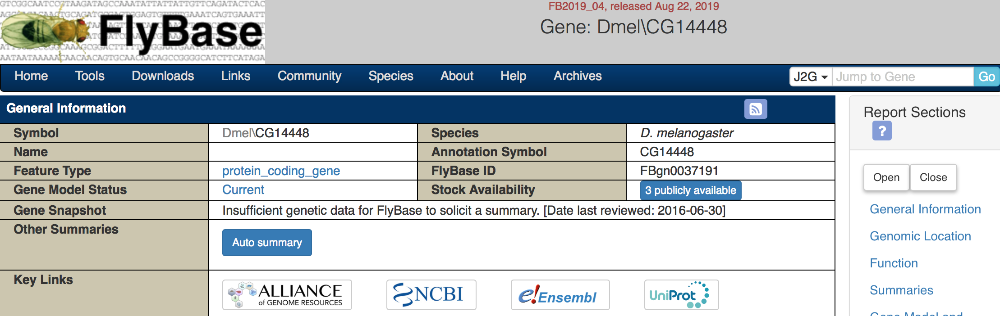
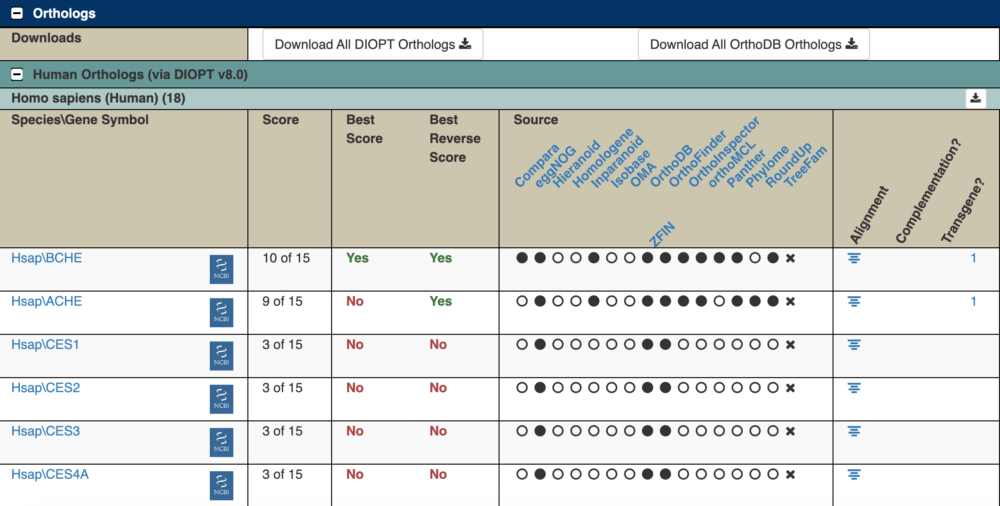
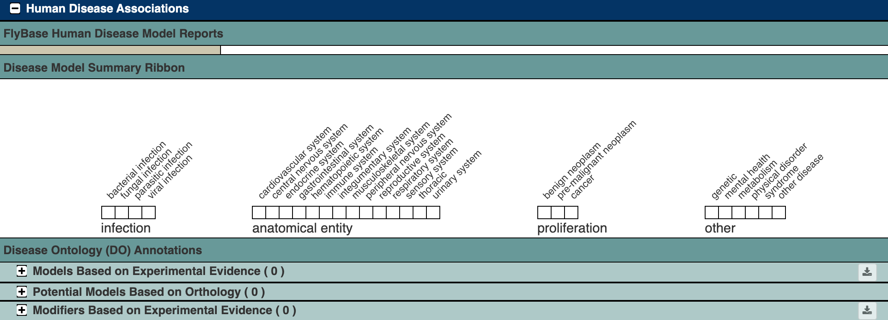
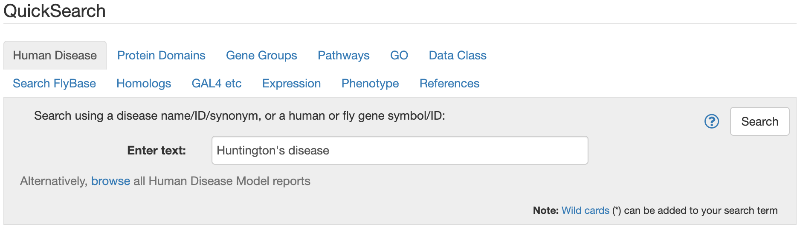
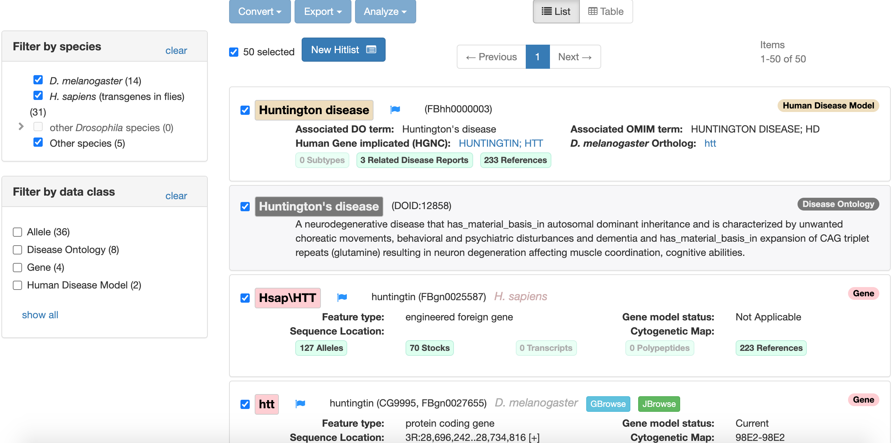
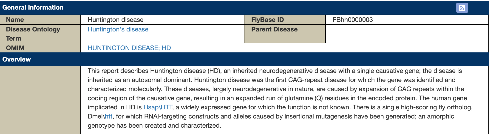
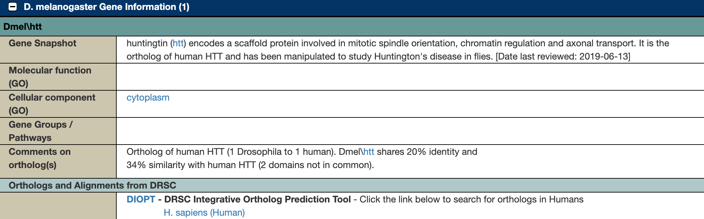

```{r setup, include=FALSE}
library(learnr)
knitr::opts_chunk$set(echo = FALSE)
```


<!---
Don't edit the Welcome page, it will be filled in automatically using the information from the YAML header
Edit the rest of the document as you like
There are some suggested sections to provide a standard order across our tutorials, but they may not all be needed/appropriate for all tutorials.
Section 1. Content 1 has example quizes and exercises
-->

## Welcome {.splashpage}

### `r rmarkdown::metadata$title`

<div class="splashpage-container">
  <figure class="splashpage-image">
  `r rmarkdown::metadata$image`{width=100%}
  <figcaption class="caption">`r rmarkdown::metadata$image_caption`</figcaption>
  </figure>

  `r rmarkdown::metadata$summary`
  

</div>


#### Learning Goals

```{r}
# Extract learning goals from YAML and add HTML tags to make an ordered list
learningGoals <- rmarkdown::metadata$learning_goals
learningGoals <- paste("<li>", learningGoals, "</li>", sep="", collapse="")

```

<ol>
`r learningGoals`
</ol>

#### Authors:

```{r}
# Extract authors from YAML and add HTML tags to make a list
authorList <- rmarkdown::metadata$author
authorList <- paste("<li>", authorList, "</li>", sep="", collapse="")

```

<ul>
`r authorList`
</ul>


```{r}
# Extract the tutorial version from the YAML data and store it so we can print it using inline r code below.  This can't be done directly inline because the code for extracting the YAML data uses backticks
tv <- rmarkdown::metadata$output$`learnr::tutorial`$version
```

#### Version: `r tv`

## Introduction

{width=100%}

FlyBase ([flybase.org](http://flybase.org)) is a website for the *Drosophila* scientific community that organizes research results about *Drosophila*.  We can use it to find out what has been discovered about genes we're interested in.

There are many species of *Drosophila*.  Most research is done using *Drosophila melanogaster* (abbreviated Dmel), but FlyBase also has information about other species of flies.

## FlyBase Gene Pages

### FlyBase ID

One important role for FlyBase is keeping track of all the Drosophila genes and what we know about them.

Every gene on FlyBase has a **FlyBase ID** number that looks like this: `FBgnXXXXXXX`, with the X's being different numbers.  FB stands for FlyBase and gn stands for gene.  There are ~17000 *Drosophila melanogaster* genes.  Each known *Drosophila* gene has its own FlyBase ID, and you can use the FlyBase ID to find information about the genes such as what they do and whether they are related to any human genes.

### Look up a gene on FlyBase

Go to FlyBase, and enter `FBgn0000024` in the search bar ("Jump to Gene").

{width=100%}

### View FlyBase entry for the *Ace* gene

This page has a ton of useful information for finding out more about this gene!  We'll highlight a few important things to start with

{width=100%}

+ The gene **Symbol** and **Name**.  Genes are usually named after what they do, and their symbol is a usually shortened version of the name.  In this case, gene `FBgn0000024` is named Acetylcholine esterase, and is abbreviated *Ace*.
+ The **Gene Snapshot** gives a quick summary of what we know about this gene.  In this case, it's an enzyme involved in neurotransmission.

### Gene Ontology

Further down the page are the **Gene Ontology** or **GO** terms.  There are 3 categories of GO terms:

+ **Molecular Function**: What does this gene do at a molecular level?  How does it interact with other molecules? (Examples: enzyme - catalyzes a reaction, DNA binding - binds to DNA, transporter - moves something across a membrane)
+ **Biological Process**: What does this gene do for the organism?  What's the "big picture"? (Examples: involved in development, reproduction, immune system, etc.)
+ **Cellular Component**: Where in a cell is the gene found?  (Examples: the nucleus, mitochondria, cell membrane, etc.)

{width=100%}

For the *Ace* gene, we can see its **molecular functions** include acetylcholinesterase activity (it's an enzyme).  You can click on these terms to find out more about them.  For example, if you click on "acetylcholinesterase activity" you can find out more about the reaction that is being catalyzed, and find other genes that carry out this same reaction.

You can also see from this table how we know this information - it tells you what kind of evidence we have to prove it, and it links to the paper where that evidence came from.

### Other information

This page contains a lot of other information, including any known interactions of this gene with other genes, information about similar genes in other organisms (orthologs), and whether related genes are relevant to any human diseases (we will discuss how to explore these in the next section).  As investigate *Drosophila* data and find genes that you want to learn more about, FlyBase is a good place to start.

### Some genes are unknowns

There are some genes that we still don't know anything about.  We can tell from the DNA sequence that there is a protein encoded there because we can see a long string of codons for amino acids.  But we've never discovered what that protein does.  More research is needed!

Here's an example of an unknown gene:

{width=100%}

As you can see, it doesn't have a name - we don't know what to name it since we don't know anything about it.  There is also no information for the gene snapshot.

Unknown genes can be frustrating or disappointing, since they don't provide us with any information.  But they can also be exciting - maybe this data is a step towards finding out what they do!

## Use FlyBase to investigate *labial*

The *labial* gene (gene symbol: *lab*) gene is a gene involved in the copper region of the *Drosophila* midgut, as well as controling the identity of segments that contribute to the head and the anterior thorax.  We can use FlyBase to learn more about this gene.

### Find the FlyBase ID
In most datasets, genes will be listed by an ID number rather than their name, such as the FlyBase ID number (FBgn number).  We can use Flybase to find these IDs and match them up to data in the dataset we're investigating.  Go to FlyBase and search for "lab" in the "Jump to Gene" searchbar.

```{r, flybase-lab, echo=FALSE}
quiz(caption = "Look up the *lab* gene on FlyBase",
  question("What is the FlyBase ID number for *lab*?",
    answer("FBgn0002522", correct=TRUE),
    answer("FBgn0000024"),  
    answer("FBgn0000003"),
    answer("FBgn0001264"),
    allow_retry = TRUE,
    random_answer_order = TRUE
  ),
  question("What biological processes is the *lab* gene involved in? HINT: Choose more than one answer.",
    answer("brain development", correct=TRUE),
    answer("midgut development", correct=TRUE),
    answer("immune system"),
    answer("cell cycle"),
    allow_retry = TRUE,
    random_answer_order = TRUE
  )
)
```

## Finding Orthologs

### Introduction

FlyBase also contains information about **orthologs** for each of the FlyBase genes.  Orthologs are genes that have similar sequences and functions across species.

Finding orthologs can be challenging - the sequences are similar, but not identical, and it can be hard to predict whether the gene is likely to be doing the same thing in other species.  There are several different computer programs that will analyze genes (using different features, including their nucleotide and amino acid sequences, predicted structures, and genome locations) to try to identify orthologs.

### DIOPT to the rescue!

With so many options for finding orthologs, how do you know which one to use?  Fortunately, we don’t have to choose.

DIOPT (DRSC Integrative Ortholog Prediction Tool) is a convenient tool that combines and summarizes information from several different ortholog prediction programs.  Rather than having to pick a single program, you can look at the DIOPT score and see how many of the programs think that a particular gene is an ortholog.

The DIOPT score is very straightforward: out of the total number of ortholog prediction programs, how many of them predicted this gene was an ortholog?  As of writing this tutorial, there are 15 programs for predicting fly-human orthologs, so a score of 7 means 7 out of those 15 programs think that the gene is an ortholog.

FlyBase uses DIOPT to report orthologs.  If you scroll down and expand the Orthologs section for a gene, you can see the list of potential orthologs and their DIOPT scores for several different species, including humans.  It also tells you which programs did or did not predict that particular ortholog.

Here are the top few predicted human orthologs for the *Ace* gene:
{width=100%}

In the results, "Hsap" stands for *Homo sapiens*, and the letters and numbers after the slash are the gene symbol.  You can click on these gene symbols to find out more about the human genes.

As you can see, the first two results (BCHE and ACHE) score quite well (10 out of 15 and 9 out of 15), so there’s a pretty good chance that they are orthologs.  It’s not uncommon for there to be multiple human genes that are orthologs of a single fly gene - humans have larger and more complex genomes, so they may have multiple specialized versions of a gene where flies only need a single version.  The rest of the results do not score very high and are much less likely to be true orthologs.

Once you know the likely human orthologs, you can then research those genes in other databases and scientific literature.  We can go back and forth between flies, humans, and other species and compare what we know across all species to try to build up an understanding of what the gene does and what happens when it stops working correctly.

```{r huntingtons-lab-orthologs}
quiz(caption = "Investigate orthologs for the *lab* gene",
  question("What is the most likely human ortholog for the *lab* gene?",
    answer("HTT"),
    answer("HOXB1", correct = TRUE),
    answer("HSAP"),
    answer("LAT"),
    allow_retry = TRUE,
    random_answer_order = TRUE
  ),
  question("How many programs think this gene is an ortholog of *lab*?",
    answer("1"),
    answer("4"),
    answer("7", correct = TRUE),
    answer("11"),
    answer("14"),
    allow_retry = TRUE
  )
)
```

## Disease models

Because disease models are of particular interest, there is a special section in the FlyBase gene report about relationships between that FlyBase gene and any human diseases.  Note that there are 3 types of relationships that are reported:

- **Models Based on Experimental Evidence**: someone has studied flies with disruptions to this gene and has shown that the flies have similar symptoms to humans
- **Potential Models Based on Orthology**: we think this gene could be used to study a particular disease because we think it’s an ortholog, but we don’t have proof.
- **Modifiers Based on Experimental Evidence**: this gene doesn’t directly cause a disease, but makes a disease caused by a different gene better or worse

### Disease report for the *Ace* gene

The *Ace* gene has no known or predicted relationship to any human diseases, so its report is pretty boring in this section:

{width=100%}

### Huntington’s Disease

Let’s take a look at something more interesting.  Say we've heard that scientists are using fruit flies to study Huntington’s disease.  Can we use FlyBase to find out more?

FlyBase has lots of information besides just reports about specific genes.  If you go to the FlyBase homepage and scroll down to the Quick Search box, you can see some of the categories of information available.  Let’s search for the Huntington’s disease model:

1. Go to the FlyBase homepage
1. In the Quick Search box, select "Human Disease"
1. Enter "Huntington’s disease"

{width=100%}

This will give you a list of everything related to Huntington’s disease on FlyBase:

{width=100%}


At the top we see:
The **Human Disease Model** report - information about models for this disease
The **Disease Ontology** report - information from a database about human diseases
The **Gene Report** for the human (*Homo sapiens*) gene: Hsap/HTT
The **Gene Report** for the *Drosophila* homolog: Dmel/htt

The Human Disease Model report is a good place to start.  Clicking on this result takes us to the [full report](https://flybase.org/reports/FBhh0000003).

At the top we can see some information about the disease, including a brief overview of the disease and a link to the OMIM (Online Mendelian Inheritance in Man) database entry for the disease:

{width=100%}


Further down the page, there is a section describing the relevant *Drosophila* gene(s):

{width=100%}

```{r huntingtons-quiz-1}
quiz(caption = "Explore the Huntington's disease report",
  question("What is the gene symbol for the Drosophila ortholog of the human Huntington's disease gene?",
    answer("hunt"),
    answer("HD"),
    answer("htt", correct = TRUE),
    answer("Dmel"),
    allow_retry = TRUE,
    random_answer_order = TRUE
  )
)
```

### Investigate the *htt* gene

Now that we know the *htt* gene is used to model Huntington’s disease, let’s find out more about this gene.  Look up the Gene report for this gene.  The easiest way to do this is to type "htt" in the Jump to Gene box.

```{r huntingtons-quiz-2}
quiz(caption = "Explore the *htt* gene report",
  question("What biological processes is the *htt* gene involved in? HINT: Choose more than one answer.",
    answer("brain development"),
    answer("choline catabolic process"),
    answer("establishment of mitotic spindle orientation", correct = TRUE),
    answer("synaptic vesicle transport", correct = TRUE),
    answer("cell cycle"),
    answer("axo-dendritic transport", correct = TRUE),
    allow_retry = TRUE,
    random_answer_order = TRUE
  ),
  question("How many different *alleles* (versions of the gene) can be used as models of Huntington's disease, **based on experimental evidence**?",
    answer("0"),
    answer("1"),
    answer("2"),
    answer("3"),
    answer("4"),
    answer("5", correct = TRUE),
    allow_retry = TRUE
  )
)
```

### *htt* alleles (variant forms of the gene)

Yes!  Here we can see that there are actually five different variants of the *htt* gene that have been experimentally shown to cause symptoms similar to Huntington’s disease in flies.  These variants all have different types of mutations affecting the *htt* gene.

It can be useful to have different versions of the gene that all mimic Huntington's disease.  Depending how these mutations were made or discovered, they can be useful for different types of experiments.  Also, if experiments turn out the same for several different disease-causing mutations, it's more likely that the result will transfer to other organisms, and isn't just a quirk of a particular mutation.

## Summary

FlyBase is a fantastic source of information.  You can use FlyBase to find:

- Gene functions and interactions
- Orthologs (*Drosophila* genes that are related to genes in other species, including humans)
- *Drosophila* genes that are relevant to human diseases
- The name, symbol or ID number for a gene, so you can research it on other databases.

#### Learn More

FlyBase is designed to help scientists do research, so it has *a lot* of information, and we've just looked at a few of the basic features.  Here are some resources if you'd like to learn more:

+ Check out the "Help" tab on FlyBase
+ Visit [FlyBase TV](https://www.youtube.com/c/FlyBaseTV), the FlyBase YouTube channel
+ Look at the FlyBase "[New to Flies](https://wiki.flybase.org/wiki/FlyBase:New_to_Flies?)" wiki page
