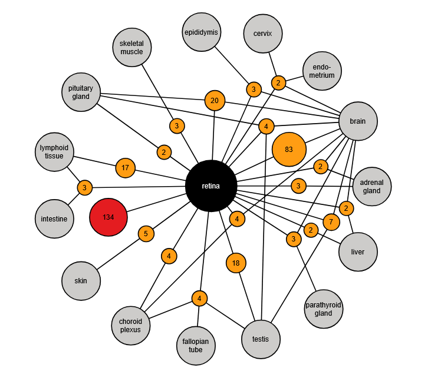

```{r setup, include=FALSE}
library(learnr)
knitr::opts_chunk$set(echo = FALSE)
```


<!---
Don't edit the Welcome page, it will be filled in automatically using the information from the YAML header
Edit the rest of the document as you like
There are some suggested sections to provide a standard order across our tutorials, but they may not all be needed/appropriate for all tutorials.
Section 1. Content 1 has example quizes and exercises
-->

## Welcome {.splashpage}

### `r rmarkdown::metadata$title`

<div class="splashpage-container">
  <figure class="splashpage-image">
  `r rmarkdown::metadata$image`{width=100%}
  <figcaption class="caption">`r rmarkdown::metadata$image_caption`</figcaption>
  </figure>

  `r rmarkdown::metadata$summary`
  

</div>


#### Learning Goals

```{r}
# Extract learning goals from YAML and add HTML tags to make an ordered list
learningGoals <- rmarkdown::metadata$learning_goals
learningGoals <- paste("<li>", learningGoals, "</li>", sep="", collapse="")

```

<ol>
`r learningGoals`
</ol>

#### Authors:

```{r}
# Extract authors from YAML and add HTML tags to make a list
authorList <- rmarkdown::metadata$author
authorList <- paste("<li>", authorList, "</li>", sep="", collapse="")

```

<ul>
`r authorList`
</ul>


```{r}
# Extract the tutorial version from the YAML data and store it so we can print it using inline r code below.  This can't be done directly inline because the code for extracting the YAML data uses backticks
tv <- rmarkdown::metadata$output$`learnr::tutorial`$version
```

#### Version: `r tv`

## Introduction

### Where should I start?

{width=100%}
<p class=caption> **HPA flowchart**: How to use this module. </p>


---

We recommend everyone completes the *Knowledge Check: Gene expression and proteins* and *What is the HPA?* sections and then branch out to the section that is most relevant to you. 

- **A taste of HPA**, (*15 minutes*): For people who are looking to introduce themselves to a wide variety of databases and experienced researchers who know exactly what kind of information they're looking for. This will give you a surface level look at what HPA offers. Users with additional interest could use the following two sections to explore HPA at a deeper level if interested. You can also access this material through the "Database sampler" module (in development).

A student in introductory biology could do the following sections on their own at home or in class with limited support from an instructor. These sections are also geared toward building an independent research project.

- **I need to find a gene/protein of interest**, (*X minutes*): This section will guide you through browsing the eight different atlases HPA offers. 

- **I want to know more about a gene/protein**, (*X minutes*): This section assumes you have the name of a gene/protein to search for as a starting point. 

After completing the section of your choosing, check your understanding of HPA using the *Try it yourself! Human Protein Atlas: Look up a protein* quiz section!


## Knowledge check: Gene expression and proteins

- The form and function of genes
- The form and function of proteins
- The Central Dogma: How transcription and translation read a DNA template and synthesize a polypeptide from   those instructions
- Gene expression: How variation in gene expression creates specialized cells

<!-- #Image of Central Dogma  -->
{width=100%}

<p class=caption> **The Central Dogma**: The process of reading a DNA template and synthesizing a polypeptide from those instructions. Image sourced from The NIH National Human Genome Research Institute (February 11th 2025). Available from: https://www.genome.gov/genetics-glossary/Central-Dogma License: [CC BY 3.0] </p>

---

### Test your knowledge!

```{r HPA_centralDogma-quiz}
quiz(caption = "What you need to know before using HPA:",
     
     
  question("Which of the following statements about genes are true? HINT: Choose 3",
    answer("Genes contain instructions for making a specific protein", correct = TRUE),
    answer("Genes are passed down from parents to offspring", correct = TRUE),
    answer("The building blocks of genes are nucleotides", correct = TRUE),
    answer("The building blocks of genes are amino acids"),
    answer("All DNA sequences code for specific proteins"),
    allow_retry = TRUE,
    random_answer_order = TRUE
  ),
  
  
  question("Which of the following statements about proteins are true? HINT: Choose 2",
           
    answer("The building blocks of proteins are nucleotides"),
    answer("The building blocks of proteins are amino acids", correct=TRUE),
    answer("Proteins perform the majority of functions in cells", correct = TRUE),
    allow_retry = TRUE,
    random_answer_order = TRUE
  ),
  
  
  question("When we say a 'given cell has a high level of gene expression', what does this suggest?",
    answer("The cell is producing more protein, which may lead to increased in RNA expression"),
    answer("The cell is producing more RNA, which may lead to increased protein production", correct = TRUE),
    answer("The cell is producing less RNA, which may lead to decreased protein production"),
    answer("The cell is producing less RNA, which may lead to increased protein production"),
    allow_retry = TRUE,
    random_answer_order = TRUE
  ),
  
  
  question("Which of the following statements are true about gene expression?",
    answer("Gene expression differs across parts of the body", correct = TRUE),
    answer("Genes can be turned ON (expressed), or turned OFF (not expressed)", correct=TRUE),
    answer("There is no medium level of gene expression, only high levels or none"),
    allow_retry = TRUE,
    random_answer_order = TRUE
    
  )
)
```


## What is the HPA?

Before the internet became widely available, people who needed to know where things are used atlases. An atlas is a book that contains maps. If you wanted directions to a specific place or wanted to know where the river next to your house went, you could use an atlas.

The Human Protein Atlas is a website that shows us where genes are expressed and where proteins are found throughout the human body.  It also contains information about a particular portein including what the protein does, where we find the protein in a cell, and what types of diseases they are involved in. 

People sometimes use the names of a gene and the protein it "codes for" interchangeably, which can be a bit confusing. HPA includes both gene and protein data, so we will also occasionally refer to RNA alongside proteins in this module.

Remember: Not all genes code for proteins; genes can have other types of information and instructions.  The Human Protein Atlas is focused specifically on proteins and the genes that code for them (“protein-coding genes”).

---

{width=100%}

We will be encountering both RNA and protein expression data, so let's quickly go over the differences between them. Although they both are trying to measure the same thing (how many copies of a protein are being made in a given cell) we measure RNA-expression and protein expression differently.

RNA expression is measured and reported in counts - the number of copies mRNA in the cell for a given gene. Protein expression is performed using antibodies, staining, and fluorescence. Since protein cells are visually analyzed, they are not given numeric values but are sorted into cells with high, medium, low, and undetected protein expression.

Keep this in mind as you explore HPA!

---

{width=100%}
{width=100%}
<p class=caption> **The Human Protein Atlas Homepage: Resources**. On the top of the page you can use the search bar to search for a protein of interest. Scroll down on the homepage of the Human Protein Atlas to find these resources, sometimes also called atlases (for example, the Cancer Atlas). We will explore them a little later in this module. Image sourced from The Human Protein Atlas (www.proteinatlas.org) (February 11th, 2025).</p>

You will primarily interact with the <a href="https://www.proteinatlas.org/"> Human Protein Atlas</a> by typing the names of genes or proteins of interest into the search bar near the top of all the website's pages. 

The boxes below the search bar ("Tissue Atlas", "Cell Atlas", etc.) provide explanations about the types of information available in the Human Protein Atlas. These pages can also be accessed through the "Resources" tab at the top of the page.

Feel free to explore the website as you wish. When you're ready, move onto the section of this module that is most relevant to you: I need to find a gene/protein of interest or I want to know more about a gene/protein.

## I need to find a gene/protein of interest

If you need to find a gene or protein for your research, HPA is a great resource!
There's no one correct way to find a great research topic but here are some common starting off points:

### Ideas for brainstorming research topics

- A disease or condition you are interested in (examples: diabetes, cystic fibrosis, depression)
- A biological process you are interested in (examples: ketosis, DNA repair, pH regulation)
- An organ or tissue you're interested in (examples: lungs, heart, gut)
- A news story or development that made you feel excited, worried, or curious (examples: news about gene therapy for sickle cell disease, a story talking about genetic factors in Alzheimer's, reviewing genetic test results of a loved one)


{width=100%}
<p class=caption> **The Human Protein Atlas Homepage: Other atlases**. An image of eight different atlases you can explore: Tissue, brain, single cell, subcellular (where are proteins found within or around a cell), cancer, blood, cell line, and structure & interaction. Image sourced from The Human Protein Atlas (www.proteinatlas.org) (February 11th, 2025).</p>


We'll use the atlases we found on the home page to look through proteins/genes and try to find one that interests us! For this module, we'll only be looking at the tissue atlas, but feel free to explore the other 7 atlases too!

---

### The Tissue Atlas

{width=100%}
<p class=caption> **The Human Protein Atlas: The tissue atlas**. Image sourced from The Human Protein Atlas (www.proteinatlas.org) (February 11th, 2025).</p>

This is the landing page for the tissue atlas. At the top of the page we have some metrics and a summary of what you can find in the atlas. For example, we see that there are 15302 entries of RNA and proteins in the tissue atlas.


{width=100%}
<p class=caption> **The Human Protein Atlas: The tissue atlas, tissue and organ proteomes**. Explore this section to find proteins used in specific parts of the body. Image sourced from The Human Protein Atlas (www.proteinatlas.org) (February 11th, 2025).</p>

Further down we see a diagram of a human, split in half and separated into a typical XY and XX individual. Hovering your mouse over the colorful body part hexagons lets us know how many enriched genes there are for each body part. In the above example we see that the retina has 134 enriched genes in the database, 240 group enriched genes, and 411 enhanced genes. 

Let's click on "Retina" to learn more about these genes.

---

### Exploring the retina

{width=100%}
<p class=caption> **The Human Protein Atlas: The tissue atlas, retina proteome**. The summary page on proteins expressed in the retina. The summary provides us with some background on the development and cell layers involved in the retina and tells us how many proteins we have that are used and specialized for the retina. Image sourced from The Human Protein Atlas (www.proteinatlas.org) (February 11th 2025).</p>

Here is the first section in the retina proteome. If we're not already familiar with the retina, we can read this summary page to learn more about the development and cell layers involved in the retina. We can also see based on transcriptome data that 20,162 genes are expressed in the retina (likely some housekeeping genes used across the body), 785 of which show elevated gene expression compared to other tissues (likely retina specific genes/proteins). Let's continue scrolling down the page and see what else we can find.

**The retina transcriptome**

{width=100%}
<p class=caption> **The Human Protein Atlas: The tissue atlas, retina transcriptome**. These pie charts summarize gene expression in the retina. A) How many genes have high levels of gene expression in the retina compared to the same gene in other tissues. B) How many genes are expressed in other tissues regardless of expression level. Image sourced from The Human Protein Atlas (www.proteinatlas.org) (February 21st, 2025).</p>

Under the retina transcriptome section, we find pie charts that show the specificity and distribution of genes expressed in the retina. Clicking on a slice in the pie chart will bring you to a list of genes involved in the respective areas.

**Transcript specificity** - shows how many genes have high gene expression levels in the retina compared to the same gene in other tissues

Recall that from the summary we found 20,162 genes are expressed in the retina and 785 of those elevated gene expression compared to other tissues. We see those same results in the piechart on the left, colored in warm colors. In this example those 785 genes include:

- *Tissue enriched*: At least four-fold higher mRNA level in retina compared to any other tissues 
- *Group enriched*: At least four-fold higher average mRNA level in a group of 2-5 tissues compared to any other tissue.
- *Tissue enhanced*: At least four-fold higher mRNA level in retina compared to the average level in all other tissues.

**Transcript distribution** - shows how many genes are expressed in the retina compared to other parts of the body, regardless of the level of expression

- *Detected in single*: Detected in a single tissue
- *Detected in some*: Detected in more than one but less than one-third of tissues
- *Detected in many*: Detected in at least a third but not all tissues
- *Detected in all*: Detected in all tissues

What matters more? Well, like most things in research it depends on the question you're trying to answer and the story you're trying to tell. The 785 genes that we've identified as highly expressed in the retina have at minimum a four-fold higher mRNA level when compared to the same gene expressed in non-retina tissues. But their expression levels could still vary greatly. Let's keep scrolling down to see an example of this.


**12 genes in the retina with the highest mRNA expression**

{width=100%}
<p class=caption> **The Human Protein Atlas: The tissue atlas, 12 genes with the highest mRNA expression**. Image sourced from The Human Protein Atlas (www.proteinatlas.org) (February 21st, 2025).</p>

This is table 2 on this page. It shows the 12 genes in the retina with the highest levels of gene expression (mRNA tissue), represented in the unit nTPM. Rhodopsin, the gene with the highest level of expression has an mRNA tissue expression of 3936.5 nTPM, more than twice the expression compared to S-antigen visual arrestin, the second most highly expressed gene which has an expression value of 1421.5 nTPM. 

This makes a lot of sense. The retina uses rods and cones to create black/white and color vision respectively. Rhodopsin is used in rod cells, so it's very important in the retina (Lenahan et al. 2020). On the other hand, S-antigen visual arrestin (SAG) is used in both cones and rods (Guo et al. 2022) as a regulator of Rhodopsin. 

In comparison to these two genes, the 12th highest expressed gene in the retina, small integral membrane protein 40, has a gene expression level of just 45.3 nTPM, only 1.1% of the expression level of rhodopsin!

**Previously discovered proteins in the retina**

{width=100%}
<p class=caption> **The Human Protein Atlas: The tissue atlas, proteins specifically expressed in photoreceptor cells**. Sections with specialized information related to the retina follow. Image sourced from The Human Protein Atlas (www.proteinatlas.org) (February 21st, 2025).</p>

There are number of examples of proteins that are detected in the retina, as well as a little more information about each gene/protein. While there's some good information in these sections, we probably don't want to choose these genes without putting our own twist on them for our research.


**Group enriched genes**

{width=100%}
<p class=caption> **The Human Protein Atlas: The tissue atlas, group enriched genes in the retina**. Group enriched genes share similar gene expression patterns between tissues. Image sourced from The Human Protein Atlas (www.proteinatlas.org) (February 21st 2025).</p>

Finally, we have a network that shows how many genes in other parts of the body have similar expression patterns to genes in the retina. These are shown in orange circles and are known as group enriched genes. For example, there are 5 genes that are elevated in both the retina and the skin. Why might these genes be in a group when enriched? Perhaps they are involved in the same pathway!

---

### The Tissue Atlas: Summary
In this section we explored one of the eight specialized atlases in HPA to try and find a gene/protein that interests us. Remember that you aren't restricted to just the tissue atlas or the retina! 


## I want to know more about a gene/protein

You have a protein in mind! Great! Every protein in the Human Protein Atlas has its own page with a large collection of information about the protein. 

**Our aims**:

- Find alternative names for the protein
- Find where the protein exists in the human body
- Find orthologs in other species
- Learn about the protein's function

---

### Step 1: Use the search bar to find a protein

{width=100%}
<p class=caption> **The Human Protein Atlas: Search bar**. The search bar will always appear near the top of the page no matter where you are in the website. Image sourced from The Human Protein Atlas (www.proteinatlas.org) (February 21st 2025).</p>

Proteins have a number of **aliases** - different names that all refer to the same protein. In this example, we searched for Insulin, but we would also get similar results if we searched for the other aliases for insulin such as INS, IDDM1, or IDDM2.

---

### Step 2: Examine the search results page

{width=100%}
<p class=caption> **The Human Protein Atlas: Search results**. Image sourced from The Human Protein Atlas (www.proteinatlas.org) (February 21st 2025).</p>

Here is our results page. In the top left side of the results, we can see that our search brought back 635 genes and their related proteins. Notice also how even though we asked for insulin, insulin is actually the third result.

We can also get a quick overview of each protein by hovering our mouse over each resource. In this example, we see that within all of HPA's single-cell RNA-seq data insulin had the highest expression in pancreatic cells. That makes a lot of sense, since insulin is produced in the pancreas!

Let's click on "Insulin" in the 2nd column to go to insulin's protein page.

---

### Step 3: Explore the protein's page

{width=100%}
<p class=caption> **The Human Protein Atlas: Insulin (INS)**. Image sourced from The Human Protein Atlas (www.proteinatlas.org) (February 21st 2025).</p>

Here we are in the summary tab on the insulin page. Here we can view a quick overview of what the protein does, where it is expressed, and where in the body the protein can be found. 

---

### Step 4: Examine the gene information page

While we're on the summary tab, let's check out the gene information page.

{width=100%}
<p class=caption> **The Human Protein Atlas: Insulin (INS) gene information**. The gene information is found in the summary tab under protein summary in the sidebar. Image sourced from The Human Protein Atlas (www.proteinatlas.org) (February 21st 2025).</p>

This page has another summary of what the protein does in the body and has helpful links to other databases (highlighted in the red box). You can use these other databases to get more information on the gene/protein. For example, you can find resources for insulin orthologs in other species using  Ensembl, Entrez gene (NCBI), and UniProt.

---

### Step 5: Learn more about what tissues in the body the protein is found using the tissue tab

{width=100%}
<p class=caption> **The Human Protein Atlas: Insulin (INS) gene tissue resource**. The tissue section of insulin. Image sourced from The Human Protein Atlas (www.proteinatlas.org) (February 21st 2025).</p>

It's time for HPA to live up to its name.

Let's check out the ["Tissue" tab](https://www.proteinatlas.org/ENSG00000254647-INS/tissue). At the top of this tab under "Human Protein Atlas Information", we can get an overview of which tissues in the body insulin is found. As before, we can see that insulin is primarily found in the pancreas. If we scroll down further we will see a nice graphic that shows insulin expression patterns in the body.

{width=100%}

<p class=caption> **The Human Protein Atlas: RNA and protein expression summary for insulin**. The tissue section of insulin. Image sourced from The Human Protein Atlas (www.proteinatlas.org) (February 21st 2025).</p>

On the left side of this figure we can see two anatomical models. The shaded areas represent areas in the body where insulin expression is active. In dark red, we can see that insulin is expressed highest in the pancreas. In light red, we can also see many other areas where insulin expression was detected.

In the middle of the figure we can see a comparison between RNA and protein expression. If we look closer at the RNA expression (click and hover over drop down menus) we can see a small amount of insulin RNA detected. However, we couldn't detect any insulin protein in these same areas. 

Why would RNA and protein expression differ if RNA is involved in protein synthesis? While it's possible that there is no data available for protein expression in the database, given that insulin is a very popular protein to study this seems highly unlikely. Recall that HPA measures RNA and protein expression differently; protein expression is much less precise and relies on a visual inspection of cells. We can see these images on the right side of this image.


{width=100%}
<p class=caption> **The Human Protein Atlas: Protein vs. RNA expression for insulin**. Protein expression is reported as not detected, low, medium, or high, whereas RNA expression is reported with an exact number. Image sourced from The Human Protein Atlas (www.proteinatlas.org) (February 21st 2025).</p>

Scrolling further down the page, we can see this difference reflected in the summary for RNA and protein expression respectively, as shown above. Hover over the bars to see the exact expression values. We can also see here different datasets that have contributed to these summaries when applicable.

---

### Step 6: Exploring other resource tabs

The other tabs, such as "Brain", "Single cell" and "Subcell" all look at expression data relating to those specific parts of the body or those specific data types.

{width=100%}
<p class=caption> **The Human Protein Atlas: the subcellular location of insulin**. Image sourced from The Human Protein Atlas (www.proteinatlas.org) (February 21st 2025).</p>

For example, here on the subcell page, we can see that insulin is secreted out of cells. If we look closely on the cell, we can see four places (circled in red) where color indicates insulin is leaving the cell. This page may also have information from different cell lines, such as cancer cell lines, when applicable. For more information about these atlases, we can explore them through the "Resources" tab at the top of the screen.

---

### Exploring a gene/protein (Insulin): Summary

In this section we used insulin as an example for how we can learn more about a given gene/protein. Remember that you don't have to get all of your information from HPA. There are plenty of other databases and scientific articles to draw from. But hopefully this is a good starting point for us to understand how the gene/protein of our choice!


## Try it yourself! Human Protein Atlas: Look up a protein

Phenylketonuria (PKU) is a severe disease where individuals are unable to metabolize the amino acid phenylalanine.  If untreated, children with PKU develop seizures and irreversible intellectual disabilities.  It can be controlled by maintaining a strict diet, and individuals can go on to live a normal life.  Babies are routinely screened for PKU shortly after birth, so that they can begin treatment immediately.

PKU is caused by deficiency in phenylalanine hydroxylase - the protein that processes phenylalanine.

Go to the Human Protein Atlas and enter "Phenylalanine hydroxylase" in the search bar to find out more about this protein.

```{r pku-quiz}
quiz(caption = "Investigate phenylalanine hydroxylase",
  question("What is the name of this gene?",
    answer("PAH", correct = TRUE),
    answer("PKU"),
    answer("PHE"),
    answer("Phenylalanine"),
    allow_retry = TRUE,
    random_answer_order = TRUE
  ),
  
  question("Based on protein expression data, what tissues is this phenylalanine hydroxylase expressed in?  HINT: Choose 4",
    answer("Liver", correct = TRUE),
    answer("Gallbladder", correct = TRUE),
    answer("Kidney", correct = TRUE),
    answer("Testis", correct = TRUE),
    answer("Spleen"),
    answer("Stomach"),
    answer("Bladder"),
    allow_retry = TRUE,
    random_answer_order = TRUE
  ),    
  
    question("Based on protein expression data, what level of expression does phenylalanine hydroxylase have in the liver?",
    answer("Not detected"),
    answer("Low"),
    answer("Medium", correct = TRUE),
    answer("High"),
    allow_retry = TRUE,
    random_answer_order = TRUE
  ),
  
    question("Based on protein expression data, which organ has the highest expression of phenylalanine hydroxylase? HINT: Choose 2",
    answer("Liver"),
    answer("Gallbladder"),
    answer("Kidney", correct = TRUE),
    answer("Testis", correct = TRUE),
    answer("Spleen"),
    answer("Stomach"),
    answer("Bladder"),
    allow_retry = TRUE,
    random_answer_order = TRUE
  ),
  
    question("Based on RNA expression data, which organ has the highest expression of phenylalanine hydroxylase?",
    answer("Liver", correct = TRUE),
    answer("Gallbladder"),
    answer("Kidney"),
    answer("Testis"),
    answer("Spleen"),
    answer("Stomach"),
    answer("Bladder"),
    allow_retry = TRUE,
    random_answer_order = TRUE
  ),
    
  question("Where in the cell is PKA localized?  HINT: Choose 2",
    answer("Nucleus"),
    answer("Cytoplasm"),
    answer("Extracellular matrix"),
    answer("Endoplasmic reticulum", correct = TRUE),
    answer("Mitochondria"),
    answer("Vesicles", correct = TRUE),
    allow_retry = TRUE,
    random_answer_order = TRUE
  )
)
```


## Summary

The Human Protein Atlas is a useful source of information when researching human genes. Some key features include:

- A convenient summary of what is known about the gene's function
- Information on disease associations
- Nice graphical depictions of where the protein is active within the human body

## FAQ

Currently in development

## Works cited

- Fagerberg L et al., Analysis of the human tissue-specific expression by genome-wide integration of transcriptomics and antibody-based proteomics. Mol Cell Proteomics. (2014) PubMed: 24309898 DOI: 10.1074/mcp.M113.035600
- Guo, Xin, et al. "Accelerated evolution of dim-light vision-related arrestin in deep-diving amniotes." Frontiers in Ecology and Evolution 10 (2022): 1069088.
- Lenahan, Cameron, et al. "Rhodopsin: a potential biomarker for neurodegenerative diseases." Frontiers in neuroscience 14 (2020): 326.
- NIAID Visual & Medical Arts. (10/7/2024). Next Gen Sequencer. NIAID NIH BIOART Source. bioart.niaid.nih.gov/bioart/386
- NIAID Visual & Medical Arts. (10/7/2024). Free Floating FActin. NIAID NIH BIOART Source. bioart.niaid.nih.gov/bioart/165
- NIAID Visual & Medical Arts. (10/7/2024). Antibody. NIAID NIH BIOART Source. bioart.niaid.nih.gov/bioart/17
- NIAID Visual & Medical Arts. (10/7/2024). RNABrush. NIAID NIH BIOART Source. bioart.niaid.nih.gov/bioart/455
- Uhlén M et al., Tissue-based map of the human proteome. Science (2015)
PubMed: 25613900 DOI: 10.1126/science.1260419	

