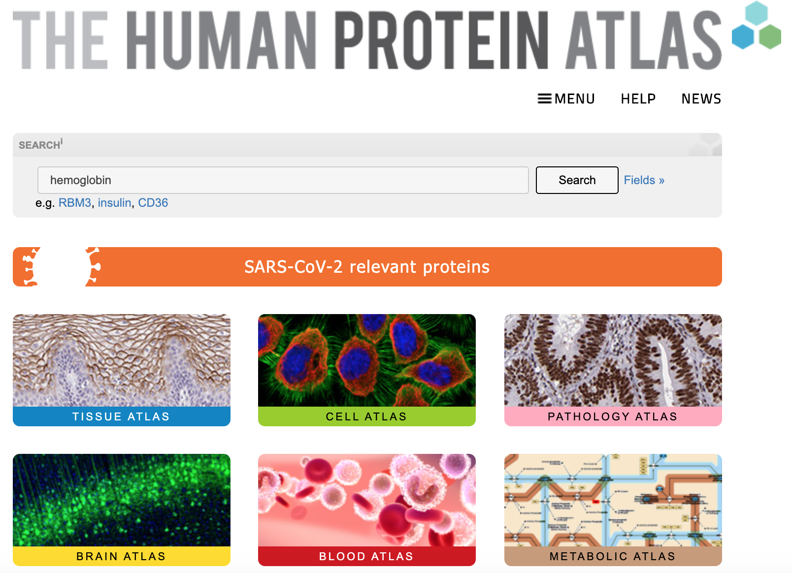
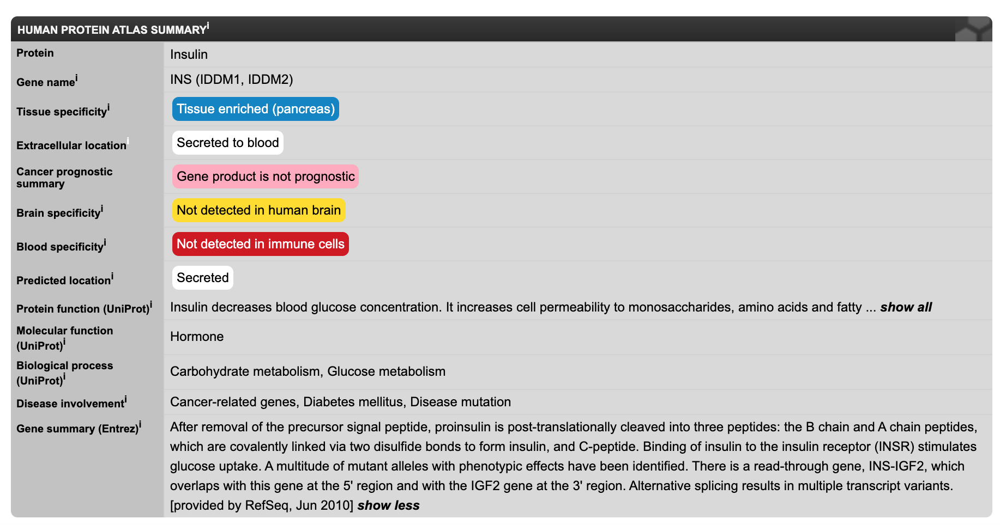
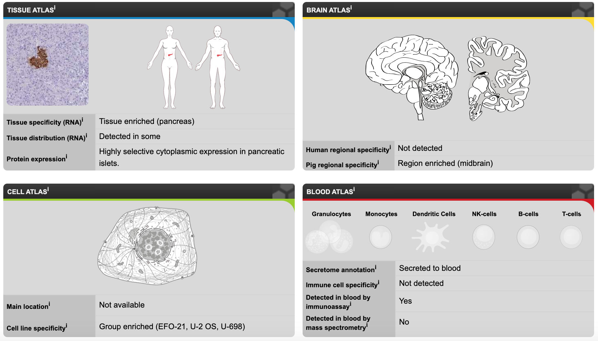
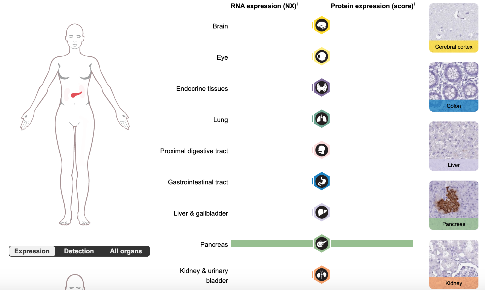

```{r setup, include=FALSE}
library(learnr)
knitr::opts_chunk$set(echo = FALSE)
```


<!---
Don't edit the Welcome page, it will be filled in automatically using the information from the YAML header
Edit the rest of the document as you like
There are some suggested sections to provide a standard order across our tutorials, but they may not all be needed/appropriate for all tutorials.
Section 1. Content 1 has example quizes and exercises
-->

## Welcome {.splashpage}

### `r rmarkdown::metadata$title`

<div class="splashpage-container">
  <figure class="splashpage-image">
  `r rmarkdown::metadata$image`{width=100%}
  <figcaption class="caption">`r rmarkdown::metadata$image_caption`</figcaption>
  </figure>

  `r rmarkdown::metadata$summary`
  

</div>


#### Learning Goals

```{r}
# Extract learning goals from YAML and add HTML tags to make an ordered list
learningGoals <- rmarkdown::metadata$learning_goals
learningGoals <- paste("<li>", learningGoals, "</li>", sep="", collapse="")

```

<ol>
`r learningGoals`
</ol>

#### Authors:

```{r}
# Extract authors from YAML and add HTML tags to make a list
authorList <- rmarkdown::metadata$author
authorList <- paste("<li>", authorList, "</li>", sep="", collapse="")

```

<ul>
`r authorList`
</ul>


```{r}
# Extract the tutorial version from the YAML data and store it so we can print it using inline r code below.  This can't be done directly inline because the code for extracting the YAML data uses backticks
tv <- rmarkdown::metadata$output$`learnr::tutorial`$version
```

#### Version: `r tv`

## Introduction

### Overview

The Human Protein Atlas is a website that organizes research results about human proteins.  It contains many types of information, including what the proteins do, where they are active, and what types of diseases they are involved in.  We can use it to find out what has been discovered about genes we’re interested in.

{width=100%}

You will primarily interact with the Human Protein Atlas by typing the names of genes or proteins of interest into the search bar.

The boxes below the search bar ("Tissue Atlas", "Cell Atlas", etc.) provide explanations about the types of information available in the Human Protein Atlas.

### Reminder: Genes and Proteins

People sometimes use the names of a gene and the protein it "codes for" interchangeably, which can be a bit confusing.

- A **gene** is a DNA sequence (made of **nucleotides**).  It contains the instructions for how to make a specific protein
- A **protein** is an **amino acid** sequence.  Proteins fold up into specific shapes that let them do their jobs.  Proteins perform the majority of functions in cells, including things like:
    - Carrying out chemical reactions
    - Moving materials around inside the cell
    - Transporting things in and out of a cell

Mutations in a *gene* can cause the *protein* to be made incorrectly, resulting in a protein that does not do its job properly.

Not all genes code for proteins; genes can have other types of information and instructions.  The Human Protein Atlas is focused specifically on proteins and the genes that code for them (“protein-coding genes”).

## Protein Pages

### Protein Summary
Every protein in the Human Protein Atlas has its own page with a large collection of information about the protein.  To see what kinds of information is available, we will look at the entry for [**insulin**](https://www.proteinatlas.org/ENSG00000254647-INS).

At the top of the page there is a summary:
{width=100%}

- **Gene name** - The name of the gene that codes for the protein.  If multiple names have been used for this gene, they will be listed in parentheses.  The gene for insulin is named “INS”.
- **Gene summary** (at the bottom) - A summary of what we know about this gene.  For insulin, it contains a description of how it is processed, and then an explanation of how it binds to the insulin receptor and stimulates glucose uptake.
- **Where is it located?** (Tissue specificity, Extracellular location, Brain specificity, Blood specificity, Predicted location) - The Human Protein Atlas has several types of information about the protein’s location.  More information is available further down on the page.
- **What does it do?** (Protein function, Molecular function, Biological process) - What molecular, chemical, and biological processes does it carry out?  Insulin is a hormone involved in carbohydrate metabolism.
- **Disease involvement** - Is it associated with any diseases?  Insulin is associated with diabetes as well as cancer.

Further down the page we can see diagrams depicting where the protein is located:
{width=100%}

Insulin is located specifically in the pancreas.

### Tissue Atlas

If we click on the [Tissue Atlas box](https://www.proteinatlas.org/ENSG00000254647-INS/tissue), we can see more detailed information:

{width=100%}

Insulin is very cleanly localized to the pancreas.  Both the RNA and the protein experimental data show high expression in the pancreas and very little expression anywhere else.

## Look up a Protein

Phenylketonuria (PKU) is a severe disease where individuals are unable to metabolize the amino acid phenylalanine.  If untreated, children with PKU develop seizures and irreversible intellectual disabilities.  It can be controlled by maintaining a strict diet, and individuals can go on to live a normal life.  Babies are routinely screened for PKU shortly after birth, so that they can begin treatment immediately.

PKU is caused by deficiency in **phenylalanine hydroxylase** - the protein that processes phenylalanine.

Go to the Human Protein Atlas and enter "Phenylalanine hydroxylase" in the search bar to find out more about this protein.

```{r pku-quiz}
quiz(caption = "Investigate phenylalanine hydroxylase",
  question("What is the name of this gene?",
    answer("PKU"),
    answer("PAH", correct = TRUE),
    answer("PHE"),
    answer("Phenylalanine"),
    allow_retry = TRUE,
    random_answer_order = TRUE
  ),
  question("What tissues is this gene expressed in?  HINT: Choose 3",
    answer("Stomach"),
    answer("Liver", correct = TRUE),
    answer("Spleen"),
    answer("Gallbladder", correct = TRUE),
    answer("Kidney", correct = TRUE),
    answer("Small intestine"),
    allow_retry = TRUE,
    random_answer_order = TRUE
  ),
  question("Where in the cell is it localized?  HINT: Choose 2",
    answer("Nucleus"),
    answer("Cytoplasm"),
    answer("Extracellular matrix"),
    answer("Endoplasmic reticulum", correct = TRUE),
    answer("Mitochondria"),
    answer("Vesicles", correct = TRUE),
    allow_retry = TRUE,
    random_answer_order = TRUE
  )
)
```

## Summary

The Human Protein Atlas is a useful source of information when researching human genes.  Some key features include:

- A convenient summary of what is known about the gene's function
- Information on disease associations
- Nice graphical depicitions of where the protein is active
