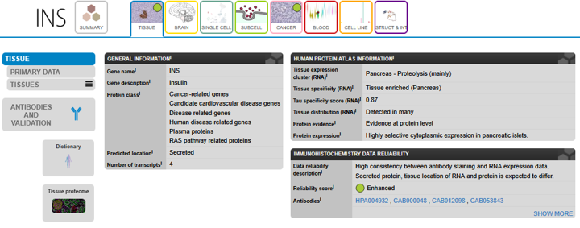

```{r setup, include=FALSE}
library(learnr)
knitr::opts_chunk$set(echo = FALSE)
```


<!---
Don't edit the Welcome page, it will be filled in automatically using the information from the YAML header
Edit the rest of the document as you like
There are some suggested sections to provide a standard order across our tutorials, but they may not all be needed/appropriate for all tutorials.
Section 1. Content 1 has example quizes and exercises
-->

## Welcome {.splashpage}

### `r rmarkdown::metadata$title`

<div class="splashpage-container">
  <figure class="splashpage-image">
  `r rmarkdown::metadata$image`{width=100%}
  <figcaption class="caption">`r rmarkdown::metadata$image_caption`</figcaption>
  </figure>

  `r rmarkdown::metadata$summary`
  

</div>


#### Learning Goals

```{r}
# Extract learning goals from YAML and add HTML tags to make an ordered list
learningGoals <- rmarkdown::metadata$learning_goals
learningGoals <- paste("<li>", learningGoals, "</li>", sep="", collapse="")

```

<ol>
`r learningGoals`
</ol>

#### Authors:

```{r}
# Extract authors from YAML and add HTML tags to make a list
authorList <- rmarkdown::metadata$author
authorList <- paste("<li>", authorList, "</li>", sep="", collapse="")

```

<ul>
`r authorList`
</ul>


```{r}
# Extract the tutorial version from the YAML data and store it so we can print it using inline r code below.  This can't be done directly inline because the code for extracting the YAML data uses backticks
tv <- rmarkdown::metadata$output$`learnr::tutorial`$version
```

#### Version: `r tv`

## What you need to know before you start

- The form and function of genes
- The form and function of proteins
- The Central Dogma: How transcription and translation read a DNA template and synthesize a polypeptide from   those instructions
- Gene expression: How variation in gene expression creates specialized cells

<!-- #Image of Central Dogma  -->
{width=100%}

<p class=caption> **The Central Dogma**: The process of reading a DNA template and synthesizing a polypeptide from those instructions. Image sourced from The NIH National Human Genome Research Institute (February 11th 2025). Available from: https://www.genome.gov/genetics-glossary/Central-Dogma License: [CC BY 3.0] </p>

### Test your knowledge!

```{r HPA_centralDogma-quiz}
quiz(caption = "What you need to know before using HPA:",
     
     
  question("Which of the following statements about genes are true? HINT: Choose 3",
    answer("Genes contain istructions for making a specific protein", correct = TRUE),
    answer("Genes are passed down from parents to offspring", correct = TRUE),
    answer("The building blocks of genes are nucleotides", correct = TRUE),
    answer("The building blocks of genes are amino acids"),
    answer("All DNA sequences code for specific proteins"),
    allow_retry = TRUE,
    random_answer_order = TRUE
  ),
  
  
  question("Which of the following statements about proteins are true? HINT: Choose 2",
           
    answer("The building blocks of proteins are nucleotides"),
    answer("The building blocks of proteins are amino acids", correct=TRUE),
    answer("Proteins perform the majority of functions in cells", correct = TRUE),
    allow_retry = TRUE,
    random_answer_order = TRUE
  ),
  
  
  question("What does it mean to have a high level of gene expression for a given gene?",
    answer("The cell is making a lot of proteins the gene codes for", correct = TRUE),
    answer("The cell is not making the protein the gene codes for"),
    allow_retry = TRUE,
    random_answer_order = TRUE
  ),
  
  
  question("Which of the following statements are true about gene expression?",
    answer("Gene expression differs across parts of the body", correct = TRUE),
    answer("Genes can be turned ON (expressed), or turned OFF (not expressed)", correct=TRUE),
    answer("There is no medium level of gene expression, only high levels or none"),
    allow_retry = TRUE,
    random_answer_order = TRUE
    
  )
)
```


## The Human Protein Atlas: What is it?

Before the internet became widely available, people who needed to know where things are used atlases. An atlas is a book that contains maps. If you wanted directions to a specific place or wanted to know where the river next to your house went, you could use an atlas.

The Human Protein Atlas is a website that shows us where genes are expressed and where proteins are found throughout the human body.  It also contains information about a particular portein including what the protein does, where we find the protein in a cell, and what types of diseases they are involved in. 

People sometimes use the names of a gene and the protein it "codes for" interchangeably, which can be a bit confusing. HPA includes both gene and protein data, so we will also occasionally refer to RNA alongside protiens in this module.

Remember: Not all genes code for proteins; genes can have other types of information and instructions.  The Human Protein Atlas is focused specifically on proteins and the genes that code for them (“protein-coding genes”).


{width=100%}
{width=100%}
<p class=caption> **The Human Protein Atlas Homepage: Resources**. On the top of the page you can use the search bar to search for a protein of interest. Scroll down on the homepage of the Human Protein Atlas to find these resources, sometimes also called atlases (for example, the Cancer Atlas). We will explore them a little later in this module. Image sourced from The Human Protein Atlas (www.proteinatlas.org) (February 11th 2025).</p>


You will primarily interact with the <a href="https://www.proteinatlas.org/"> Human Protein Atlas</a> by typing the names of genes or proteins of interest into the search bar near the top of all the website's pages. 
The boxes below the search bar ("Tissue Atlas", "Cell Atlas", etc.) provide explanations about the types of information available in the Human Protein Atlas. These pages can also be accessed through the "Resources" tab at the top of the page.

Feel free to explore the website as you wish. When you're ready, move onto the section of this module that is most relevant to you: I need to find a gene/protein of interest or I want to know more about a gene/protein.

## Human Protein Atlas: I need to find a gene/protein of interest

If you need to find a gene or protein for your research, HPa is a great resources!
There's no one correct way to find a great research topic but here are some common starting off points;

**Ideas for brainstorming research topics**

- A disease or condition you are interested in
- A biological process you are interested in
- An organ or tissue you're interested in
- A news story that made you feel excited
- A news story that made you feel afraid

</br>

{width=100%}

We'll use the atlases we found on the home page to look through proteins and try to find one that interests us! For this module, we'll only be looking at the tissue atlas, but feel free to explore the other 7 atluses too!

### The Tissue Atlas

{width=100%}

This is the landing page for the tissue atlas. At the top of the page we have some metrics and a summary of what you can find in the atlas. For example, we see that there are 15302 entries of RNA and proteins in the tissue atlas.


{width=100%}

Further down we see a diagram of a human, split in half and separated into a typical XY and XX individual. Hovering your mouse over the colorful body part hexagons lets us know how many enriched genes there are for each body part. In the above example we see that the retina has 134 enriched genes in the database, 240 group enriched genes, and 411 enhanced genes. Let's click on "Retina" to learn more about these genes.


{width=100%}

Here is the retina proteome. We can get a little more information on the different cells in the retina in this first section. If we scroll down further, we see a number of resources: 


{width=100%}
Under the retinome transcriptome section, we find pie charts that show the specificity and distribution of genes expressed in the retina. Clicking on a slice in the pie chart will bring you to a list of genes involved in the respective areas.

{width=100%}
There are number of examples of proteins that are detected in the retina. We probably don't want to choose these genes without putting our own twist on them for our research.

{width=100%}
Finally, we have a network that shows how many genes in other parts of the body have similar expression patterns to the retina.We can click on any of these bubbles to be taken to the list of involved genes.


## Human Protein Atlas: I want to know more about about a protein

You have a protein in mind! Great! Every protein in the Human Protein Atlas has its own page with a large collection of information about the protein. 

**Our aims**:

- Find alternative names for the protein
- Find where the protein exists in the human body
- Find orthologs in other species
- Learn about the protein's function
<br />

### Step 1: Use the search bar to find a protein

{width=100%}

Proteins have a number of **aliases** - different names that all refer to the same protein. In this example, we searched for Insulin, but we would also get similar results if we searched for the other aliases for insulin such as INS, IDDM1, or IDDM2.

### Step 2: Examine the search results page

{width=100%}

Here is our results page. In the top left side of the results, we can see that our search brought back 635 genes and their related proteins. Notice also how even though we asked for insulin, insulin is actually the third result.

We can also get a quick overview of each protein by hovering our mouse over each resource. In this example, we see that within all of HPA's single-cell RNA-seq data insulin had the highest expression in pancreatic cells. That makes a lot of sense, since insulin is produced in the pancreas!

Let's click on "Insulin" in the 2nd column to go to insulin's protein page.

### Step 3: Explore the protein's page

{width=100%}
Here we are in the summary tab on the insulin page. Here we can view a quick overview of what the protein does, where it is expressed, and where in the body the protein can be found. 

### Step 4: Examine the gene information page

While we're on the summary tab, let's check out the gene information page.

{width=100%}
This page has another summary of what the protein does in the body and has helpful links to other databases (highlighted in the red box). You can use these other databases to get more information on the protein. For example, you can find resources for insulin orthologs in other species using  Ensembl, Entrez gene (NCBI), and UniProt.


### Step 5: Learn more about what tissues in the body the protein is found

{width=100%}
It's time for HPA to live up to its name.

Let's check out the ["Tissue" tab](https://www.proteinatlas.org/ENSG00000254647-INS/tissue). At the top of this tab under "Human Protein Atlas Information", we can get an overview of which tissues in the body insulin is found. As before, we can see that insulin is primarily found in the pancreas.

{width=100%}

Scrolling down further, we arrive at a section titled "RNA AND PROTEIN EXPRESSION SUMMARY". Here we can see the expression data for both the RNA that codes for the protein and the protein itself. We can also see where in the body those tissues are. We know that insulin is made in the pancreas, but in this diagram, we can see other tissues represented in light red. Indeed, there seems to be some minimal expression of insulin in other parts of the body, but the pancreas - shown in dark red - is where the vast majority of insulin is expressed. 

We also see an interesting chart that has RNA expression on the left and protein expression on the right. Click on the icons or colored bars and hover your mouse to get more information on expression in a particular part of the body.

{width=100%}

<p class=caption> **How are RNA and protein expression measured?**: Image edited by Sayumi York, art sourced from NIAID Visual & Medical Arts. (10/7/2024). Next Gen Sequencer. NIAID NIH BIOART Source (165, 386, 17,& 455). (February 14th 2025).</p>

Why would RNA and protein expression differ if RNA is involved in protein synthesis? In the gastrointestinal tract, we can see some minimal RNA expression of insulin, but it appears that there is no protein expression. While it's possible that there is no data available for protein expression in the database, given that insulin is a very popular protein to study this seems highly unlikely.

The underlying reason is that we measure RNA-expression and protein expression differently.

RNA expression is measured and reported in counts - the number of copies mRNA in the cell for a given gene. Protein expression is performed using antibodies, staining, and fluorescence. Since protein cells are visually analyzed, they are not given numeric values but are sorted into cells with high, medium, low, and undetected protein expression.

{width=100%}

Further down the page we see this reflected in the protein and RNA expression overviews (hover over the bars to see the exact expression values.)

The other tabs, such as "Brain", "Single cell" and "Subcell" all look at expression data relating to those specific parts of the body or those specific data types.

{width=100%}
For example, here on the subcell page, we can see that insulin is secreted out of cells. If we look closely on the cell, we can see four places (circled in red) where color indicates insulin is leaving the cell.

## Try it yourself! Human Protein Atlas: Look up a protein

Phenylketonuria (PKU) is a severe disease where individuals are unable to metabolize the amino acid phenylalanine.  If untreated, children with PKU develop seizures and irreversible intellectual disabilities.  It can be controlled by maintaining a strict diet, and individuals can go on to live a normal life.  Babies are routinely screened for PKU shortly after birth, so that they can begin treatment immediately.

PKU is caused by deficiency in phenylalanine hydroxylase - the protein that processes phenylalanine.

Go to the Human Protein Atlas and enter "Phenylalanine hydroxylase" in the search bar to find out more about this protein.

```{r pku-quiz}
quiz(caption = "Investigate phenylalanine hydroxylase",
  question("What is the name of this gene?",
    answer("PKU"),
    answer("PAH", correct = TRUE),
    answer("PHE"),
    answer("Phenylalanine"),
    allow_retry = TRUE,
    random_answer_order = TRUE
  ),
  question("What tissues is this gene expressed in?  HINT: Choose 3",
    answer("Stomach"),
    answer("Liver", correct = TRUE),
    answer("Spleen"),
    answer("Gallbladder", correct = TRUE),
    answer("Kidney", correct = TRUE),
    answer("Small intestine"),
    allow_retry = TRUE,
    random_answer_order = TRUE
  ),
  question("Where in the cell is it localized?  HINT: Choose 2",
    answer("Nucleus"),
    answer("Cytoplasm"),
    answer("Extracellular matrix"),
    answer("Endoplasmic reticulum", correct = TRUE),
    answer("Mitochondria"),
    answer("Vesicles", correct = TRUE),
    allow_retry = TRUE,
    random_answer_order = TRUE
  )
)
```


## Summary

The Human Protein Atlas is a useful source of information when researching human genes.  Some key features include:

- A convenient summary of what is known about the gene's function
- Information on disease associations
- Nice graphical depicitions of where the protein is active
