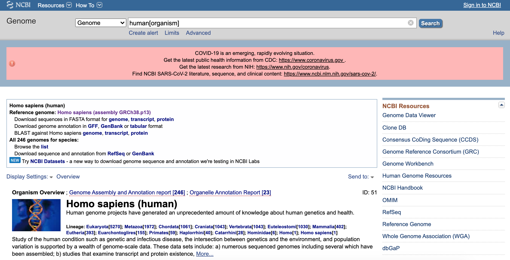
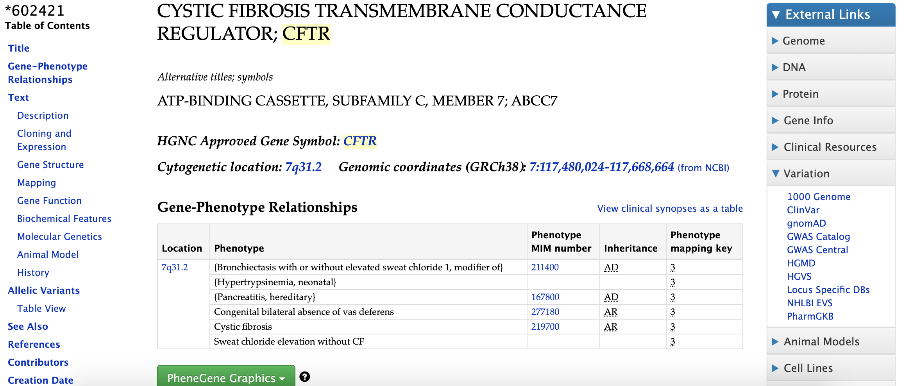
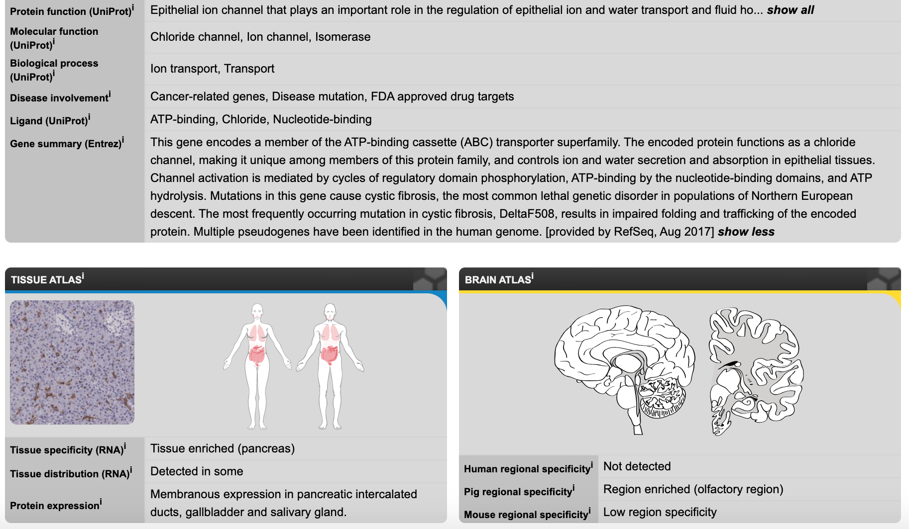
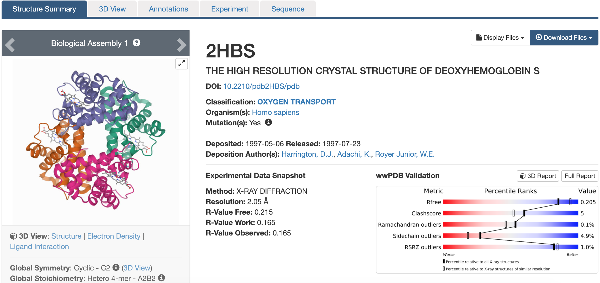

```{r setup, include=FALSE}
library(learnr)
knitr::opts_chunk$set(echo = FALSE)
```


<!---
Don't edit the Welcome page, it will be filled in automatically using the information from the YAML header
Edit the rest of the document as you like
There are some suggested sections to provide a standard order across our tutorials, but they may not all be needed/appropriate for all tutorials.
Section 1. Content 1 has example quizes and exercises
-->

## Welcome {.splashpage}

### `r rmarkdown::metadata$title`

<div class="splashpage-container">
  <figure class="splashpage-image">
  `r rmarkdown::metadata$image`{width=100%}
  <figcaption class="caption">`r rmarkdown::metadata$image_caption`</figcaption>
  </figure>

  `r rmarkdown::metadata$summary`
  

</div>


#### Learning Goals

```{r}
# Extract learning goals from YAML and add HTML tags to make an ordered list
learningGoals <- rmarkdown::metadata$learning_goals
learningGoals <- paste("<li>", learningGoals, "</li>", sep="", collapse="")

```

<ol>
`r learningGoals`
</ol>

#### Authors:

```{r}
# Extract authors from YAML and add HTML tags to make a list
authorList <- rmarkdown::metadata$author
authorList <- paste("<li>", authorList, "</li>", sep="", collapse="")

```

<ul>
`r authorList`
</ul>


```{r}
# Extract the tutorial version from the YAML data and store it so we can print it using inline r code below.  This can't be done directly inline because the code for extracting the YAML data uses backticks
tv <- rmarkdown::metadata$output$`learnr::tutorial`$version
```

#### Version: `r tv`

## Introduction

The process of scientific discovery involves a great deal of collaboration.  Different people do different experiments and find out different small pieces of the puzzle, and as we bring the information together we start to understand the big picture.  This is true for expert scientists as well as beginners - we all need a way to find out what other people have already learned, and to share any new information we discover.

An important part of collaboration is **sharing the data we collect** with each other.

Recent technologies have allowed us to collect huge amounts of biological data.  What kinds of data?

- Genomic DNA sequences of many organisms
- Gene activity across different organisms, tissues, and cell types
- Protein structures
- Enzymatic reactions and metabolic pathways
- Orthologs (genes that have similar sequences and functions across different organisms)

**Biological databases** are a way for scientists to organize and share their data.  Most of this data is publicly available, if you know where to look.  We’ll take a quick look at some important biological databases to give you an idea of what’s out there.

#### Heads up:

Many biological databases have websites for accessing the data.  However, they are not always the most intuitive and user-friendly.  It can be a bit overwhelming trying to explore these databases and understand the huge wealth of information they provide, even for experienced scientists.  Don’t be afraid to ask for help!

We will now take a quick tour of some important biological databases and see the types of information they have available.

## GenBank (Genomes)

The DNA sequence of the genomes for many important organisms can be found in the [GenBank](https://www.ncbi.nlm.nih.gov/genbank/) database.  GenBank is maintained by the National Center for Biotechnology (NCBI).

Here is the entry for the [human genome](https://www.ncbi.nlm.nih.gov/genome/?term=human[organism]).

{width=100%}


If you wanted, you could download it yourself!  It wouldn’t make much sense to look at, it’s just a long series of A, T, C, and G.  We need other computer programs and more research to help us make sense of the DNA sequence.  But it is freely available for anyone to access.

GenBank has many other sequences - whole genomes, individual genes, and partial sequences from many different organisms.

As you can see from the image, NCBI is maintaining a collection of resources for research on the novel coronavirus.

## OMIM (Genes)

As genes are discovered, the scientists who discover them get to name them and give them a gene symbol. Usually the gene name tells you something about what the gene does. This system works pretty well, but sometimes there are problems - two scientists might both discover the same gene and give it two different names, or there might be two genes with similar functions that are given the same name. In order to keep accurate track of all these genes, each gene is given a unique ID number.

There are a few databases (including GenBank) that act as central repositories for genes from all organisms.  Then there are databases focused on individual organisms or specific categories of genes.  One of the challenges of bioinformatics is keeping track of all the available information and matching up information from different databases.

One example of an organism-specific database is the [Online Mendelian Inheritance in Man (OMIM)](https://www.omim.org/) database.  This database stores information about human genes and the diseases caused by mutations in these genes.

Here is the entry for [CFTR](https://www.omim.org/entry/602421), from OMIM.  Mutations in CFTR lead to cystic fibrosis:

{width=100%}


The top of the page lists the gene symbol and its location in the human genome, as well as phenotypes associated with the gene (how it affects the organism, including causing cystic fibrosis).  If you scroll further down, it has much more information about what we know about the gene, what research has been done, and how studies are being carried out in other organisms to help us understand this gene.

## Human Protein Atlas (Gene Activity)

Besides just knowing gene sequences and location in the genome, scientists are interested in gathering data about where and when those genes are active (“expressed”).  Knowing when and where a gene is active can help us figure out what it does.  The [Human Protein Atlas](https://www.proteinatlas.org/) is one database that collects gene expression data for human genes.

Here is the expression data for [CFTR](https://www.proteinatlas.org/ENSG00000001626-CFTR):
{width=100%}


This screenshot is scrolled down a bit from the top of the page so you can see the expression data summary.  As you can see, the CFTR gene is enriched in the pancreas, and is also expressed in a few other locations.  It was not detected in the brain.  If you click on either of these expression summaries you can get more detailed information.  Further down on the page there is also information about subcellular localization (where in the cell is it located).

## PDB (Protein Structures)

Studying the structure of proteins can tell us something about how they work, or about what goes wrong when they don’t work.  For example, sickle cell anemia is caused by a single mutation in a gene for a subunit of hemoglobin.  This mutation causes the hemoglobin to stick together, forming long fibers that deform red blood cells.

The [Protein Data Bank (PDB)](https://www.rcsb.org/) stores information about the structure of proteins.  Here is the entry for [Hemoglobin S](https://www.rcsb.org/structure/2hbs) (the sickle-cell form of hemoglobin) from PDB:
{width=100%}


Here you can view the structure and see information about how it was obtained, including what experimental methods were used and some statistics about how accurate we think the structure is, as well a link to the journal article for the structure.

If you click on the 3D View tab you will see an interactive model that you can rotate, zoom in, and select specific amino acids.  You can also download the structure, though you will need a program that knows how to interpret it in order to make much use of it.  

## Knowledge Check

```{r database-quiz, echo=FALSE}
quiz(caption="Where would you go to find...",
  question("The sequence of the *E. coli* genome?",
    answer("GenBank", correct = TRUE),
    answer("OMIM"),
    answer("Human Protein Atlas"),
    answer("PDB"),
    allow_retry=TRUE
  ),
  question("What diseases are related to the insulin gene?",
    answer("GenBank"),
    answer("OMIM", correct = TRUE),
    answer("Human Protein Atlas"),
    answer("PDB"),
    allow_retry=TRUE
  ),
  question("Where in the body dopamine receptors are expressed?",
    answer("GenBank"),
    answer("OMIM"),
    answer("Human Protein Atlas", correct=TRUE),
    answer("PDB"),
    allow_retry=TRUE
  ),
  question("The structure of the SARS-CoV-2 (COVID-19) spike protein",
    answer("GenBank"),
    answer("OMIM"),
    answer("Human Protein Atlas"),
    answer("PDB", correct=TRUE),
    allow_retry=TRUE
  )
)
```

## Summary

- Biological databases make vast amounts of scientific research freely available to anyone.
- Different databases can hold many different types of data including genome sequences, gene functions and roles in diseases, gene expression, and protein structure.
- Biological databases can be a bit overwhelming to explore.  Focus on finding the information you're interested in, and don't be afraid to ask for help if you get stuck.
