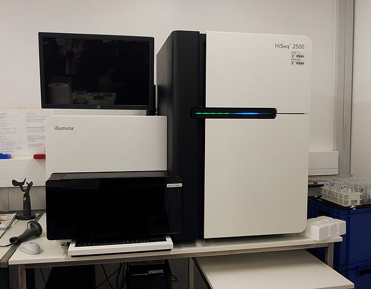
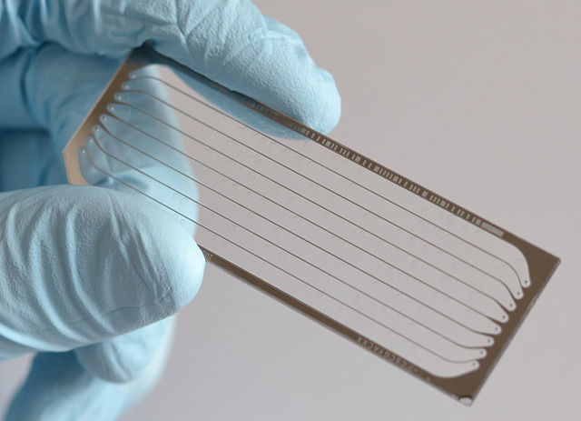

```{r setup, include=FALSE}
library(learnr)
knitr::opts_chunk$set(echo = FALSE)
```


<!---
Don't edit the Welcome page, it will be filled in automatically using the information from the YAML header
Edit the rest of the document as you like
There are some suggested sections to provide a standard order across our tutorials, but they may not all be needed/appropriate for all tutorials.
Section 1. Content 1 has example quizes and exercises
-->

## Welcome {.splashpage}

### `r rmarkdown::metadata$title`

<div class="splashpage-container">
  <figure class="splashpage-image">
  `r rmarkdown::metadata$image`{width=100%}
  <figcaption class="caption">`r rmarkdown::metadata$image_caption`</figcaption>
  </figure>

  `r rmarkdown::metadata$summary`
  

</div>


#### Learning Goals

```{r}
# Extract learning goals from YAML and add HTML tags to make an ordered list
learningGoals <- rmarkdown::metadata$learning_goals
learningGoals <- paste("<li>", learningGoals, "</li>", sep="", collapse="")

```

<ol>
`r learningGoals`
</ol>

#### Authors:

```{r}
# Extract authors from YAML and add HTML tags to make a list
authorList <- rmarkdown::metadata$author
authorList <- paste("<li>", authorList, "</li>", sep="", collapse="")

```

<ul>
`r authorList`
</ul>


```{r}
# Extract the tutorial version from the YAML data and store it so we can print it using inline r code below.  This can't be done directly inline because the code for extracting the YAML data uses backticks
tv <- rmarkdown::metadata$output$`learnr::tutorial`$version
```

#### Version: `r tv`

## Introduction

### Preface
Recent developments in sequencing technology, often referred to as “next-generation sequencing” have been revolutionizing biological research.  Next-gen sequencing allows us to collect millions of DNA sequences from a biological sample.  These large quantities of sequence data let us ask new kinds of questions about genome organization, evolution, gene activity, disease progression, and microbial populations, to name just a few areas of research.

In order to understand and interpret these large quantities of sequencing data, scientists must turn to computers.  When biologists use computer science to answer questions about biology, usually related to macromolecules (e.g. RNA, DNA, proteins, metabolites), it is called **bioinformatics**. As scientists continue to collect more and more data, the field of bioinformatics continues to grow.

### What is bioinformatics?

The following video gives some insight into what exactly bioinformatics is and what it’s useful for.


### Overview of a next-generation sequencing project

There are 3 major components of a next-gen sequencing project:

1. **Sample collection**: collecting the material (DNA or RNA) from the organisms.  This might mean collecting a water sample from a lake, collecting a blood sample from a patient, or dissecting the intestines out of a fruitfly.
    + This is sometimes called the "*in vivo*" part of the process because it takes place in a living organism - "vivo" is Latin for "life".
    + Some sequencing projects actually involved extracting material from deceased organisms (like sequencing the Neanderthal genome).  But most involve collecting samples from living organisms.
2. **Sequencing**: The DNA or RNA goes through a series of steps to prepare it for sequencing, and then its sequence can be read by special sequencing machines.
    + This is sometimes called the "*in vitro*" part of the process, because it is done in test tubes and similar equipment - "vitro" is Latin for "glass".  You may have heard of "in vitro fertilization".  Scientists and doctors use the phrase "in vitro" to mean processes done in the lab as opposed to in a living organism.
3. **Computational Analysis**: Once the sequences have been read, computers are used to analyze the sequence data.  This might involve counting the number sequences from different genes, or looking for mutations.  Genomes are much too long for a human to read themselves, so scientists have developed computer programs to help.
    + This is sometimes called the "*in silico*" part of the process, since it is done on a computer and computers use silicon chips.  This is a bit of a joke - *in vivo* and *in vitro* are Latin phrases that have been used in science for decades.  "*In silico*" is not a real Latin phrase, just scientists having fun :)
    
## *In vivo* - Sample Collection

All sequencing projects start with biological samples.  It’s important to keep this in mind, as you think about a sequencing project.  What sorts of challenges and quirks might arise from the sample collection process?

There are two basic parts to sample collection:

1. **Prepare the organisms**.  This is the "experiment" part of the process, where you set up the conditions you want to compare.  This could involve things like:
    + Feeding mice different diets
    + Genetically engineering a fruit fly to "turn off" a gene (so you can study what happens when that gene is not functioning)
    + Recruiting human volunteers to give a blood sample
2. **Collect the samples**.  This is the practical process of obtaining the material for sequencing.  This could involve things like:
    + Collecting feces samples from your mice.
    + Dissecting fruit flies to obtain the tissue that you want to study
    + Collecting blood samples from your volunteers

Once you’ve collected the samples, you will need to do some preparation before you send them off for sequencing.  This usually involves a "DNA extraction" or "RNA extraction" procedure, and may also involve some additional steps to clean up the sample and make sure you sequence what you want to sequence.  For example:

+ If you’re studying RNA, you often need to remove ribosomal RNA because there is so much of it that it gets in the way.  (80% of a cell’s RNA might be ribosomal!)
+ If you have a microbiome sample, you may need to remove the host DNA - if you want to sequence the bacteria from the mouse gut, you don’t want to have a bunch of mouse DNA getting in the way

Once you’ve got a clean DNA or RNA sample, it can be sent off to a sequencing facility.

## *In vitro* - Next-Gen Sequencing

There are a few methods for next-gen sequencing, but we will focus on Illumina sequencing.

<figure style="margin-bottom: 1em">
    
    
    <figcaption class="caption"> **Left:** Illumina HiSeq 2500 by Konrad Förstner, 3 December 2013. License: Creative Commons CC0 1.0 Universal Public Domain Dedication. **Right:** Next generation sequencing slide by Bainscou, 7 April 2015. License: Creative Commons Attribution 3.0 Unported</figcaption>
</figure>
 
Illumina Sequencing uses a method called sequencing by synthesis. To prepare a sample for sequencing, the DNA is first fragmented into 100-200bp pieces and special adapters are attached to the ends of the fragmented DNA. These adapters will be important for sequencing the DNA. At this point, the samples are usually sent off to a facility that has an Illumina Sequencer machine (left image).

At the sequencing facility, the sample is loaded into a lane on a special glass chip (right image). The chip is covered with millions of DNA sequences complementary to the special adapters. This complementarity will allow the adapters on the sample DNA fragments to hybridize with the DNA molecules in the lane. The chip, which can hold up to eight samples, is then loaded into an Illumina Sequencing machine. Through a process known as bridge amplification, each individual DNA fragment is amplified. This step is important to increase the signal from each sample DNA fragment to the computer, which cannot detect a single DNA molecule. The final result is 150 million clusters of DNA molecules, one for each of the original DNA fragments.

Now, we can finally start sequencing the DNA fragments. To identify each base of the sequence, the four DNA nucleotides (A, T, G, C) are labeled with a different color. The first base is added to each of the millions of clusters.  A special camera is used to detect the color for each cluster, and the computer records the first base identity for all the clusters. Then a second base is added to every cluster, the camera detects the second color, and the computer records the second base. This continues for 50-100bp. This process is known as sequencing by synthesis. One lane can produce **up to 150 million short sequences**, each corresponding to one cluster in the lane. Once the sequencing is complete, the data is sent back to the scientists for analysis.

The process of Illumina Sequencing can be difficult to conceptualize. Watch the video below to view an animation of the process:


```{r sequencing-questions, echo=FALSE}
quiz(caption="Illumina sequencing",
  question("How does an Illumina sequencer determine whether a base is an A, T, C or G?",
    answer("Each nucleotide has its own color", correct=TRUE),
    answer("It adds only one base at a time"),
    answer("The size of a DNA fragment"),
    answer("Chain termination"),
    allow_retry = TRUE,
    random_answer_order = TRUE
  ),
  question("What method of sequencing does Illumina use?",
    answer("Sequencing by synthesis", correct=TRUE),
    answer("Bridge amplification"),
    answer("Polymerase Chain Reaction"),
    answer("Chain termination sequencing"),
    allow_retry = TRUE,
    random_answer_order = TRUE
  )
)
```


## *In silico* - Computational Analysis

Back at the lab, scientists use computational methods to make sense of the millions of sequences, called **reads**.  There are many methods of data analysis that can be used, depending on the project.

### Read Alignment

In many projects, the first step of analysis is to match the reads up with the full genome of the organism and figure out where they came from.

Sequencing reads are a bit like short phrases (reads) from a whole book (the genome).  In order to understand what they mean, we need to find where in the book they came from.


### Counting

Perhaps the most common type of sequencing analysis involves counting the number of reads that come from particular genes (or other regions of the genome).

Some examples of questions you could address with read counting analysis include:

- What genes are active in healthy vs. diseased tissues?
- Where does a regulatory protein bind to the genome?
- How many and which species of bacteria are found in an environmental sample?

Counting reads involves a few basic steps; the details will vary depending on the project:

**Preparation**:

1. *Align* the reads to the genome (find where in the genome they came from)
1. *Annotate* the genome (define what regions we care about counting)
    + Often this has already been taken care of.  For example, you can download annotations of the human genome that list all the known genes.  
1. *Bin and count* the reads (for each read, determine what region it belongs to, then count how many reads belong to each region)
    + For example, what gene did it come from?

**Data Exploration**

This is the exciting part!  Once you’ve binned and counted the reads, then you can start trying to figure out what they mean.  There are a wide range of techniques for exploring the data and new ones are constantly under development.  Here are a few examples of things you could do if your sequencing project was measuring gene activity:

- Look at a specific gene you’re interested in, and see if there are more reads from that gene in particular samples
- Sort the data to find the genes with the most reads
- Run statistical tests to find which genes are "most different" between the samples

### Other types of analyses

There are many other types of sequence analysis projects that we will not discuss in detail here.  Here are a few examples:

- As mentioned above, you can count the number of genes from different types of bacteria in an environmental sample.  You can use this to estimate how many and what types of bacteria are in that sample.
- You can look for mutations, perhaps to understand what causes a disease, or to find out why some plants are better at withstanding drought.
    - Like counting, mutation analysis starts by aligning the reads to a genome.  Once we know where the read came from, we can check to see if the sequence is different.

## Summary

- Next-generation sequencing has provided vast amounts of new data and new ways to conduct biological research
- Bioinformatics is the process of using computers to analyze biological data
- A sequencing project has 3 basic parts:
    1. Sample collection
    2. Sequencing
    3. Computational Analysis
