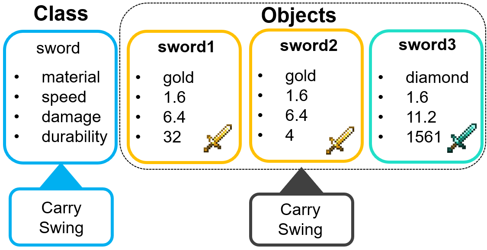
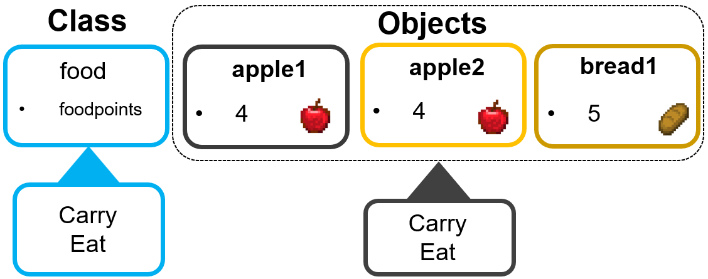
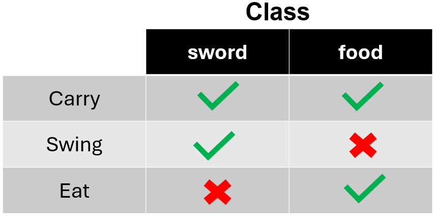

```{r setup, include=FALSE}
#Load learnr
library(learnr)
knitr::opts_chunk$set(echo = FALSE)
tutorial_options(exercise.completion=TRUE) #Uncomment to enable 

my_special_number <- 8084
super_vector <- c(888, 8084, 7, 33, 4, 624, 824, 808)

#Uncomment exercise timelimit when deployed
tutorial_options(exercise.timelimit = 180)


```


<!---
Don't edit the Welcome page, it will be filled in automatically using the information from the YAML header
Edit the rest of the document as you like
There are some suggested sections to provide a standard order across our tutorials, but they may not all be needed/appropriate for all tutorials.
Section 1. Content 1 has example quizes and exercises
-->

## Welcome {.splashpage}

### `r rmarkdown::metadata$title`

<div class="splashpage-container">
  <figure class="splashpage-image">
  `r rmarkdown::metadata$image`{width=100%}
  <figcaption class="caption">`r rmarkdown::metadata$image_caption`</figcaption>
  </figure>

  `r rmarkdown::metadata$summary`
  

</div>


#### Learning Goals

```{r}
# Extract learning goals from YAML and add HTML tags to make an ordered list
learningGoals <- rmarkdown::metadata$learning_goals
learningGoals <- paste("<li>", learningGoals, "</li>", sep="", collapse="")

```

<ol>
`r learningGoals`
</ol>

#### Authors:

```{r}
# Extract authors from YAML and add HTML tags to make a list
authorList <- rmarkdown::metadata$author
authorList <- paste("<li>", authorList, "</li>", sep="", collapse="")

```

<ul>
`r authorList`
</ul>


```{r}
# Extract the tutorial version from the YAML data and store it so we can print it using inline r code below.  This can't be done directly inline because the code for extracting the YAML data uses backticks
tv <- rmarkdown::metadata$output$`learnr::tutorial`$version
```

#### Version: `r tv`

## Introduction

...

  
## What is R?

R is a free, open-source computing language used for a wide variety of projects. It is often a more powerful and faster tool than working with Google Sheets or Excel and can generate beautiful professional figures. Even this module you are running now is using R!

Figure [Some examples of what R can do:]

Why have we chosen to use R?

- **R is free and open source**: That means no cost to you and a thriving community of developers who are eager to provide support for the tools they've developed.
- **Many different fields use R**: Ecologists, geneticists, public health experts, educators, and of course, computer scientists. Even if you decide to leave biology and pursue a different field you will have a versatile programming language under your belt.
- **R is easy to learn and use**: Some languages are harder to learn than others. Because R is used by a lot of people who don't necessarily have an extensive background, the syntax of R is relatively straightforward. While anyone's first language (if this is yours) comes with a learning curve, we will provide you with code templates to use that you can easily translate to English. 


## R as a calculator

This code block below is for you to test out R.
Let's try give it a simple command to start. We'll have R do some basic addition for us. We've put in 3 * 4, but you can put in any basic math expression:

- Addition: `5+5`
- Subtraction: `5-3`
- Multiplication: `2*3`
- Division: `4/2`
- Raising to a power: `2**3` or `2^3`
- Taking a log (natural log by default): `log(5)`

```{r calculator, exercise=TRUE, echo=FALSE}
5+5
```

## Storing data in objects

R can do math, but we want to use it for more than just a calculator. We can have R remember things by storing them in objects. An **object** is a unit of a specific kind of data. We will try it out first then explain this in more detail.
We can tell R to store something in an object with **<-**. The following code says:

*"Store the number 7 (or your number of choice) in an object called my_favorite_number."*

Then we ask R to show us what is in an object (my_favorite_number) by calling the object by its name:

*"Show me what is in the object called my_favorite_number."*

Notice that if there is a # this is a comment. The code after # is ignored when the code block is run.

```{r my_fav_number, exercise=TRUE, echo=FALSE}
#Store the number 7 (or your number of choice) in an object called my_favorite_number.
my_favorite_number <- 7
#Show me what is in the object called my_favorite_number.
my_favorite_number
```

R should have returned your favorite number!

We can also use the object in our calculations (add, subtract, multiply, divide, etc). Try it out below. Even after doing some math, notice that the contents of my_favorite_number haven't changed when we call it again by name. If we wanted to store the result, we would have to put it in a new object (my_new_number).

We can also use the two objects (my_favorite_number and my_new_number) to do math!

```{r my_new_number, exercise=TRUE, echo=FALSE, exercise.setup="my_fav_number"}
my_favorite_number + 5
my_favorite_number

my_new_number <- my_favorite_number + 5
my_new_number

my_favorite_number * my_new_number
```

Let's practice with objects.
I have prepared an object, my_special_number. Answer the questions below by interacting with my_special_number.

```{r my_special_number, exercise=TRUE}

```

```{r my_special_number_quiz}
quiz(caption = "About my_special_number:",
  question_numeric("What is my special number?",
    answer(8084, correct = TRUE),
    allow_retry = TRUE
  ),
  
  question_numeric("What is my special number multiplied by 5?",
    answer(40420, correct = TRUE),
    allow_retry = TRUE
  ),

  question("Is my_special_number case sensitive? Try calling it with MY_SPECIAL_NUMBER and find out.",
    answer("Case sensitive", correct=TRUE),
    answer("Not case sensitive"),
    allow_retry = TRUE,
    random_answer_order = TRUE
  )
)

```


## Classes and objects

What is an object really? An **object** is:

  - A unit of a specific kind of data
  - An "instance" (an occurrence) of a class

A **class** is a blueprint for an object. It tells us what kind of data the object can store and what the object can do. 

{width=70%}

Have you ever played Minecraft or some other video game? Video games are chock full of classes and objects. 

The class, sword, defines what data every sword in the game must have:

  - A material the sword is made of
  - The swing speed of the sword
  - The damage the sword does
  - A durability score

When we are playing the game and we create a sword, the game uses that class to generate a new sword with the given specifics. A sword cannot be created without these four data fields. When a new sword is created, we say it is an instance (an occurrence) of a class - it has been created from the sword class and now exists in the game environment.

Note also how each sword has its own unique id (sword1, sword2, sword3) that allows the game to differentiate between swords even if their material, speed, damage, and durability were the same. If this were not the case, every time you swung a gold sword, the durability of ALL the gold swords would go down, not just the one you were holding.

Finally, notice that the sword class says a sword can be either:

  - Carried
  - Swung
  
Let's compare this to another class, food.

{width=70%}

Every food must have a value for foodpoints. 
The food class says a food can be either:

  - Carried
  - Eaten

{width=60%}

Swords and food can both be carried, but only swords can be swung and only food can be eaten. This is a great example of how a class can define what their objects can do and how different classes and their objects are good at doing different things.

The object my_favorite_number from the last section was of the *numeric* class, which allows it to be used in calculations with other numbers and other members of the numeric class.

But if we have a situation where we try to add a number to a *string* of letters, we will get an error.

```{r my_special_number_vs_my_name, exercise=TRUE, exercise.setup="strings"}
my_word <- "cheers"
my_special_number + my_word 

```


## Strings

Data held in strings or character data (example: "Hello World") is kept within double quotes. The object my_word from the previous section contains a string.

```{r strings, exercise=TRUE}
my_word <- "cheers"
my_word
```

We will be using strings often in R. Be careful when you are copying and pasting from an outside program. R quotations (straight) look different from regular quotations (more curved). In the code block below, the quotations on line 1 are correct. The quotations on lines 2 (wrong quotations) and 3 (incomplete start and end) are wrong. 

Keep this in mind for the future if you are pasting code from somewhere else and check that all your quotations have a matching front and end!

Run the code and see what happens:

```{r quotation_difference, exercise=TRUE}
"Hello world"

“Hello world”

"Hello world
```


## Vectors (lists)

In R, lists of things of the same type are called vectors.
One of the things that makes R better than a standard calculator is that it can perform operations on whole lists of numbers. 

We can create a vector using the `c` command (short for "combine"). In this example, we store it in the object my_vector.

```{r my_vector, exercise=TRUE}
my_vector <- c(1, 6, 13, 7, 2)
my_vector
```

We can then do math on this whole list of numbers. Multiplying my_vector by 2 multiplies each number in the vector by 2:

```{r my_vector_calculate, exercise=TRUE, exercise.setup="my_vector"}
my_vector * 2
```

We can also mathematically combine two (or more) vectors if they hold the same kind of data (in this case, numerical).  If you add two vectors together, the first number of each vector get added together, then the second numbers get added together, and so on:

```{r add_vectors, exercise=TRUE}
vector1 <- c( 1, 3, 5, 7, 1)
vector2 <- c(1, 9, 3, 1, 1)
vector1 + vector2
```

## Functions ()

A **function** is a pre-defined method in R that can do *something* with a given, specific input. Do you remember the sword class from the section Classes and objects? We spoke about how a sword can be carried and swung. These are our methods or functions that the sword can interact with!


{width=70%}


**A function in R is defined with parentheses ( ).**

We can use the following functions on numerical vectors:

* `sum(my_vector)`
* `mean(my_vector)`
* `median(my_vector)`
* `length(my_vector)` 

I have prepared a vector in an object called super_vector. Use super_vector and the functions above to answer the questions. Try them in the code block below.

```{r vector_functions, exercise=TRUE}
my_vector <- c(1, 6, 13, 7, 2)
```

The `summary` function is a convenient way to calculate several of these summary statistics all at once:

```{r vector_summary, exercise=TRUE}
my_vector <- c(1, 6, 13, 7, 2)
summary(my_vector)
```

I have prepared a vector in an object called super_vector. Use super_vector and the functions above to answer the questions.

```{r super_vector, exercise=TRUE}

```

```{r super_vector_quiz}
quiz(caption = "Playing with super_vector",
  question("What is inside super_vector? HINT: Call super_vector by its name to check the super_vector object",
    answer("888, 8084, 7, 33, 4, 624, 824, 808", correct = TRUE),
    answer("123, 456, 789, 101112"),
    answer("1, 2, 3, 4, 5, 6, 7, 8, 9"),
    answer("73, 21, 3, 901, 82, 1883, 444"),
    allow_retry = TRUE,
    random_answer_order = TRUE
  ),
  
  question("What is the length of super_vector?",
    answer("8", correct=TRUE),
    answer("4"),
    answer("9"),
    answer("6"),
    answer("13"),
    allow_retry = TRUE,
    random_answer_order = TRUE
  ),

  question("What is the mean of super_vector?",
    answer("1409", correct = TRUE),
    answer("8084"),
    answer("7"),
    answer("87.9"),
    allow_retry = TRUE,
    random_answer_order = TRUE
  )
)

```


## Summary

...


## R codes

#### Exploring data with base R commands
- **head**: A base R function that gives you the first part of a called object
  - head(my_object) 
  - head(colnames(otu_table(miso)))
  - "Look into the object called miso and find the otu_table, then look at the column names   and give me the head (first part) of the column names"
  
- **tail**: A base R function that gives you the last part of a called object
  - tail(my_object)
  
- **colnames()**: A base R function that gives you the column names of a given data frame
  - colnames(my_data_frame)
  
- **rownames()**: A base R function that gives you the row names of a given data frame
  - rownames(my_data_frame)
  
- **unique()**: A base R function that lets you filter only the unique values of a given data frame

- **ls.str()**: A base R function that will list out all the objects available to you in your environment. In this module, each code block is its own environment.


## FAQ

## Common errors

## Works Cited

- Aden-Buie G, Schloerke B, Allaire J, Rossell Hayes A (2023). learnr: Interactive Tutorials for R. <https://rstudio.github.io/learnr/>, <https://github.com/rstudio/learnr>

- R Core Team (2024). R: A Language and Environment for Statistical Computing. R Foundation for Statistical Computing, Vienna, Austria.
  <https://www.R-project.org/>.
  
- Stoudt, Sara, Anthony D. Scotina, and Karsten Luebke. "Supporting Statistics and Data Science Education with learnr." Technology Innovations in Statistics Education 14.1 (2022).

- (?) Mojang, Minecraft. 2025 
