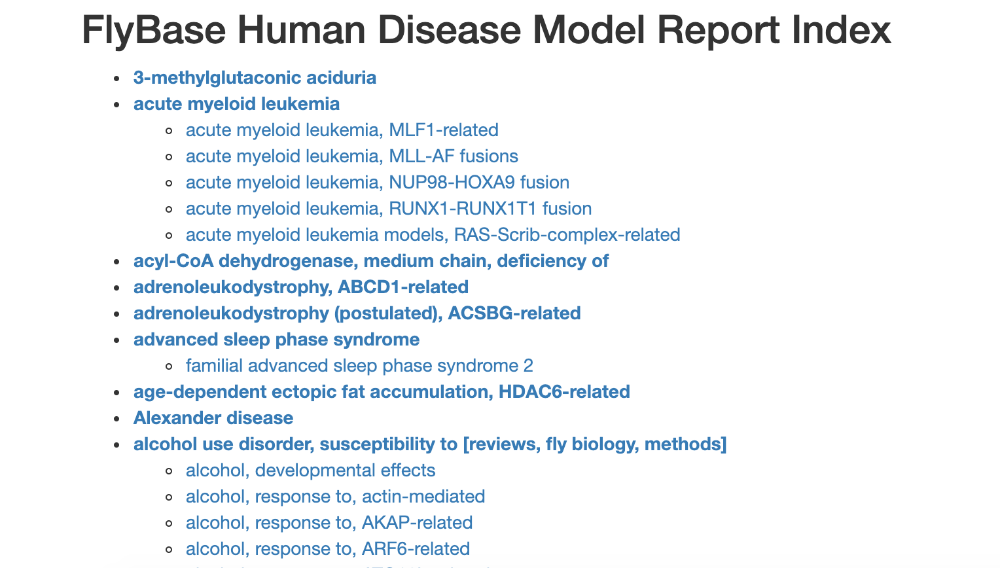

```{r setup, include=FALSE}
library(learnr)
knitr::opts_chunk$set(echo = FALSE)
```


<!---
Don't edit the Welcome page, it will be filled in automatically using the information from the YAML header
Edit the rest of the document as you like
There are some suggested sections to provide a standard order across our tutorials, but they may not all be needed/appropriate for all tutorials.
Section 1. Content 1 has example quizes and exercises
-->

## Welcome {.splashpage}

### `r rmarkdown::metadata$title`

<div class="splashpage-container">
  <figure class="splashpage-image">
  `r rmarkdown::metadata$image`{width=100%}
  <figcaption class="caption">`r rmarkdown::metadata$image_caption`</figcaption>
  </figure>

  `r rmarkdown::metadata$summary`
  

</div>


#### Learning Goals

```{r}
# Extract learning goals from YAML and add HTML tags to make an ordered list
learningGoals <- rmarkdown::metadata$learning_goals
learningGoals <- paste("<li>", learningGoals, "</li>", sep="", collapse="")

```

<ol>
`r learningGoals`
</ol>

#### Authors:

```{r}
# Extract authors from YAML and add HTML tags to make a list
authorList <- rmarkdown::metadata$author
authorList <- paste("<li>", authorList, "</li>", sep="", collapse="")

```

<ul>
`r authorList`
</ul>


```{r}
# Extract the tutorial version from the YAML data and store it so we can print it using inline r code below.  This can't be done directly inline because the code for extracting the YAML data uses backticks
tv <- rmarkdown::metadata$output$`learnr::tutorial`$version
```

#### Version: `r tv`

## Why fruit flies?

At first glance, fruit flies don’t look anything like humans.  But at a deep level, we share many anatomical structures, physiological systems, and developmental patterns.  Many *Drosophila* genes have parallels (“orthologs”) in humans that perform similar functions.

Studying fruit flies can give important insights into basic biological processes that are shared across many organisms.  Discoveries made in fruit flies have made important contributions to our understanding of genetics, development, aging, immunology, and neuroscience, to name just a few.  Fruit fly research is also being used to investigate many diseases, including Huntington’s disease, epilepsy, obesity, and Alzheimers. 

The following video highlights some of the reasons fruit flies make such great model organisms, and discusses an example of how a gene first discovered studied in fruit flies turned out to have an important role in polydactyly (having extra fingers or toes) and cancer.


## Meet *Drosophila melanogaster*

### Anatomy and Physiology

Almost every organ in humans has a match in flies, and the genes that control their development and functions are often shared across species.

](images/fly_human_organs.jpg){width=100%}

- **Eyes** - While *Drosophila* eyes are quite different from humans (*Drosophila* have compound eyes), the same genes that control development of fly eyes are involved in eye development in many species including frogs, mice, and humans.
- **Nervous system** - The central nervous systems of *Drosophila* and humans have a similar subdivision into a **brain** and **spinal cord** (ventral cord in *Drosophila*).  The **nerve cells** of *Drosophila* are quite similar to humans and many of the same genes are involved in their function.
- **Heart** - The structure of the *Drosophila* heart is different from a human, but they use the same mechanisms to control their heartbeats.  Both human and *Drosophila* heart cells have electrical properties that allow them to operate without being stimulated by the nervous system, and they both have **pacemaker cells** to regulate their heartbeat.
- **Digestive system** - The digestive systems of *Drosophila* and humans have similar organizations with regions that perform similar functions.  First is the **esophagus**,  which carries food to the **crop** (stomach in humans) where it is broken down.  Then the **midgut** (small intestine), and **hindgut** (large intestine) are responsible for absorbing the food so it can be used by the rest of the body.
- **Reproductive tract** - Like humans, *Drosophila* have **testes** which produce sperm and **ovaries** which produce eggs.

### Genetics

The *Drosophila* genome:

+ About 140 million bases in length
+ ~17,000 genes
    + About 60 percent of all human genes have orthologs in flies (retain the same function and came from a common ancestor)
    + About 75 percent of human disease-associated genes have orthologs in flies
+ 4 pairs of chromosomes:
    + 3 pairs of autosomes (non-sex chromosomes)
    + 1 pair of sex chromosomes.  Like humans, females have two X chromosomes, and males have an X and a Y chromosome.

There are many genetic tools and techniques available for Drosophila; here are just a few:

- **P-element transformation** - a technique that allows researchers to insert genes in the *Drosophila* genome
- **GAL4/UAS expression** - a technique that allows researchers to control expression of a gene, “turning on” the gene in a specific tissue or under specific conditions
- **Mutation libraries** - collections of fly strains where each strain has a mutation in a different gene

### Life Cycle
](images/fly_life_cycle.png){width=50%}


The *Drosophila* life cycle has 4 stages:

- **Egg** - Female *Drosophila* can lay hundreds of eggs!  When living in a vial, they will lay their eggs on the surface of the food.
- **Larva** - Larva look like worms.  When flies are living in a vial, you can see larvae at the bottom, crawling around on the surface of the food, and even burrowing into the food.
- **Pupa** - A larva constructs a hard shell around itself.  It will emerge a couple of days later as an adult fly (similar to a butterfly).  When flies are living in a vial, the larvae will crawl up and attach themselves to the sides of the vial before forming pupae.
- **Adult** - the familiar fruit fly.  When flies are living in a vial, the adults will flit around the vial, eating food from the bottom, flying around the top, and resting on the sides of the vial.  Flies are attracted to light, so if there is a directional light source, they will move towards it.

Under optimal conditions, the complete life cycle takes about 10 days.  With lower temperatures, less available food, or other unfavorable conditions the generation time will be longer.

## Working with *Drosophila*

So far we’ve talked about some of the advantages and characteristics of *Drosophila* as a model organism.  But what does it look like to actually work with *Drosophila* in the lab?  Here are a couple of videos demonstrating some day-to-day procedures in a fruit fly lab.

### “Fly flipping”
This video shows one of the most common tasks for fly maintenance - transferring flies to a fresh vial of food.  This is sometimes called “fly flipping” because it involves sliding the new vial over the old one and then flipping the vials over so the flies end up in the new vial.

Notice how she taps the vials on the lab bench to shake the flies down to the bottom of the vial before removing the stopper - this helps prevent the flies from escaping as she makes the transfer.


### Dissection
For many experiments, the fruit flies must be dissected in order to obtain the tissues we’re interested in studying.  The tissues might then be viewed under a high-power microscope, or have their DNA or RNA sequenced.

Dissecting a fruit fly is challenging, because it is so small!  Scientists use special tweezers with very thin tips (“fine forceps”) to manipulate the flies.  A dissecting microscope helps them see what they’re doing.  Carbon dioxide or ether is used to anesthetize the flies before the procedure.

The following video shows dissection of the reproductive tracts from *Drosophila*.  Similar processes can be used to collect other tissues, such as the gut or brain.  Don’t worry too much about the names for all the different organs mentioned in the video.  Focus on the overall procedure, and think about how this process of dissection is an essential part of many experiments.


## *Drosophila* disease models

There are hundreds of disease models that have been generated in *Drosophila* - you can see a list on the [FlyBase Disease Model](https://flybase.org/lists/FBhh/) page.

{width=80%}

There is even [a blog](http://flydiseasemodels.blogspot.com/) to help keep track of *Drosophila* disease model developments.

Many of these disease models are available through *Drosophila* Stock Centers - organizations that maintain collections of fly “strains” (distinct genotypes) and distribute them to researchers.  When a researcher develops a new fly strain, they can submit it to a stock center so that other researchers can use it.

## Summary

+ Fruit flies share many commonalities with humans including organs and organ systems, anatomical organization, and genes.
    + About 60 percent of all human genes, and about 75 percent of human disease-associated genes have orthologs in flies
+ Fruit flies have a short generation time, produce many offspring, and are easy to work with in the lab.  You can do lots of experiments without needing too much time or money.
+ Many important discoveries have been made using fruit flies
+ Fruit flies are used today for many types of research, from development to disease.  Many human diseases can be modeled and studied in fruit flies.
