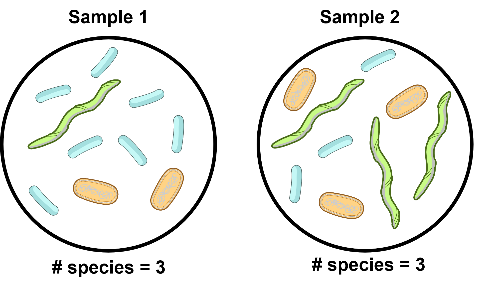
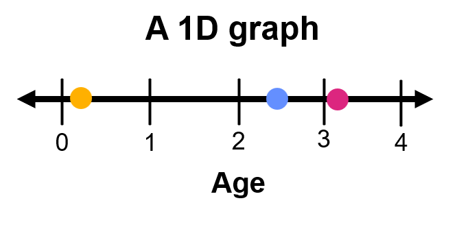
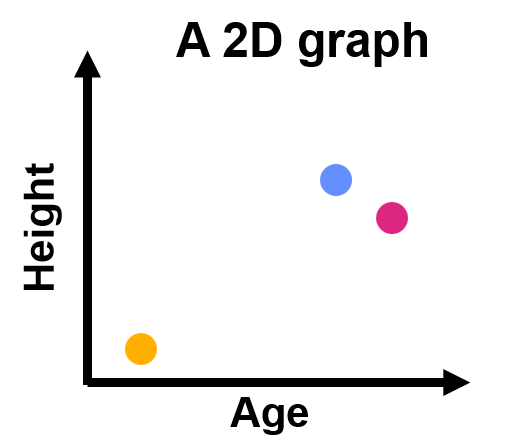
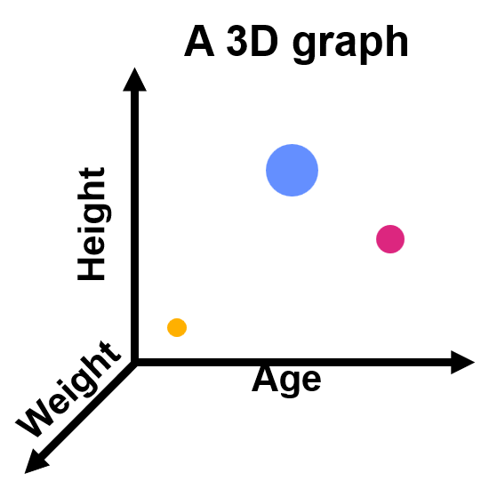

```{r setup, include=FALSE}
#Load learnr
library(learnr)
knitr::opts_chunk$set(echo = FALSE)
tutorial_options(exercise.completion=TRUE) #Uncomment to enable 

#Load libraries
library("tidyverse")
library("phyloseq")
library("DESeq2")

#Uncomment exercise timelimit when deployed
tutorial_options(exercise.timelimit = 360)

#Load MISO_16S.prop.RDS
#Normalized data from Leah Guthrie's original phyloseq object, miso2ps.rds
#Normalization by turning counts into proportions

# #Local path
#miso <- readRDS("MISO_16S.prop.clean.RDS")
#miso_counts <- readRDS("MISO_16S.clean.RDS")

#SciServer paths
miso <- readRDS( "/home/idies/workspace/c_moor_data/miso-16s/MISO_16S.prop.clean.rds" )
miso_counts <- readRDS("/home/idies/workspace/c_moor_data/miso-16s/MISO_16S.clean.rds")

# <!-- EXERCISE = should we see an interactive code chunk with this code? -->
# <!-- EVAL = should you run this code? -->
# <!-- ECHO = should you print the code? -->
# Significant_DEseq2_ASVs <-0
# sigtab<-0

Differential_Abundance <- function(x, y, z) {
  
 # Accept the input and give it a human friendly name
  my_DESeq2_object <- x
  my_comparision_list <- y
  my_pvalue <- z
  
  
  #Do the DESeq2 analysis
  my_DESeq2_object <- DESeq(my_DESeq2_object, test="Wald", fitType="parametric")
 
  #Change the contrast section to compare different variables and groups.
  res = results(my_DESeq2_object, cooksCutoff = FALSE, contrast= my_comparision_list)
  
  #Select only abundances with a p-value of z or below
  alpha = my_pvalue
  sigtab = res[which(res$padj < alpha), ]
  sigtab = cbind(as(sigtab, "data.frame"), as(tax_table(miso_counts)[rownames(sigtab), ], "matrix"))

  #Let's look at the OTUs that were significantly different between the two tissues. The following makes a nice ggplot2 summary of the results
  theme_set(theme_bw())
  scale_fill_discrete <- function(palname = "Set1", ...) {
    scale_fill_brewer(palette = palname, ...)
  }
  # Phylum order
  x = tapply(sigtab$log2FoldChange, sigtab$Phylum, function(x) max(x))
  x = sort(x, TRUE)
  sigtab$Phylum = factor(as.character(sigtab$Phylum), levels=names(x))
  
  # Class order
  x = tapply(sigtab$log2FoldChange, sigtab$Class, function(x) max(x))
  x = sort(x, TRUE)
  sigtab$Class = factor(as.character(sigtab$Class), levels=names(x))
  
  # Order order
  x = tapply(sigtab$log2FoldChange, sigtab$Order, function(x) max(x))
  x = sort(x, TRUE)
  sigtab$Order = factor(as.character(sigtab$Order), levels=names(x))
  
  # Family order
  x = tapply(sigtab$log2FoldChange, sigtab$Family, function(x) max(x))
  x = sort(x, TRUE)
  sigtab$Family = factor(as.character(sigtab$Family), levels=names(x))
  
  # Genus order
  x = tapply(sigtab$log2FoldChange, sigtab$Genus, function(x) max(x))
  x = sort(x, TRUE)
  sigtab$Genus = factor(as.character(sigtab$Genus), levels=names(x))
  
  # Species order
  x = tapply(sigtab$log2FoldChange, sigtab$Species, function(x) max(x))
  x = sort(x, TRUE)
  sigtab$Species = factor(as.character(sigtab$Species), levels=names(x))

  return(sigtab)
}


Differential_Abundance_Continuous <- function(x, y, z) {
  
 # Accept the input and give it a human friendly name
  my_DESeq2_object <- x
  my_name <- y
  my_pvalue <- z
  
  
  #Do the DESeq2 analysis
  my_DESeq2_object <- DESeq(my_DESeq2_object, test="Wald", fitType="parametric")
 
  #Change the contrast section to compare different variables and groups.
  res = results(my_DESeq2_object, cooksCutoff = FALSE, name=my_name)
  
  
  #Select only abundances with a p-value of z or below
  alpha = my_pvalue
  sigtab = res[which(res$padj < alpha), ]
  sigtab = cbind(as(sigtab, "data.frame"), as(tax_table(miso_counts)[rownames(sigtab), ], "matrix"))

  #Let's look at the OTUs that were significantly different between the two tissues. The following makes a nice ggplot2 summary of the results
  theme_set(theme_bw())
  scale_fill_discrete <- function(palname = "Set1", ...) {
    scale_fill_brewer(palette = palname, ...)
  }
  # Phylum order
  x = tapply(sigtab$log2FoldChange, sigtab$Phylum, function(x) max(x))
  x = sort(x, TRUE)
  sigtab$Phylum = factor(as.character(sigtab$Phylum), levels=names(x))
  
  # Class order
  x = tapply(sigtab$log2FoldChange, sigtab$Class, function(x) max(x))
  x = sort(x, TRUE)
  sigtab$Class = factor(as.character(sigtab$Class), levels=names(x))
  
  # Order order
  x = tapply(sigtab$log2FoldChange, sigtab$Order, function(x) max(x))
  x = sort(x, TRUE)
  sigtab$Order = factor(as.character(sigtab$Order), levels=names(x))
  
  # Family order
  x = tapply(sigtab$log2FoldChange, sigtab$Family, function(x) max(x))
  x = sort(x, TRUE)
  sigtab$Family = factor(as.character(sigtab$Family), levels=names(x))
  
  # Genus order
  x = tapply(sigtab$log2FoldChange, sigtab$Genus, function(x) max(x))
  x = sort(x, TRUE)
  sigtab$Genus = factor(as.character(sigtab$Genus), levels=names(x))
  
  # Species order
  x = tapply(sigtab$log2FoldChange, sigtab$Species, function(x) max(x))
  x = sort(x, TRUE)
  sigtab$Species = factor(as.character(sigtab$Species), levels=names(x))

  return(sigtab)
}

```


<!---
Don't edit the Welcome page, it will be filled in automatically using the information from the YAML header
Edit the rest of the document as you like
There are some suggested sections to provide a standard order across our tutorials, but they may not all be needed/appropriate for all tutorials.
Section 1. Content 1 has example quizes and exercises
-->

## Welcome {.splashpage}

### `r rmarkdown::metadata$title`

<div class="splashpage-container">
  <figure class="splashpage-image">
  `r rmarkdown::metadata$image`{width=100%}
  <figcaption class="caption">`r rmarkdown::metadata$image_caption`</figcaption>
  </figure>

  `r rmarkdown::metadata$summary`
  

</div>


#### Learning Goals

```{r}
# Extract learning goals from YAML and add HTML tags to make an ordered list
learningGoals <- rmarkdown::metadata$learning_goals
learningGoals <- paste("<li>", learningGoals, "</li>", sep="", collapse="")

```

<ol>
`r learningGoals`
</ol>

#### Authors:

```{r}
# Extract authors from YAML and add HTML tags to make a list
authorList <- rmarkdown::metadata$author
authorList <- paste("<li>", authorList, "</li>", sep="", collapse="")

```

<ul>
`r authorList`
</ul>


```{r}
# Extract the tutorial version from the YAML data and store it so we can print it using inline r code below.  This can't be done directly inline because the code for extracting the YAML data uses backticks
tv <- rmarkdown::metadata$output$`learnr::tutorial`$version
```

#### Version: `r tv`

## Phyloseq

In this module we'll do some more advanced analysis on our 16S data. Up until this point we have used R as a more efficient, more powerful tool compared to working in Google Sheets or Microsoft Excel. The analyses in this module would be exceptionally difficult to perform without a computational tool like R.

This module will use the following packages:

- [**phyloseq**](https://joey711.github.io/phyloseq/): A library that specializes in 16S microbial community data
- [**ggplot2**](https://ggplot2.tidyverse.org/): A library that is part of the tidyverse group of packages that will allow us to create great figures
- [**DESeq2**](https://github.com/thelovelab/DESeq2): A library made for performing differential expression analysis; we will be co-opting this function for a differential abundance analysis.

This module assumes that you have previously completed our "Exploring 16S data with phyloseq" module. We will be using the same data. Likewise, this tutorial assumes you have some previous exposure to working with R objects.


## Alpha diversity
<!-- Uses raw count data -->

We can measure the biodiversity by measuring each sample's alpha diversity (diversity within a sample) and comparing these measurements. We will use **Simpson's index** to calculate alpha diversity here. Simpson's alpha diversity measure is based on the number of unique ASVs and their proportion within the sample, taking into account which species are more dominant and which are more rare, with an emphasis on species evenness.

To make things easier for us, we will use the inverse Simpson's index, so that a higher number on the scale (0-1) means a higher alpha diversity.
  
{width=70%}
<p class=caption> **Species richness vs species evenness**: Although the number of species between the two samples is the same, sample 2 has a higher species evenness, where each species is represented more equally. Bacteria art from NIAID Visual & Medical Arts (42, 57, & 179). Figure by Sayumi York (March 27, 2025).</p>

We will do this using the plot_richness() function of phyloseq. We can customize the plot based on different metadata fields. If we don't want these extra fields, we can just delete them or add a hashtag (#) in front of them to comment them out. 

We will use non-normalized data in counts (miso_counts) as recommended by [McMurdie & Holmes (2014)](https://journals.plos.org/ploscompbiol/article?id=10.1371/journal.pcbi.1003531) for our alpha diversity and differential abundance analyses. 

Use the code below to plot alpha diversity for each individual (x = "subject"), and color by timepointgroup. If you get a warning message, you may ignore it and continue.

```{r plot_richness_example, exercise=TRUE, echo=FALSE}
plot_richness(miso_counts, x="subject", 
              color="timepointgroup", 
              shape="timepointgroup", 
          	  title ="fill in the blank",
              measures="InvSimpson")

```

Use the code below to subset the data using subset_samples() and make a new alpha diversity plot. The example below demonstrates how to subset data associated with females ("F") only, based on metadata variable 'gender', and make a new alpha diversity plot using the subsetted data. We could also use subset_taxa() to subset a specific taxa of interest. If you get a warning message, you may ignore it and continue.

```{r plot_richness_subset_example, exercise=TRUE, echo=FALSE}

subset <- subset_samples(miso_counts, gender == "F")

plot_richness(subset, x="timepoint", 
              color="phase", 
              shape="timepointgroup", 
          	  title ="fill in the blank",
              measures="InvSimpson")


```


```{r alpha_diversity_quiz}
quiz(caption = "Using plot_richness to plot alpha diversity",
  question("For subject S02, which timepointgroup has the HIGHEST alpha diveristy? HINT: the answer can be found in the alpha diversity plot where x = subject and color is by timepointgroup",
    answer("BD", correct = TRUE),
    answer("HD"),
    answer("WO"),
    allow_retry = TRUE
  ),

  question("What male subject has the data point for the LOWEST alpha diversity? HINT: Use subset_samples() to subset males, and specify individuals (subject) on x-axis of the alpha diversity plot.",
    answer("S06"),
    answer("S10", correct=TRUE),
    answer("S09"),
    answer("S19"),
    answer("S31"),
    allow_retry = TRUE,
    random_answer_order = TRUE
  )
)

```

---

### Try it out!

Use the example code blocks given below to make some alpha diversity plots!

```{r plot_richness_try_whole, exercise=TRUE, echo=FALSE}
plot_richness(miso_counts, x="subject", 
              color="timepointgroup", 
              shape="timepointgroup", 
          	  title ="fill in the blank",
              measures="InvSimpson")

```

```{r try_it_plot_richness, exercise=TRUE, echo=FALSE}

subset <- subset_samples(miso_counts, gender == "F")

plot_richness(subset, x="timepoint", 
              color="phase", 
              shape="timepointgroup", 
          	  title ="fill in the blank",
              measures="InvSimpson")

```

## Multidimensional analysis

### What is a multidimensional analysis?

{width=70%}
<p class=caption> **A 1D graph**: We have one dimension (age) to compare samples. Figure by Sayumi York (March 27, 2025).</p>

What does a one-dimensional graph look like? It's likely you use one every day although you may not think of it as a graph. Take for example, a ruler or the volume control on your computer. A one-dimensional graph simply graphs a measure of something with just one variable (ex. # of centimeters or volume measurement).

{width=70%}
<p class=caption> **A 2D graph**: We have two dimensions (age and height) to compare samples. Figure by Sayumi York (March 27, 2025).</p>

A two-dimensional graph is probably the graph you're most familiar with. A two-dimensional graph has an x-axis and a y-axis and it draws a relationship between the measurements on each axis to describe their relationship. For example, *y = mx + b* describes a linear relationship between a given x variable and its respective y variable.

{width=70%}
<p class=caption> **A 3D graph**: We have three dimensions (age, height, and weight) to compare samples. The size of the data points correlates to their z-axis. Figure by Sayumi York (March 27, 2025).</p>

How about a three-dimensional graph? A three-dimensional graph would have a z-axis, and would add depth. Data points would be plotted in a space, like a cube sticking out from your screen (here we are imagining the larger data points are closer to us). 

We hit some problems once we have a four-dimensional graph. We live in a 3-dimensional world (3D), so we would need to plot the graph on a fourth axis like time, shape, or color.

As you can imagine as we add on a fifth or sixth and beyond dimension things become even more complicated to graph and then interpret. But some experiments have more than one factor, and in genomics we often have many; one for each variable in our metadata and one for each ASV depending on what question we're asking.

We can tackle this challenge with a PCoA.


## PCoA

- **Objective**: Comparing the relationship between variables and how they relate to samples
- **Best for questions like**: What variables correlate with each other?
- **Example question**: How strong is the correlation between subject sex and caloric intake? What drives the difference in the "spread" of the data?

A Principal coordinates analysis (PCoA) is a multidimensional analysis that shrinks down your dimensions into groups called principal coordinates. Each principle coordinate (PC) is a collection of variables and their relationships, and the components are ordered by the amount of variation within the data set they explain. A PCoA then plots the data along two axes, each representing a PC and thus takes a multidimensional analysis and makes it so the results are visible in a 2D space!

Let's see it in action!

---

#### Step 1: Ordinate

The first step is to create a similarity matrix between all samples through the ordinate function. Every sample is compared to every other using the Bray-Curtis distance (a statistical measure); we have stored the data in a new object called miso.pcoa.

If you run the code and it seems like nothing happens, that is normal - ordinating the PCoA will not generate any kind of message.

```{r ordinate_PCoA, exercise=TRUE, echo=FALSE}
miso.pcoa <- ordinate(miso, method="PCoA", distance="bray")
```

---

#### Step 2: Plot PCoA

Now that we have our ordination, we use our original phyloseq object (miso) along with the ordination object (miso.pcoa) we created in the previous code block to create the graph.

Notice how we can ask R to color or change the shape of the data points based on a metadata column. And of course, we can't forget a title!

```{r plot_PCoA, exercise=TRUE, echo=FALSE, exercise.setup = "ordinate_PCoA"}
plot_ordination(miso, miso.pcoa, 
        color = "subject", 
        shape = "phase", 
        title="My PCoA")
```

The samples that are closer together are more similar in composition than samples far away from each other. For example, a closely associated group of datapoints in the upper left corner of the plot appears to be distinct from a closely associated group of datapoints in the lower left corner of the plot.

Each principal coordiate (PC) is a collection of relationships between the different variables in your dataset. Axis 1 represents PC1, which explains 16.7% of the variance in the dataset. Likewise, Axis 2 represents PC2, which explains 11.9% of variance in the dataset. If the percentage of a PC is very high, that means there are only a few factors that are really driving the relationship between the samples. If the percentage of PC is low (as is the case with our plot above) this suggests that many factors, not just a handful, are likely driving the relationship between the samples.

A PCoA is a complex analysis. It's okay if you still don't understand the principal coordinates themselves. Just focus on how close the samples are to each other.

#### Subsetting a PCoA

If we just change the field for color or shape, the PCoA plot itself won't change - only the appearance of the data point changes. If we want to do an PCoA with a given subset of samples, we need to create that subset and repeat the ordination too. Be careful with this, since R won't give you an error if you use the same ordination with a different phyloseq object so long as R notices the sample names match! 

The following code plots an PCoA to compare the composition of all ASVs with the phylum Firmicutes.

Just like before, you can subset your phyloseq object (miso) with subset_taxa() and subset_samples() to create variations of your PCoA.

```{r subset_PCoA, exercise=TRUE, echo=FALSE}
#Subset a group of interest
miso_subset <- subset_taxa(miso, Phylum == "Firmicutes")

#Ordinate based on your subset
miso.pcoa.subset <- ordinate(miso_subset, method="PCoA", distance="bray")

#Plot the new subsetted ordination with the subsetted phyloseq object
plot_ordination(miso_subset, miso.pcoa.subset, 
        color = "subject", 
        shape = "phase", 
        title="My subsetted (Firmicutes) PCoA")
```


<!-- Eigenvalues Tutorial?-->
<!-- Eigenvectors Tutorial? -->
```{r pcoa_quiz}
quiz(caption = "Creating and interpreting a PCoA plot",
    
     question("In a PCoA plot, samples that are farther apart...",
      answer("Have less in common than samples that are closer together", correct = TRUE),
      answer("Have more extreme compositions"),
      answer("Have more ASVs"),
      allow_retry = TRUE,
      random_answer_order = TRUE
     ),
     
     question("Looking at the PCoA with all data included, what other subject is subject 28 (purple, top) most similar to?",
      answer("S09", correct = TRUE),
      answer("S24"),
      answer("S18"),
      answer("S12"),
      answer("S32"),
      allow_retry = TRUE,
      random_answer_order = TRUE
    ),
     
    question("In a PCoA with only data from ASVs with the class Bacteroidia, what is the percent of variance in the dataset explained by principal coordinate 1? HINT: You will need to change the code subsetting phylum and Firmicutes",
      answer("22.5%", correct = TRUE),
      answer("12.8%"),
      answer("13.1%"),
      answer("6.2%"),
      answer("11.7%"),
      allow_retry = TRUE,
      random_answer_order = TRUE
    )
)

```
---

#### Try it yourself! - PCoA

Use the code blocks below to practice making an interpretting a PCoA of your choice.

```{r Try_it_PCoA_full, exercise=TRUE, echo=FALSE}

miso.pcoa <- ordinate(miso, method="PCoA", distance="bray")

plot_ordination(miso, miso.pcoa, 
        color = "subject", 
        shape = "phase", 
        title="My PCoA")

```

```{r Try_it_PCoA_subset, exercise=TRUE, echo=FALSE}
#Subset a group of interest
miso_subset <- subset_taxa(miso, Phylum == "Firmicutes")

#Ordinate based on your subset
miso.pcoa.subset <- ordinate(miso_subset, method="PCoA", distance="bray")

#Plot the new subsetted ordination with the subsetted phyloseq object
plot_ordination(miso_subset, miso.pcoa.subset, 
        color = "subject", 
        shape = "phase", 
        title="My subsetted (Firmicutes) PCoA")
```


## Differential abundance

- **Objective**: Compare the change in abundance/proportion of ASVs between samples
- **Best for questions like**: What ASVs showed the most change between samples?
- **Example question**: What ASVs changed the most between timepoint 1 and 2? What trends are there in the change in a given taxonomic group?

Differential abundance shows us the difference in abundance of ASVs between two conditions. We will be using the library DESeq2. You can see the application of DESeq2 for differential expression in our RNA-seq modules where was also talk about how to interpret the log fold change.

For this analysis, we will be using count data; DESeq2 will take into consideration the differences in total number of reads between samples for us. In this section we will show you the different parts of the code one by one and then combine them at the end as they all need to be **run in the same code block - the code won't work until then!**

---

### Step 1: Convert the phyloseq object to a DESeq2 object define an experimental design

The function phyloseq_to_deseq2 will take care of all the conversion of the data for us. What is important is that we tell DESeq2 what do with with the data.

The design field is where we put our factor of interest.

In this example, we are comparing samples between the groups of the variable timepointgroup (BD, HD, and WO).


```{r phyloseq_to_deseq2, exercise = TRUE, eval=FALSE}
my_miso_DESeq2 <- phyloseq_to_deseq2(miso_counts, design = ~ timepointgroup)
```

---

### Step 2: Tell DESeq2 which groups you want to compare

DESeq2 will only give you the results for one comparision at a time. For example, in the variable timepointgroup, we have to make a total of three comparisions if we wanted to make every possible comparision.

- BD vs HD
- HD vs WO
- WO vs BD

We'll just choose the last one for now.

```{r create_my_comparision, exercise=TRUE, eval=FALSE}
my_comparision <-c("timepointgroup", "WO", "BD")
```

---

### Step 3: Run the differential abundance analysis

We have created the function Differential_Abundance() for you to help skip some of the more complicated steps. As written, this function will show you all the ASVs that have a differential abundance with a p-value of 0.05 (5%) or below. If you require a different p-value, you can change the number. 

We store the results in a new object called Significant_DEseq2_ASVs.


```{r run_differential_abundance, exercise=TRUE, eval=FALSE}
Significant_DEseq2_ASVs<-Differential_Abundance(my_miso_DESeq2, my_comparision, 0.05)
```

---

### Step 4: View the ASVs with significant differential abundance

The Differential_Abundance() function has stored the ASVs with a differential abundance with a cut off at our chosen p-value or below in an object called Significant_DEseq2_ASVs. We can view the results by calling the name of the object. 

```{r significant_DEseq2_genes, exercise=TRUE, eval=FALSE}
Significant_DEseq2_ASVs
```

---

### Step 5: Plot our results in a ggplot

Change the value in x = to select what goes on the x-axis and change the value in color = to change how those values are labeled. For instance, we might plot a phylum on the x-axis and then color our data points by class. 

Note that this plot only uses the ASVs with a significantly different abundance between our groups. So if only see a few data points, the plot is working you just don't have that many ASVs with significantly different abundance between the groups in the comparison you chose.

```{r plot_deseq2, exercise=TRUE, eval=FALSE}
ggplot(Significant_DEseq2_ASVs, aes(x=Class, y=log2FoldChange, color=Class)) + geom_point(size=3) + 
  theme(axis.text.x = element_text(angle = -90, hjust = 0, vjust=0.5))
```

---

### The complete differential abundance code

Let's put it all together. Try run the analysis below.

```{r DESeq2_example, exercise=TRUE, echo=TRUE}
# STEP 1: Convert the phyloseq object to a DESeq2 object and tell R the experimental design 
my_miso_DESeq2 <- phyloseq_to_deseq2(miso_counts, design = ~ timepointgroup)

# STEP 2: Select the groups to compare
my_comparision <-c("timepointgroup", "WO", "BD")

# STEP 3: Run the differential abundance analysis at the chosen p-value
Significant_DEseq2_ASVs<-Differential_Abundance(my_miso_DESeq2, my_comparision, 0.05)

# STEP 4: Retrieve the list of ASVs with a significant difference in abundance between the chosen groups
Significant_DEseq2_ASVs

# STEP 5: Plot the results with your chosen x axis and legend
ggplot(Significant_DEseq2_ASVs, aes(x = Phylum, y=log2FoldChange, color= Class)) + geom_point(size=3) +
  theme(axis.text.x = element_text(angle = -90, hjust = 0, vjust=0.5))+
  ggtitle("my title here")

```

How do we interpret the results?

- **log2FoldChange**:  The latter of the two conditions in our chosen variable is what DESeq2 considers the baseline. For example, the code: *my_comparision <-c("timepointgroup", "WO", "BD")*, sets the baseline as BD. Thus, any positive number represents a greater abundance in the former ("WO") condition compared to the latter - baseline ("BD"). The larger the magnitude of the number, the greater the difference in abundance.
- **p-value**: The base p-value, without corrections for multiple comparisons. 
- **p-adj**: The p-value after correcting for multiple comparisions. You should use p-adj when reporting your results.

In this example, ASV245 has a negative log2FoldChange. Since our baseline condition is BD, that means there is a lower abundance of ASV245 in the WO condition. Likewise, ASV1114 has a positive log2FoldChange, so ASV1114 has an increased abundance in the WO condition.
Finally, the magnitude of ASV245 is greater than the magnitude of ASV1114. Thus, ASV245 has a larger difference in abundance between BD and WO conditions than ASV1114 does.


```{r differential_abundance_quiz}
quiz(caption = "Using DESeq2 to examine differential abundance - WO vs BD",
    
    question("How many differentially abundant ASVs were found between the WO and BD conditions?",
    answer("7", correct = TRUE),
    answer("10"),
    answer("32"),
    answer("11"),
    answer("9"),
    allow_retry = TRUE
  ),
    
  question("Does ASV 2114 have a greater abundance in WO or BD?",
    answer("BD", correct = TRUE),
    answer("WO"),
    allow_retry = TRUE
  ),
  

  question("Of all the ASVs found to be differentially abundant between WO and BD, which has the MOST differential abundance between the WO and BD conditions? HINT: Look at the highest absolute value for Log2FoldChange",
    answer("ASV245", correct = TRUE),
    answer("ASV1248"),
    answer("ASV1693"),
    answer("ASV2074"),
    answer("ASV2114"),
    allow_retry = TRUE
  )
) 
``` 

``` {r differential_abundance_quiz_part2}
quiz(caption = "",
  question("How many phylum have differentially abundant ASVs between WO and BD?",
    answer("3"),
    answer("1"),
    answer("0"),
    answer("4", correct=TRUE), #for some reason, this breaks when it is a part of the above code block
    allow_retry = TRUE,
    random_answer_order = TRUE
  )
)
``` 

How can we change the comparision? 

To change the comparison, we need to change the code in Step 2!. In the axample above, we compared timepointgroup WO with BD. If we now want to compare HD to BD, we can change the my_comparison() portion of the code and swap out "WO" for "HD" so that we can compare the "HD" to the "BD" (baseline) group.

```{r DESeq2_example_comparison, exercise=TRUE, echo=TRUE}
# STEP 1: Convert the phyloseq object to a DESeq2 object and tell R the experimental design 
my_miso_DESeq2 <- phyloseq_to_deseq2(miso_counts, design = ~ timepointgroup)

# STEP 2: Select the groups to compare
my_comparision <-c("timepointgroup", "WO", "BD")

# STEP 3: Run the differential abundance analysis at the chosen p-value
Significant_DEseq2_ASVs<-Differential_Abundance(my_miso_DESeq2, my_comparision, 0.05)

# STEP 4: Retrieve the list of ASVs with a significant difference in abundance between the chosen groups
Significant_DEseq2_ASVs

# STEP 5: Plot the results with your chosen x axis and legend
ggplot(Significant_DEseq2_ASVs, aes(x = Phylum, y=log2FoldChange, color= Class)) + geom_point(size=3) +
  theme(axis.text.x = element_text(angle = -90, hjust = 0, vjust=0.5))+
  ggtitle("my title here")

```

```{r differential_abundance_quiz_comparison}
quiz(caption = "Using DESeq2 to examine differential abundance between HD vs BD",
    
    question("How many differentially abundant ASVs are there between HD and BD?",
    answer("6"),
    answer("4"),
    answer("9"),
    answer("10"),
    answer("2", correct=TRUE),
    allow_retry = TRUE,
    random_answer_order = TRUE
  ),
     
    question("Does ASV807 a higher abundance in HD or BD?",
    answer("HD", correct = TRUE),
    answer("BD"),
    allow_retry = TRUE
  )
) 
```


How can we change the factor we are examining for differential abundance. For example, instead of comparing different timepointgroups BD, HD, WO we did above, how can we instead perform differential abundance based on subjects?

If we want to change the factor we are looking at (example: from timepointgroup to subject) we will have to change the design code in Step 1 as well. In step 1 change timepointgroup to subject.

Then of course, step 2 needs to match. In step 2 change timepointgroup to subject.

Finally, we need to choose two variables within the factor subject to compare. Let's choose S02 and subject S03. In step 2 replace "WO" with "S02". Then replace "BD" with "S03".

```{r DESeq2_example_design, exercise=TRUE, echo=TRUE}
# STEP 1: Convert the phyloseq object to a DESeq2 object and tell R the experimental design 
my_miso_DESeq2 <- phyloseq_to_deseq2(miso_counts, design = ~ timepointgroup)

# STEP 2: Select the groups to compare
my_comparision <-c("timepointgroup", "WO", "BD")

# STEP 3: Run the differential abundance analysis at the chosen p-value
Significant_DEseq2_ASVs<-Differential_Abundance(my_miso_DESeq2, my_comparision, 0.05)

# STEP 4: Retrieve the list of ASVs with a significant difference in abundance between the chosen groups
Significant_DEseq2_ASVs

# STEP 5: Plot the results with your chosen x axis and legend
ggplot(Significant_DEseq2_ASVs, aes(x = Phylum, y=log2FoldChange, color= Class)) + geom_point(size=3) +
  theme(axis.text.x = element_text(angle = -90, hjust = 0, vjust=0.5))+
  ggtitle("my title here")

```

```{r differential_abundance_quiz_design}
quiz(caption = "Using DESeq2 to examine differential abundance",
     
    question("In our example, which is the baseline condition?",
    answer("S03", correct=TRUE),
    answer("S02"),
    allow_retry = TRUE,
    random_answer_order = TRUE
  ),
     
     
    question("Which of the following Phylum have ASVs that are differentially abundant between the subject S02 and subject S03?",
    answer("Firmicutes", correct=TRUE),
    answer("Bacteroidetes", correct=TRUE),
    answer("Proteobacteria", correct=TRUE),
    answer("Actinobacteria", correct=TRUE),
    answer("Verrucomicrobia", correct=TRUE),
    answer("Tenericutes", correct=TRUE),
    allow_retry = TRUE,
    random_answer_order = TRUE
  )
)

```


---

### Try it out!

```{r try_it_DESeq2, exercise=TRUE, echo=FALSE}

# STEP 1: Convert the phyloseq object to a DESeq2 object and tell R the experimental design 
my_miso_DESeq2 <- phyloseq_to_deseq2(miso_counts, design = ~ timepointgroup)

# STEP 2: Select the groups to compare
my_comparision <-c("timepointgroup", "WO", "HD")

# STEP 3: Run the differential abundance analysis at the chosen p-value
Significant_DEseq2_ASVs<-Differential_Abundance(my_miso_DESeq2, my_comparision, 0.05)

# STEP 4: Retrive the list of ASVs with a significant difference in abundance between the chosen groups
Significant_DEseq2_ASVs

# STEP 5: Plot the results with your chosen x axis and legend
ggplot(Significant_DEseq2_ASVs, aes(x = Phylum, y=log2FoldChange, color= Class)) + geom_point(size=3) + theme(axis.text.x = element_text(angle = -90, hjust = 0, vjust=0.5)) +
  ggtitle("my title here")
```

## Try it out!

### PCoA


```{r Try_it_PCoA_end, exercise=TRUE, echo=FALSE}
#Subset a group of interest
miso_subset <- subset_taxa(miso, Phylum == "Firmicutes")

#Ordinate based on your subset
miso.pcoa.subset <- ordinate(miso, method="PCoA", distance="bray")

#Plot the new subsetted ordination with the subsetted phyloseq object
plot_ordination(miso_subset, miso.pcoa.subset, 
        color = "subject", 
        shape = "phase", 
        title="My subsetted (Firmicutes) PCoA")
```

```{r Try_it_PCoA_blank, exercise=TRUE, echo=FALSE}

```

---

### Alpha Diversity

```{r try_it_plot_richness_end, exercise=TRUE, echo=FALSE}

my_subset <- subset_samples(miso_counts, gender == "F")

plot_richness(my_subset, x="timepoint", 
              color="phase", 
              shape="timepointgroup",
          	  title ="fill in the blank", 
              measures= "InvSimpson")

```

```{r Try_it_plot_richness_blank, exercise=TRUE, echo=FALSE}

```

---

### Differential abundance


```{r try_it_DESeq2_end, exercise=TRUE, echo=FALSE}
# STEP 1: Convert the phyloseq object to a DESeq2 object and tell R the experimental design 
my_miso_DESeq2 <- phyloseq_to_deseq2(miso_counts, design = ~ timepointgroup)

# STEP 2: Select the groups to compare
my_comparision <-c("timepointgroup", "WO", "HD")

# STEP 3: Run the differential abundance analysis at the chosen p-value
Significant_DEseq2_ASVs<-Differential_Abundance(my_miso_DESeq2, my_comparision, 0.05)

# STEP 4: Retrieve the list of ASVs with a significant difference in abundance between the chosen groups
Significant_DEseq2_ASVs

# STEP 5: Plot the results with your chosen x axis and legend
ggplot(Significant_DEseq2_ASVs, aes(x = Phylum, y=log2FoldChange, color= Class)) + geom_point(size=3) +
  theme(axis.text.x = element_text(angle = -90, hjust = 0, vjust=0.5))+
  ggtitle("my title here")
```

```{r Try_it_differential_abundance_blank, exercise=TRUE, echo=FALSE}

```


## Related R commands

## Advanced

- Add ellipsis CI @ 95%
- R formulas in DESeq2 (ex. interaction terms)

## Summary

## FAQ

## Common errors

No significant genes found
No datapoint on the DESeq2 graph - missing NA?
Warning: Removed 3 rows containing missing values or values outside the scale range
(`geom_point()`).

## Works cited

- Aden-Buie G, Schloerke B, Allaire J, Rossell Hayes A (2023). learnr: Interactive Tutorials for R. <https://rstudio.github.io/learnr/>, <https://github.com/rstudio/learnr>

- Evans, Ciaran, Johanna Hardin, and Daniel M. Stoebel. "Selecting between-sample RNA-Seq normalization methods from the perspective of their assumptions." Briefings in bioinformatics 19.5 (2018): 776-792.

- Guthrie, Leah, et al. "Impact of a 7-day homogeneous diet on interpersonal variation in human gut microbiomes and metabolomes." Cell host & microbe 30.6 (2022): 863-874.

- McMurdie, Paul J., and Susan Holmes. "phyloseq: an R package for reproducible interactive analysis and graphics of microbiome census data." PloS one 8.4 (2013): e61217.

- McMurdie, Paul J., and Susan Holmes. "Waste not, want not: why rarefying microbiome data is inadmissible." PLoS computational biology 10.4 (2014): e1003531.

- NIAID Visual & Medical Arts. (10/7/2024). Bacillus Bacteria. NIAID NIH BIOART Source. bioart.niaid.nih.gov/bioart/42

- NIAID Visual & Medical Arts. (10/7/2024). Borrelia. NIAID NIH BIOART Source. bioart.niaid.nih.gov/bioart/57

- NIAID Visual & Medical Arts. (10/7/2024). Gram Negative Bacteria. NIAID NIH BIOART Source. bioart.niaid.nih.gov/bioart/179

- R Core Team (2024). R: A Language and Environment for Statistical Computing. R Foundation for Statistical Computing, Vienna, Austria.
  <https://www.R-project.org/>.
  
- Stoudt, Sara, Anthony D. Scotina, and Karsten Luebke. "Supporting Statistics and Data Science Education with learnr." Technology Innovations in Statistics Education 14.1 (2022).

- Wickham, Hadley. "ggplot2." Wiley interdisciplinary reviews: computational statistics 3.2 (2011): 180-185.


<!-- ADDITIONAL UNUSED CODE -->

<!-- #DA Barplot code (requires miso_counts_unpivot table) ########################-->
<!-- miso_counts <- readRDS("miso_counts_unpivot.RDS") -->
<!-- ASVs_for_subset <- row.names(Significant_DEseq2_ASVs) -->
<!-- unpivot_keep_ASVs <- miso_unpivot[miso_unpivot$ASV %in% Keep_ASVs, ] -->
<!-- ggplot(unpivot_keep_ASVs, aes(fill=subject, y=count, x=ASV)) + -->
<!--     geom_bar(position="dodge", stat="identity")+ -->
<!--   ggtitle("WO vs HD") -->


<!-- #Heatmap ###################### -->
<!-- #prune_taxa to subset DA ASVs only -->
<!-- Keep_ASVs<-row.names(Significant_DEseq2_ASVs) -->
<!-- miso_counts_DA <- prune_taxa(Keep_ASVs, miso_counts) -->
<!-- #Remove rows with no ASV counts (prevents creation of Bray-Curtis matrix) -->
<!-- miso_counts_DA <- prune_samples(sample_sums(miso_counts_DA) > 0, miso_counts_DA) -->
<!-- #Different heatmaps -->
<!-- plot_heatmap(miso_counts_DA, "PCoA", "bray", title="WO vs HD", sample.label="subject", taxa.label=NULL) -->
<!-- plot_heatmap(miso_counts_DA, "PCoA", "bray", "Phylum", title="WO vs HD") -->
<!-- # Change axes orders -->
<!-- sampleOrder = unique(sample_names(miso_counts_DA)) -->
<!-- taxaOrder = unique(taxa_names(miso_counts_DA)) -->
<!-- plot_heatmap(miso_counts_DA, "PCoA", "bray", title="WO vs HD", sample.label="", sample.order = sampleOrder, taxa.order=taxaOrder) -->
<!-- plot_heatmap(miso_counts_DA, "PCoA", "bray", sample.label="timepoint", "Phylum") -->
<!-- plot_heatmap(miso_counts_DA, method = "PCoA", "bray", taxa.label="Phylum", low="blue", high="red", title="My title here") -->

<!-- # Tax glom heatmap -->
<!-- miso_glom<-tax_glom(miso_counts, taxrank="Phylum", NArm=TRUE, bad_empty=c(NA, "", " ", "\t")) -->
<!-- plot_bar(miso_glom, x="timepointgroup", fill = "Phylum", title = "choose a name for your graph") + -->
<!--   geom_bar(aes(color = Phylum, fill = Phylum), stat = "identity", position = "stack")  -->
  
<!-- PERMANOVA CODE -->
<!-- permanova_results <- adonis2(distance(ps_arch.prop, method="bray", permutations=9999) ~ species*location, data = samdf) -->
<!-- permanova_results -->
