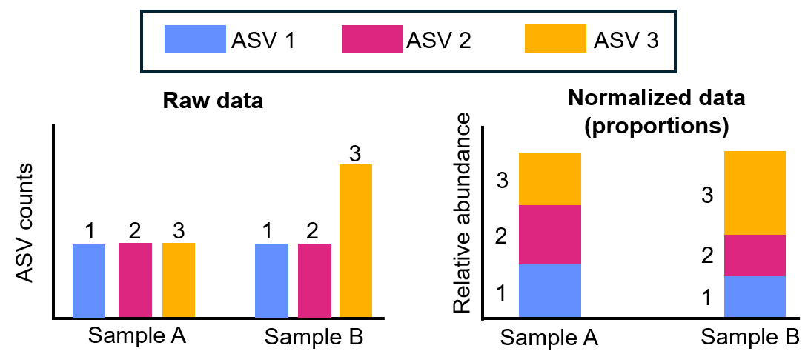
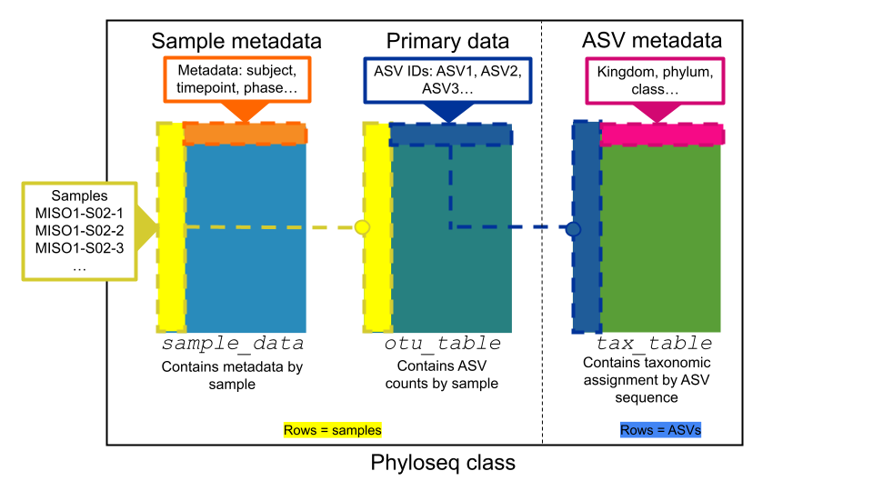

```{r setup, include=FALSE}
#Load learnr
library(learnr)
knitr::opts_chunk$set(echo = FALSE)
tutorial_options(exercise.completion=TRUE) #Uncomment to enable 


library("tidyverse")
library("phyloseq")

#Uncomment exercise timelimit when deployed
tutorial_options(exercise.timelimit = 180)

#Load MISO_16S.prop.RDS
#Normalized data from Leah Guthrie's original phyloseq object, miso2ps.rds
#Normalization by turning counts into proportions

#Local path
#miso <- readRDS("MISO_16S.prop.clean.RDS")

#SciServer paths
# miso <- readRDS( "/home/idies/workspace/Storage/vgaysin1/persistent/MISO_16S.prop.rds" )
miso <- readRDS( "/home/idies/workspace/c_moor_data/miso-16s/MISO_16S.prop.clean.rds" )


# <!-- EXERCISE = should we see an interactive code chunk with this code? -->
# <!-- EVAL = should you run this code? -->
# <!-- ECHO = should you print the code? -->

```


<!---
Don't edit the Welcome page, it will be filled in automatically using the information from the YAML header
Edit the rest of the document as you like
There are some suggested sections to provide a standard order across our tutorials, but they may not all be needed/appropriate for all tutorials.
Section 1. Content 1 has example quizes and exercises
-->

## Welcome {.splashpage}

### `r rmarkdown::metadata$title`

<div class="splashpage-container">
  <figure class="splashpage-image">
  `r rmarkdown::metadata$image`{width=100%}
  <figcaption class="caption">`r rmarkdown::metadata$image_caption`</figcaption>
  </figure>

  `r rmarkdown::metadata$summary`
  

</div>


#### Learning Goals

```{r}
# Extract learning goals from YAML and add HTML tags to make an ordered list
learningGoals <- rmarkdown::metadata$learning_goals
learningGoals <- paste("<li>", learningGoals, "</li>", sep="", collapse="")

```

<ol>
`r learningGoals`
</ol>

#### Authors:

```{r}
# Extract authors from YAML and add HTML tags to make a list
authorList <- rmarkdown::metadata$author
authorList <- paste("<li>", authorList, "</li>", sep="", collapse="")

```

<ul>
`r authorList`
</ul>


```{r}
# Extract the tutorial version from the YAML data and store it so we can print it using inline r code below.  This can't be done directly inline because the code for extracting the YAML data uses backticks
tv <- rmarkdown::metadata$output$`learnr::tutorial`$version
```

#### Version: `r tv`

## Phyloseq

In this module, we'll use two R packages to explore our 16S microbiome data:

  - [*phyloseq*](https://joey711.github.io/phyloseq/), a package for microbiome analysis
  - [*ggplot2*](https://ggplot2.tidyverse.org/), a popular graph making tool that is a part of the tidyverse group of packages

While no prior experience in R is needed, we will refer to objects throughout this module. We have a separate module for learning about R objects (Meet R!). For more on ggplot check out the R for Data Science module (r4ds2) or the [R Graph Gallery](https://r-graph-gallery.com/).

## Key concepts

### OTU or ASV?
Amplicon sequencing results in **amplicon sequence variants (ASVs)**. ASVs varying from as little as one single nucleotide can be defined as separate ASVs. ASVs can further be grouped into **operational taxonomic units (OTUs)** by clustering similar ASVs based on a threshold of similarity (for example, ASVs with 1% difference in sequence can be grouped into the same species.) For now, you can think of these terms of being interchangeable. We will refer to our data as ASVs, and phyloseq will refer to them as OTUs.

### ASV counts normalization
An important concept in microbiome data analysis is the concept of data **normalization**. Data normalization corrects for differences in sample size and allows us to make comparisons between samples. Not every analysis uses normalized reads as an input, but in this tutorial, the ASV counts were normalized by the total number of reads in each sample to convert the counts to proportion.


{width=100%}
<p class=caption> **An example of normalization by proportions**: In this example we have 3 ASVs, and we wish to compare data between sample A and sample B. Based on the raw count data (left), it is easy for a viewer to believe that sample A and B have the same amount of ASVs 1 and 2. However, when comparing between samples based on proportion (right), it becomes clear that sample A has a higher proportion of ASVs 1 and 2 compared to ASV 3. Original figure by Evans et al. (2018); figure cleaned and edited by Sayumi York (March 21, 2025).</p>


### Subsetting data in R:
R has powerful features for accessing data parts via **subsetting**, which involves selecting portions of information from a bigger set of data. Different data structures (examples: data frames, matrices, lists) can have different rules for subsetting. For example, an otu_table is a matrix, and can be subsetted using rules for subsetting a matrix in R, which utilizes brackets [ ]. To subset matrices, you can specify the [row 1, column 2] to access information stored in row 1 and column 2. For more information on subsetting, see the associated [R Cheatsheet](https://docs.google.com/document/d/1R99uj_oliyvnNOPLOfI2bUBBa64Z2PAIJ0oicbHyVZU/edit?usp=sharing). We will practice this in this module.


## Exploring a phyloseq object

Let's explore our phyloseq object called 'miso'. We can check by calling the object through its name. Do so now by running the code below.

```{r explore_miso, exercise=TRUE, echo=FALSE}
miso
```

Here we see that the phyloseq object consists of an otu_table, sample_data and tax_table. Phyloseq knits all these tables together inside the object as shown below.

{width=100%}

<p class=caption> **The phyloseq class**: The image above shows a conceptual diagram of the phyloseq class. Dotted lines between the tables show how phyloseq is able to relate the different data in each tables to each other. The sample_table and otu_table both have samples stored in rows, but the tax_table has ASVs stored in rows. Image by Sayumi York (March 21, 2025).</p>

Our phyloseq object is composed of 3 core data tables (some have more).

  - **The sample data table (sample_data)**: holds all the metadata relating to each sample. For example our metadata contains information on what timepoint in the experiment the sample is from (timepoint 1, 2, 3, 4 or 5), the gender of the subject, whether they were on the homogenized diet (HD) at the time, the subject's age, etc.
  
  - **The OTU abundance table (otu_table)**: holds the data on how many of each ASV were found in each sample.
  
  -  **The taxonomic annotation table (tax_table)**: holds all the taxonomic data for each ASV (what phylum, class, order, etc. the ASV has belongs to). Note, that not every ASV has a taxonomic assignment at every level.

---

```{r miso-object_quiz}
quiz(caption = "What's in the phyloseq object?",
    
  question("How many ASVs are in the phyloseq object?",
    answer("1702", correct = TRUE),
    answer("105"),
    answer("32"),
    answer("9"),
    allow_retry = TRUE,
    random_answer_order = TRUE
  ),
  
  question("How many samples are in the phyloseq object?",
    answer("1702"),
    answer("105", correct=TRUE),
    answer("32"),
    answer("9"),
    allow_retry = TRUE,
    random_answer_order = TRUE
  ),
  
  question("How many variables are there in the experiment? (ex. age, phase, timepoint)",
    answer("1702"),
    answer("105"),
    answer("32", correct = TRUE),
    answer("9"),
    allow_retry = TRUE,
    random_answer_order = TRUE
  )
)
```


## Sample_data

The sample_data contains all the metadata for each sample. 

Using the head() command allows us to look only at the first handful of columns and rows, but if we remove head() we can also see the entirety of each. 

Note: The sample data is stored as a data frame class (or table) - as opposed to the matrix class for example. Thus, sample_data can be called using a data.frame() command to display the sample data as an interactive table.

Use the code block below to examine sample_data (metadata) table using head() and data.frame() commands.

```{r sample_data_head, exercise=TRUE, echo=FALSE}
head(data.frame(sample_data(miso)))
```

Now, use the code block below to view a handful of column names and row names.

```{r sample-data1, exercise=TRUE, echo=FALSE}
head(colnames(sample_data(miso)))
head(rownames(sample_data(miso)))
```

---

```{r overview_sample_data_quiz}
quiz(caption = "Exploring the sample_table",
  question("What are columns in the sample_table?",
    answer("Samples"),
    answer("Sample metadata", correct=TRUE),
    answer("Taxonomy ranks"),
    allow_retry = TRUE
  ),
  
  question("What are rows in the sample_table?",
    answer("Samples", correct=TRUE),
    answer("Sample metadata"),
    answer("Taxonomy ranks"),
    allow_retry = TRUE
  ),
  
  question("Check all that are variables in the sample_data",
    answer("age", correct=TRUE),
    answer("subject", correct=TRUE),
    answer("gender", correct=TRUE),
    answer("timepointgroup", correct=TRUE),
    answer("id", correct=TRUE),
    allow_retry = TRUE
  )
)
```

Let's try looking at different metadata variables (e.g. subject and timepointgroup) represented by the columns of the metadata table. 

Use code block below to identify unique subjects and timepointgroups present in miso data. Try substituting the column name in between the double quotes with another metadata variable (e.g. age). 

```{r unique_metadata, exercise=TRUE, echo=FALSE}
unique(data.frame(sample_data(miso)[, "subject"]))
unique(data.frame(sample_data(miso)[, "timepointgroup"]))

```

---

```{r metadata_sample_table_quiz}
quiz(caption="Exploring metadata in sample_table",

  question("How many subjects are in the dataset? HINT: Use the arrow on the top right side of the data frame table to access more columns",
    answer("5"),
    answer("21", correct=TRUE),
    answer("35"),
    answer("105"),
    answer("32"),
    allow_retry = TRUE
  ),
  
  question("What are the timepointgroups in the dataset?",
    answer("1-5"),
    answer("BD, HD, WO", correct=TRUE),
    answer("miso and non-miso"),
    allow_retry = TRUE
  )
)
```


## OTU_table

An otu_table contains ASV counts for all the samples. In an otu_table, columns are different ASVs, and rows are different samples. Remember, that even though we are using ASVs for input, and not OTUs, phyloseq treats them the same, and uses only 'otu' nomenclature.

Examine the first few columns and rows with the following code.

```{r otu_table_colnames, exercise=TRUE, echo=FALSE}
head(colnames(otu_table(miso)))
```

```{r otu_table_rownames, exercise=TRUE, echo=FALSE}
head(rownames(otu_table(miso)))
```

---

```{r otu_table_quiz1}
quiz(caption = "What is the otu_table?",
  
question("What are columns in the otu_table?",
    answer("Sample names"),
    answer("ASV IDs", correct=TRUE),
    answer("Taxonomy ranks"),
    allow_retry = TRUE
  ),

question("What are rows in the otu_table?",
    answer("Sample names", correct=TRUE),
    answer("ASV IDs"),
    answer("Taxonomy ranks"),
    allow_retry = TRUE
  )
)
```


We can examine a specific sample or ASV in the otu_table by selecting the samples (rows) and ASVs (columns). 
Use code below to examine ASV1 counts for sample 1. This is done by specifying sample information (rows) and ASV information (columns) in the brackets (example: [rows, columns]). As we can see in the example, we can call a row or column by its position in the data frame ("give me row 1") or by calling it specifically ("give me ASV1").

```{r otu_table-3, exercise=TRUE, echo=FALSE}
# This will give you counts for ASV1 for sample 1.
otu_table(miso)[1,"ASV1"]
```

We can see that the sample MISO1-S02-1 has a value of 0.059 for ASV 1. Recall that we are working with normalized data, so our data is in proportions. So really our data are telling us that 5.9% of this sample is ASV 1! We canxplore different samples and ASVs by changing the numbers in the brackets. 

For samples 1 through 5, explore counts for ASV50. Notice how we can ask for a range of rows or columns using the : symbol.

```{r otu_table-4, exercise=TRUE, echo=FALSE}
# This will give you counts for ASV50, for samples 1 through 5.
otu_table(miso)[1:5, "ASV50"]
```

---

```{r otu_table_quiz2}
quiz(caption = "What's in the otu_table?",
     
    question("For samples 1 through 5, how many samples have zero counts for ASV1000?",
    answer("1",),
    answer("3", ),
    answer("All of them", correct=TRUE),
    allow_retry = TRUE
  ),
  
  question("What is the normalized count for ASV115 in sample 10",
    answer("there is no ASV0115",),
    answer("0.05988178", ),
    answer("0.005442962", ),
    answer("0.0009637625", correct=TRUE),
    allow_retry = TRUE
  )
)
```

## Tax_table

The tax_table contains all the information relating to what ASV has what taxonomy assigned to it.

Examine the column and rows in the tax_table with the following code.

```{r tax_table_col_rows, exercise=TRUE, echo=FALSE}
colnames(tax_table(miso))
head(rownames(tax_table(miso)))
```

---

```{r tax_table_cols_rows_quiz}
quiz(caption = "What's in the tax_table?",
  question("What are columns in the tax_table?",
    answer("Sample names"),
    answer("ASV IDs"),
    answer("Taxonomy ranks", correct=TRUE),
    allow_retry = TRUE
  ),
  
  question("What are rows in the tax_table?",
    answer("Sample names",),
    answer("ASV IDs", correct=TRUE),
    answer("Taxonomy ranks"),
    allow_retry = TRUE
  )
)
```

Use the interactive code block below to try out the commands you learned and retreive specific ASV information.

Check the taxonomy associated with ASV1. Within the brackets, rows and columns are separated by a comma (","). By leaving the column blank, R will return all columns. In this case it will return the taxonomic assignment at all levels for ASV1.

```{r tax_table_col_rows_ASV1, exercise=TRUE, echo=FALSE}
tax_table(miso)["ASV1",]
```

---

```{r tax_table_ASV2005}
quiz(caption = "Let's find a taxnomic assignment by ASV",
  question("What is the taxonomic Family associated with ASV2005?",
    answer("Bifidobacteriaceae"),
    answer("Lachnospiraceae", correct=TRUE),
    answer("Clostridiales"),
    answer("NA"),
    allow_retry = TRUE
  )
)
```

## Visualizing taxonomy

Now that we have a good idea of what's in the phyloseq object, let's try plotting our phyloseq object to get an idea of everything that's inside it.

The code below plots the taxonomy profile of individuals (subjects) based on Phylum.

```{r plot_bar_demo, exercise=TRUE, echo=FALSE}
  plot_bar(miso, "subject", fill = "Phylum") + 
  geom_bar(aes(color = Phylum, fill = Phylum), stat = "identity", position = "stack") 
```

Notice that the y-axis currently has "Abundance" on a scale of 1-5. Why is this the case? Remember that we are working with proportions, so each sample should add up to 1, which represents 100% of a sample. For each subject we sampled them at 5 different time points. Thus, we have a total of "5" for all time points included.

---

```{r plot_bar_phylum_quiz}
quiz(caption = "Plotting phylum by subject",
  question("How many different known Phyla are in the data?",
    answer("14"),
    answer("13", correct=TRUE),
    answer("5"),
    allow_retry = TRUE
  )
)
```

The demo code above plotted the taxonomy profile of individuals based on phylum. Use the code below to play around with the plot_bar() function. 

The demo plot did not have a plot title. Use code block below to give your plot a title by substituting "Choose a name for your graph" with a title name appropriate for the plot (e.g. Phylum by individual).

```{r plot_bar_phylum_title, exercise=TRUE, echo=FALSE}
plot_bar(miso, x="subject", fill = "Phylum", title = "Choose a name for your graph") +
  geom_bar(aes(color = Phylum, fill = Phylum), stat = "identity", position = "stack")
```

Try substituting phylum with another taxonomic rank of interest, like class, by substituting "Phylum" with "Class" in the code block below. Make sure you replace all instances of phylum, and pay attention to the case (example: notice that subject is in all lowercase, but Phylum uses a capital P). 
Hint: To plot class using the template code below, you will need to substitute 3 things in the code, plus a new title.

```{r plot_bar_subject_Class, exercise=TRUE, exercise.eval=FALSE}
plot_bar(miso, x= "subject", fill = "Phylum", title = "choose a name for your graph") +
  geom_bar(aes(color = Phylum, fill = Phylum), stat = "identity", position = "stack")
```

Try plotting a different taxonomy based on another variable such as timepointgroup, phase, age and gender, by substituting "subject".

```{r plot_bar_subject_Phylum, exercise=TRUE, exercise.eval=FALSE}
plot_bar(miso, x= "subject", fill = "Phylum", title = "choose a name for your graph") +
  geom_bar(aes(color = Phylum, fill = Phylum), stat = "identity", position = "stack")
```
---

```{r plot_bar_tax_quiz}
quiz(caption = "Changing the phyloseq graph by taxonomic level",
  question("What are the 2 most common bacterial classes in the dataset?",
    answer("Clostridia", correct = TRUE),
    answer("Bacteroidia", correct = TRUE),
    answer("Mollicutes"),
    answer("Synergistia"),
    allow_retry = TRUE,
    random_answer_order = TRUE
  ),

  question("What timepoint has the lowest proportion of Verrucomicrobia?",
    answer("1"),
    answer("2"),
    answer("3"),
    answer("4"),
    answer("5", correct=TRUE),
    allow_retry = TRUE,
    random_answer_order = FALSE
  )
)
```

## Using subset_taxa()

What happens when we try to plot our data at the level of order? Try it out with the following code.

```{r plot_bar_metadata_change_order, exercise=TRUE, exercise.eval=FALSE}
plot_bar(miso, x= "subject", fill = "Order", title = "choose a name for your graph") +
  geom_bar(aes(color = Order, fill = Order), stat = "identity", position = "stack")
```

There are way more orders than there are phyla. As we get more and more groups in our graph, it becomes harder to read.

Subset_taxa() allows you to select a group of data based on a taxonomic rank. This allows us to discriminate between taxa on a finer scale.

The code below subsets only ASVs with the phylum Firmicutes and plots the associated order for all these ASVs by subject. First, we create a new phyloseq object called my_subset, which then stores only our Firmicutes ASVs. Then we plot these ASVs by their taxonomic order.

```{r r_subset_example, exercise=TRUE, echo=FALSE}
my_subset <- subset_taxa(miso, Phylum == "Firmicutes")

plot_bar(my_subset, x="subject", fill = "Order", title = "Orders of Firmicutes ASVs by subject") + 
  geom_bar(aes(color = Order, fill = Order), stat = "identity", position = "stack")

```

That looks much better! There are only 7 orders represented within ASVs of the phylum Firmicutes, so we can see them clearly in our graph.

The command below will retrieve a list of all the different phyla you could subset. Of course, if we change "Phylum" to another taxonomic rank we will see all the different groups of that rank.

```{r examine_unique_taxonomic_group, exercise=TRUE, echo=FALSE}
unique(tax_table(miso)[ , "Phylum"])

```

Modify the code below to subset class Bacteroidia (instead of Firmicutes) and plot the different orders of the class Bacteroidia for the 21 individuals (subjects). Be careful - there a few things to modify in the code below to get the right plot! And don't forget the title!
Hint: To plot orders for the class Bacteroidia using the template code below, you will need to substitute 5 things in the code, plus a new title.

```{r subsetting_bacteroidia, exercise=TRUE, exercise.eval=FALSE}
my_subset <- subset_taxa(miso, Phylum == "Firmicutes")

plot_bar(my_subset, x="subject", fill = "Class", title = "My title") +
  geom_bar(aes(color = Class, fill = Class), stat = "identity", position = "stack")

```

---

```{r subsetting_quiz}
quiz(caption = "Changing the phyloseq graph",
  question("How many different known classes are represented in the entire dataset?",
    answer("13"),
    answer("14"),
    answer("21", correct=TRUE),
    allow_retry = TRUE
  ),

  question("What are the 2 most abundant orders in the class Gammaproteobacteria?",
    answer("Pseudomonadales"),
    answer("Pasteurellales"),
    answer("Aeromonadales"),
    answer("Enterobacteriales", correct=TRUE),
    answer("Betaproteobacteriales", correct=TRUE),
    allow_retry = TRUE
  )
)
```


## Try it out!

Use the following code blocks and example code to explore the data.

```{r try_it_out_1, exercise=TRUE, echo=FALSE}
#Subsetting based on a group
my_subset <- subset_taxa(miso, Phylum == "Firmicutes")

#Plotting using the new subset
plot_bar(my_subset, x= "subject", fill = "Class", title = "My title") +
  geom_bar(aes(color = Class, fill = Class), stat = "identity", position = "stack")
```

```{r try_it_out_2, exercise=TRUE, echo=FALSE}

```

```{r try_it_out_3, exercise=TRUE, echo=FALSE}

```

```{r try_it_out_4, exercise=TRUE, echo=FALSE}

```

```{r try_it_out_5, exercise=TRUE, echo=FALSE}

```


## Related R ocmmands

Also available at our [R Cheatsheet](https://docs.google.com/document/d/1R99uj_oliyvnNOPLOfI2bUBBa64Z2PAIJ0oicbHyVZU/edit?usp=sharing)!

#### Exploring data with base R commands
- **head**: A base R function that gives you the first part of a called object
  - head(my_object) 
  - head(colnames(otu_table(miso)))
  - "Look into the object called miso and find the otu_table, then look at the column names   and give me the head (first part) of the column names"
  
- **tail**: A base R function that gives you the last part of a called object
  - tail(my_object)
  
- **colnames()**: A base R function that gives you the column names of a given data frame
  - colnames(my_data_frame)
  
- **rownames()**: A base R function that gives you the row names of a given data frame
  - rownames(my_data_frame)
  
- **unique()**: A base R function that lets you filter only the unique values of a given data frame

- **ls.str()**: A base R function that will list out all the objects available to you in your environment. In this module, each code block is its own environment.

#### Phyloseq commands

- **otu_table()**: Used to reference the otu_table of a phyloseq object

- **tax_table()**: Used to reference the tax_table of a phyloseq object

- **sample_data()**: Used to reference the sample_data of a phyloseq object 
  - Note: Requires data.frame() to work

- **subset_taxa()**: Used to subset a data frame and keep only the chosen taxa

- **plot_bar()**: Returns a ggplot2 object that can be modified further with ggplot commands using + to add more options. 

#### ggplot commands

- **facet_wrap** (Advanced): Ask ggplot to facet by a given field. This will break the graph down into smaller graphs focused on each subject.

```{r facet_example, exercise=TRUE, echo=FALSE}
plot_bar(miso, x="timepoint", fill = "Phylum", title = "choose a name for your graph") +
  geom_bar(aes(color = Phylum, fill = Phylum), stat = "identity", position = "stack") +
  facet_wrap(~subject)
```

## Summary

In this module we have explored a 16S dataset and used phyloseq to create informative barplots about our data. Using these barplots we can make some observations about the data and come up with new questions or draw conclusions! 

## FAQ

## Common errors

**When subsetting data**:
- **1) Error in dimnames(x) <- dn : length of 'dimnames' [1] not equal to array extent**
Your subset does not contain any data. Make sure your taxonomic level (example: phylum, class, order) matches the name of your taxonomic group (Alphaproteobacteria, Bacilli, Clostridiales). You may have a mismatch (example: asking phyloseq to subset by the phylum Clostridiales, which is an order)


## Works Cited

- Aden-Buie G, Schloerke B, Allaire J, Rossell Hayes A (2023). learnr: Interactive Tutorials for R. <https://rstudio.github.io/learnr/>, <https://github.com/rstudio/learnr>

- Evans, Ciaran, Johanna Hardin, and Daniel M. Stoebel. "Selecting between-sample RNA-Seq normalization methods from the perspective of their assumptions." Briefings in bioinformatics 19.5 (2018): 776-792.

- Guthrie, Leah, et al. "Impact of a 7-day homogeneous diet on interpersonal variation in human gut microbiomes and metabolomes." Cell host & microbe 30.6 (2022): 863-874.

- McMurdie, Paul J., and Susan Holmes. "phyloseq: an R package for reproducible interactive analysis and graphics of microbiome census data." PloS one 8.4 (2013): e61217.

- R Core Team (2024). R: A Language and Environment for Statistical Computing. R Foundation for Statistical Computing, Vienna, Austria.
  <https://www.R-project.org/>.
  
- Stoudt, Sara, Anthony D. Scotina, and Karsten Luebke. "Supporting Statistics and Data Science Education with learnr." Technology Innovations in Statistics Education 14.1 (2022).

- Wickham, Hadley. "ggplot2." Wiley interdisciplinary reviews: computational statistics 3.2 (2011): 180-185.

