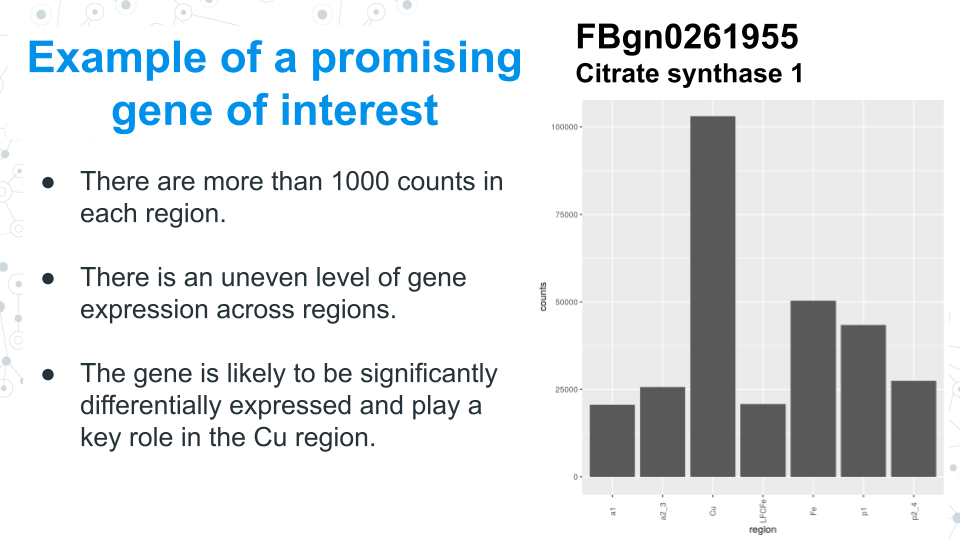
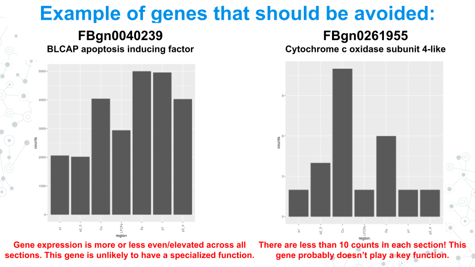
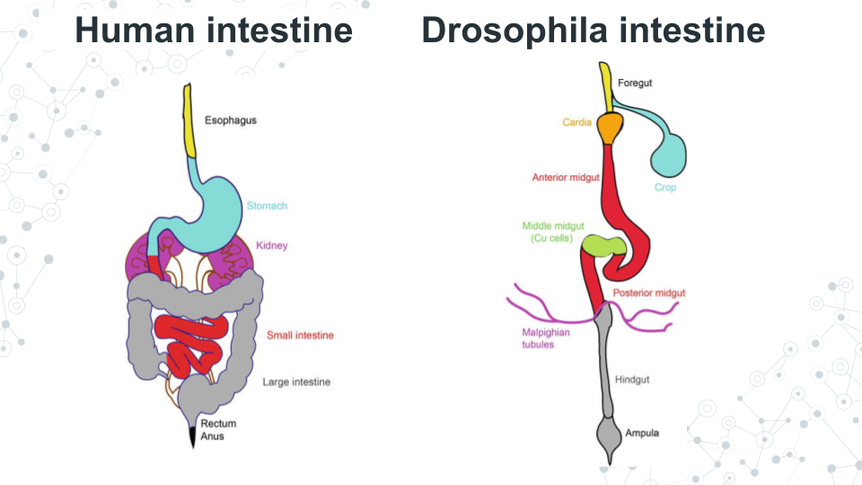
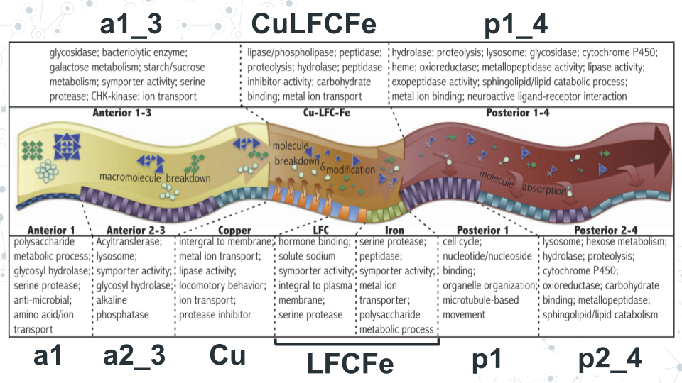
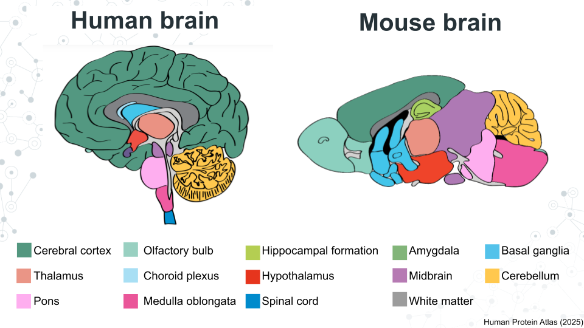
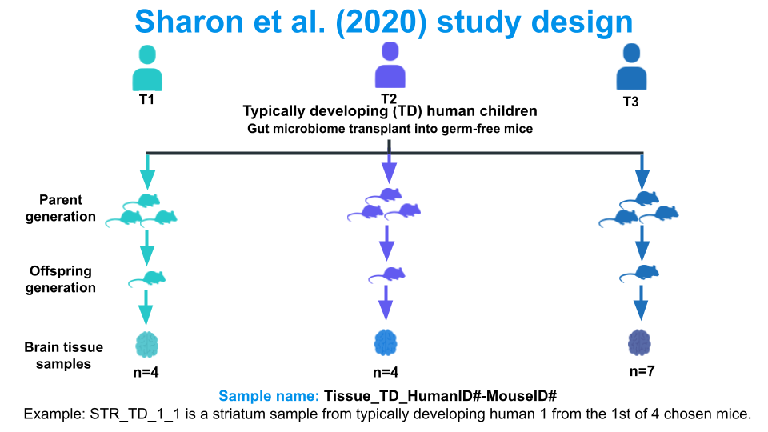
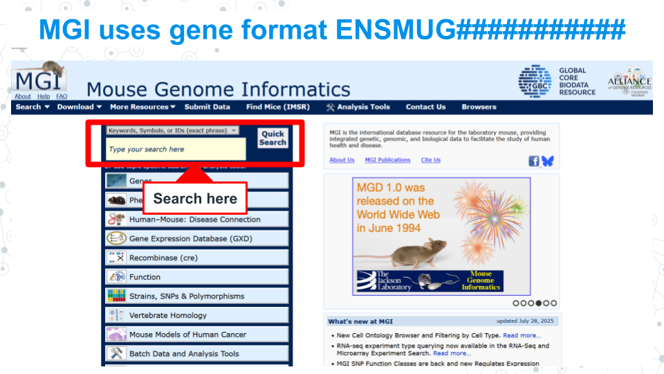
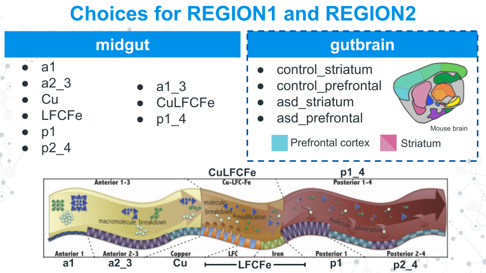

```{r setup, include=FALSE}
#Load learnr
library(learnr)
knitr::opts_chunk$set(echo = FALSE)
tutorial_options(exercise.completion=TRUE) #Uncomment to enable 

#Uncomment exercise timelimit when deployed
tutorial_options(exercise.timelimit = 360)

#Load libraries
library("DESeq2")
library("clusterProfiler")
library("org.Dm.eg.db")
library("tidyverse")
library("org.Mm.eg.db")
library("MarianesMidgutData")

#####################################
#Define functions
####################################

# Generic functions

formatDESeq2Results <- function( x ) {
  df <- as.data.frame(x)
  df <- data.frame(rownames(df), df)
  colnames(df) <- c("GeneID", colnames(df)[-1])
  rownames(df) <- c()
  return(df)
}

# Fly functions

runClusterProfiler <- function (x) {
  ids <- bitr( x$GeneID, "ENSEMBL", "ENTREZID", "org.Dm.eg.db" )
  kegg <- enrichKEGG(ids$ENTREZID, "dme", keyType="ncbi-geneid")
  kegg@result$Description <- sub( " - Drosophila melanogaster \\(fruit fly\\)", "", kegg@result$Description )
  return(kegg)
}

getClusterProfilerGenes <- function (x, i) {
  data.frame( x ) %>%
    filter( str_detect( Description, i ) ) %>%
    pull( geneID ) %>%
    strsplit( "/" ) %>%
    unlist() %>%
    bitr( fromType="ENTREZID", toType="SYMBOL", OrgDb="org.Dm.eg.db") %>%
    pull( SYMBOL )
}

plotAcrossRegions <- function( x ) {
  df <- data.frame(counts(midgut)[x,], midgut_tsv$condition)
  colnames(df) <- c("counts", "region")
  df <- df[10:30,]
  df$region <- fct_relevel( factor( df$region ), "a1", "a2_3", "Cu", "LFCFe", "Fe", "p1", "p2_4" )
  ggplot( df ) +
    geom_bar( aes( region, counts ), stat="identity" ) +    
    ggtitle(x)+
    theme_bw() + 
    theme( axis.text.x = element_text( angle=90, vjust=0.5 ) )
}


#Mouse functions
runClusterProfilerMouse <- function (x) {
  ids <- bitr( x$GeneID, "ENSEMBL", "ENTREZID", "org.Mm.eg.db" )
  kegg <- enrichKEGG(ids$ENTREZID, "mmu", keyType="ncbi-geneid")
  kegg@result$Description <- sub( " - Mus musculus \\(house mouse\\)", "", kegg@result$Description )
  return(kegg)
}

getClusterProfilerGenesMouse <- function (x, i) {
  data.frame( x ) %>%
    filter( str_detect( Description, i ) ) %>%
    pull( geneID ) %>%
    strsplit( "/" ) %>%
    unlist() %>%
    bitr( fromType="ENTREZID", toType="SYMBOL", OrgDb="org.Mm.eg.db") %>%
    pull( SYMBOL )
}

plotAcrossTissue <- function( x ) {
  df <- data.frame(counts(brain)[x,], brain_metadata$tissue, row.names = row.names(brain_metadata))
  colnames(df) <- c("counts", "tissue")  
  df$tissue<- fct_relevel( factor( df$tissue), "STR", "PFC")
  ggplot( df ) +
    geom_bar( aes( tissue, counts ), stat="identity" ) +
    ggtitle(x)+
    theme_bw() + 
    theme( axis.text.x = element_text( angle=90, vjust=0.5 ) )
}

plotAcrossMice <- function( x ) {
  df <- data.frame(counts(brain)[x,], brain_metadata$bio_sample, row.names = row.names(brain_metadata))
  colnames(df) <- c("counts", "bio_sample")  
  df$bio_sample <- fct_relevel( factor( df$bio_sample), "PFC_TD_1_1", "PFC_TD_1_2", "PFC_TD_1_3","PFC_TD_1_4",
                               "PFC_TD_2_1", "PFC_TD_2_2", "PFC_TD_2_3","PFC_TD_2_4",
                               "PFC_TD_3_1","PFC_TD_3_2","PFC_TD_3_3","PFC_TD_3_4","PFC_TD_3_5","PFC_TD_3_6","PFC_TD_3_7",
                               "Striatum_TD_1_1","Striatum_TD_1_2","Striatum_TD_1_3","Striatum_TD_1_4",
                               "Striatum_TD_2_1","Striatum_TD_2_2","Striatum_TD_2_3","Striatum_TD_2_4",
                               "Striatum_TD_3_1","Striatum_TD_3_2","Striatum_TD_3_3","Striatum_TD_3_4","Striatum_TD_3_6","Striatum_TD_3_7")
  ggplot( df ) +
    geom_bar( aes( bio_sample, counts ), stat="identity" ) +
    ggtitle(x)+
    theme_bw() + 
    theme( axis.text.x = element_text( angle=90, vjust=0.5 ) )
}


plotAcrossHostDonor<- function( x ) {
  df <- data.frame(counts(brain)[x,], brain_metadata$host_donor_tissue, row.names = row.names(brain_metadata))
  colnames(df) <- c("counts", "host_donor_tissue")  
  df$host_donor_tissue <- fct_relevel( factor( df$host_donor_tissue), "TD_1_STR","TD_2_STR","TD_3_STR","TD_1_PFC", "TD_2_PFC", "TD_3_PFC")
  ggplot( df ) +
    geom_bar( aes( host_donor_tissue, counts ), stat="identity" ) +
    ggtitle(x)+
    theme_bw() + 
    theme( axis.text.x = element_text( angle=90, vjust=0.5 ) )
}


#####################################
#Local paths
####################################

brain<-readRDS("brain.RDS")
brain_metadata<-read.csv("brain_metadata.csv", row.names = 1)


#####################################
#Sciserver paths
####################################

#####################################
#Packages
####################################


```


<!---
Don't edit the Welcome page, it will be filled in automatically using the information from the YAML header
Edit the rest of the document as you like
There are some suggested sections to provide a standard order across our tutorials, but they may not all be needed/appropriate for all tutorials.
Section 1. Content 1 has example quizes and exercises
-->

## Welcome {.splashpage}

### `r rmarkdown::metadata$title`

<div class="splashpage-container">
  <figure class="splashpage-image">
  `r rmarkdown::metadata$image`{width=100%}
  <figcaption class="caption">`r rmarkdown::metadata$image_caption`</figcaption>
  </figure>

  `r rmarkdown::metadata$summary`
  

</div>


#### Learning Goals

```{r}
# Extract learning goals from YAML and add HTML tags to make an ordered list
learningGoals <- rmarkdown::metadata$learning_goals
learningGoals <- paste("<li>", learningGoals, "</li>", sep="", collapse="")

```

<ol>
`r learningGoals`
</ol>

#### Authors:

```{r}
# Extract authors from YAML and add HTML tags to make a list
authorList <- rmarkdown::metadata$author
authorList <- paste("<li>", authorList, "</li>", sep="", collapse="")

```

<ul>
`r authorList`
</ul>


```{r}
# Extract the tutorial version from the YAML data and store it so we can print it using inline r code below.  This can't be done directly inline because the code for extracting the YAML data uses backticks
tv <- rmarkdown::metadata$output$`learnr::tutorial`$version
```

#### Version: `r tv`

## Research project brainstorming

Coming up with a good research project idea can be an exciting but daunting challenge. <mark>**We recommend reviewing the available datasets in this document and choose one to focus on, then trying one of the following approaches.**</mark> If you're working with a group, considering assigning every member be responsible for a particular approach and have everyone bring 1 or 2 ideas to your next meeting to vote on.

The following text assumes you are using the midgut dataset. However, a similar approach could be used for a different dataset.

### Approach 1 - Start with a gene of interest

- Suggested for students that come with a biological phenomenon of interest
- Involves looking for differentially expressed genes involved in that interest

**1. Identify a biological interest of yours.**: Do you have a disease state or condition you are interested in? How about a particular organ, organ system, cell type, or organelle? You might think about things you've heard on the news or in social media relating to human health. 

**2. Find genes that are involved in your chosen interest**: Look up research papers through sites like PubMed and Google Scholar to look up studies that identify genes of interest for your particular topic. Skim through at least 4-5 different papers that contain some type of gene name or a process (like a metabolic process). Don't delve too deep or get stuck in the details. Just start creating a list of genes.

**3. Confirm that the gene exists in both humans and Drosophila**: If you started with a gene found in humans, look it up on FlyBase to get an "FBgn" ID. If you started with a fly gene, you will have to get the "FBgn" ID on FlyBase and search for an ortholog in Human Protein Atlas. Note that some genes may have slightly different names in each species. 


{width=100%}
<p class=caption> **An example of a promising gene of interest for a student research project**: This gene is expressed in all regions but in one region (Cu) much more than all others. It is likely that the gene plays a key role in the Cu region and has an interesting biological story.</p>

{width=100%}
<p class=caption> **An examples of genes that should be avoided in a student research project**: Genes that show a relatively consistent expression level across conditions or whose counts are minimal may be housekeeping genes that do not have a specialized role or are not important to the body and do not have an interesting biological story.</p>


**4. Use plotAcrossRegions to see if there is an interesting story within your list of genes**: Jump over to the plotAcrossRegions section and run the code on your chosen genes using their FBgn ID. Genes that are likely to be differentially expressed and serve a specialized function in the midgut show an uneven expression across regions. Pay attention to the y-axis. Genes that are unevenly expressed but are found in low counts across all regions are not likely to be key genes.

**5. Confirm that the gene is significantly differentially expressed between regions using the table generated by the DESeq2 analysis**: Compare the regions with the highest and lowest expression (counts). In the generated table, check that the *padj* value is less than 0.05. 

### Approach 2 - Select a category of differentially expressed genes from the ClusterProfiler dot plot

- Suggested for students that aren't sure what they're interested in
- Start with a group of genes identified as differentially expressed
- Find an interesting biological story to tell within those genes

**1. Run a ClusterProfiler analysis on two regions.**: Jump to the ClusterProfiler analysis section and choose two sections of the midgut to run the analysis on. From within your dotplot results, choose a catagory with a with low
*padj* value and high count value. 

**2. Run getClusterProfilerGenes on that category to get a list of differentially expressed genes within the category**: Remember to run getClusterProfilerGenes in the same code chunk as the rest of the ClusterProfiler analysis. 

**3. Pick a gene and follow steps 3-5 from Approach 1**: Repeat for all genes to make an interesting poster based on your chosen metabolic process.


### Approach 3 - Select highly differentially expressed genes from the DESeq2 results table

This approach is similar to approach 2.

- Suggested for students that aren't sure what they're interested in
- Start with a table of significantly differentially expressed genes
- Find an interesting biological story to tell within those genes

**1. Run the DESeq2 analysis and get a results table**: Choose any two regions of your choice to run through the DESeq2 analysis.

**2. Filter genes with significant *padj* value**: Use the filter function to get a list of genes that are significantly (<0.05 or <0.01 or even <0.001) expressed in the two regions of your choice. Remember to run the filter function within the same code block as the DESeq2 code.

**3. Pick a gene and follow steps 3-5 from Approach 1**: Choose 2-3 from this process that you think have a specialized role in the midgut.

**4. Use databases and read preivously published research to figure out what function your genes are involved in**: Look for a story that is presentable. What is special about this gene? What function does it have? What interactions does it have with other genes? What does being differential expressed signify for this gene? What metabolic process is this gene a part of? Are there any studies done on your gene? What diseases or conditions is the gene linked to?

**5. Use databases to find related genes**: These genes could be involved the in the same biological process; they do not have to be differentially expressed to be able to tell a good story.

## Meet the midgut dataset

The data presented here are from the 2013 study by Marianes and Spradling, **Physiological and stem cell compartmentalization within the Drosophila midgut**. We refer to this study as the midgut study. To best make use of this data we recommend you complete the following modules, some of which use these data as an example for related analyses:

- Model Organisms: *Drosophila melanogaster*
- Biological Databases: FlyBase
- Introduction to RNA-seq data
- Differential expression with DESeq2

### Why should we study the Drosophila midgut?

{width=100%}

<p class=caption> **A figure comparing the human intestine and fly intestine by Sadaqat et al. 2021**: Different colored sections represent sections that serve a similar function between the two species.</p>

*Drosophila melanogaster*, the fruit fly, is one of the most popular model organisms in research. *Drosophila* and humans have many **orthologs** - genes that come from the same ancestor - that make them useful for foundational research. Scientists start with cheap models like the fly and build a body of evidence before moving on to more complex organisms including vertebrates like mice and humans themselves. The image above shows how the human intestine is similar to the fly intestine (note that not all structures/functions are shared in both).

### Different parts of the midgut we can compare

Just like the human intestine, the *Drosophila* midgut can be seen as different specialized sections, each of which serves a particular role in digestion. Understanding what genes are expressed in each section of the *Drosophila* midgut can give us a clue to what the human ortholog might be doing.

> "…certain digestive processes—such as the breakdown or uptake of particular nutrients—are known to occur only in a specific portion of the intestine. For example, in fruit flies, a region in the middle of the intestine is acidified, and may act like an extra stomach. And in both fruit flies and mammals, iron is taken up mostly in the area of the gut just after the stomach."

> Marianes & Spradling, (2013)

{width=100%}
<p class=caption> **The *Drosophila* midgut**: Different sections of the midgut are associated with specific functions. The large bolded text represents how you can call that given section in an analysis. Image from Marianes & Spradling (2013). </p>

We have subsetted the data to make research easier for you. The above image shows the general functions of each section of the midgut. The bolded text (example: a1) is what you will use in your code when referring to that specific section.

### Some research ideas to get you started

You will need to identify genes of interest, formulate a research question around them, and check that they are in the midgut dataset.

- Look up gastrointestinal conditions such as diabetes, irritable bowel syndrome, and Celiac's disease. What genes and/or pathways are involved in these disorders?
- We now know the gut is inextricably linked to our brains, immune system, and circadian rhythms. What genes are involved in these connecting systems? What genes are used to communicate between these systems?
- The leaky gut hypothesis is centered on the idea that conditions like Celiac's disease may be caused by irregular gut intestine permeability. What genes are involved in maintaining the gut's defenses and are they the same across all gut regions? 
- What genes are involved in gut inflammation and how might they impact other genes in shared pathways?

### Differential expression template (Drosophila midgut dataset)

```{r deseq2-table-one-pager, exercise=TRUE, echo=FALSE}
temp <- results(midgut, contrast = c("condition", "REGION1", "REGION2") )
R1_vs_R2 <- formatDESeq2Results(temp)
R1_vs_R2
```

```{r try_it_out_deseq2-table-a, exercise=TRUE, echo=FALSE}

```
```{r try_it_out_deseq2-table-b, exercise=TRUE, echo=FALSE}

```
```{r try_it_out_deseq2-table-c, exercise=TRUE, echo=FALSE}

```

### ClusterProfiler the for Drosophila midgut dataset

```{r clusterprofiler_drosophila-onepager, exercise=TRUE, echo=FALSE}
# Run differential expression analysis
temp <- results(midgut, contrast = c("condition", "REGION1", "REGION2") )
R1_vs_R2 <- formatDESeq2Results(temp)
sig_genes <- filter(R1_vs_R2, padj <= 0.01)
dim(sig_genes)
R1_vs_R2

# Run ClusterProfiler analysis
R1_vs_R2_clusters <- runClusterProfiler(sig_genes)

# Look at the dotplot to see the groups of genes
dim(R1_vs_R2_clusters)
dotplot(R1_vs_R2_clusters, showCategory=34, title="YOUR TITLE HERE", font.size=10, label_format = 50)

# Get the gene symbols for a group of genes
getClusterProfilerGenes(R1_vs_R2_clusters, "YOUR CATEGORY HERE")
```

```{r try_it_out_clusterprofiler_drosophila-a, exercise=TRUE, echo=FALSE}

```
```{r try_it_out_clusterprofiler_drosophila-b, exercise=TRUE, echo=FALSE}

```
```{r try_it_out_clusterprofiler_drosophila-c, exercise=TRUE, echo=FALSE}

```

### plotAcrossRegions the for Drosophila midgut dataset

- FlyBase IDs take the format FBgn#######

```{r plotAcrossRegions_drosophila-one-pager, exercise=TRUE, echo=FALSE}
plotAcrossRegions("YOUR FLYBASE ID HERE")
```


```{r plotAcrossRegions_drosophila-try-it-a, exercise=TRUE, echo=FALSE}

```
```{r plotAcrossRegions_drosophila-try-it-b, exercise=TRUE, echo=FALSE}

```
```{r plotAcrossRegions_drosophila-try-it-c, exercise=TRUE, echo=FALSE}

```


## Meet the brain dataset

:::{.attention_box_pause}
:::{.attention_header_box_pause}
:::{.attention_title}
#### **The brain dataset is still in development**
:::
:::
::: {.attention_content}
This dataset is currently undergoing pilot testing at Clovis Community College (Fall 2025). We do not have as extensive materials to support some resources such as the Mouse Genome Informatics (MGI) database yet. Regardless, interested students are welcome to test these data. We look forward to your research posters!
:::
:::

<br>

These data are from the 2019 study by Sharon et al. titled **Human Gut Microbiota from Autism Spectrum Disorder Promote Behavioral Symptoms in Mice**. We will refer to these data as the brain dataset. To best make use of this data we recommend you complete the following modules: 

- Introduction to RNA-seq data
- Differential expression with DESeq2

### The brain, its functions, and the gut-brain axis

{width=100%}
<p class=caption> **Comparing homologous regions in the human and mouse brains**: Despite being vastly different in shape and size, our brains share a surprising amount of homology. Colored regions distinguish tissues from each other. Each tissue is associated with specialized functions. Regions that are close together are more likely to have similar functions than those that are far apart. Image from Human Protein Atlas, edited by Sayumi York.</p>

Although drastically different in overall shape and size, the human and mouse brain are remarkably similar in structure and organization and show homology in neural pathways. Specific parts of the brain are responsible for a specific function. For example, the amygdala is known to control emotions. 

Despite advancements in our understanding of the brain there is still much we don't yet know about what each region does or how they interact with one another, let alone how they connect to different disease states or developmental pathways.

Over the last couple of decades, considerable research effort has been invested into exploring the **gut-brain axis**. It is now widely accepted that the gastrointestinal tract has a bidirectional relationship with the central nervous system, wherein each provides molecular feedback to each other. Consequently, many scientists are interested how the gut microbiome (the microbes that live in your GI tract) could impact human health, including chronic health conditions and neurodiverse development.

### The mouse brain study design


{width=100%}
<p class=caption> **Study design from Sharon et al. (2020)**: Germ-free mice were transplated with gut microbiomes from human children and bred. Their offspring were then harvested for brain tissue for RNA-seq analysis. Note that this is a subset of a larger dataset. </p>

Sharon et al. took gut microbiome (fecal) samples from typically developing (TD) human children and implanted them into germ-free mice (mice without a microbiome). This parental generation of mice bred amongst themselves and produced offspring from which brain tissue samples were taken.

Brain tissue samples included two areas of the brain responsible for social behavior, the **Prefrontal cortex (PFC)** and the **Striatum (STR)**. These two brain sections are in close proximity to each other and are hypothesized to have similar functions, though each region's exact purpose and their relationship to each other are still being studied. 

### Working with mouse functions and resources

Our standard RNA-seq miniCURE focuses on the midgut dataset and uses *Drosophila* based resources, such as FlyBase. Since the brain dataset is based on mouse samples we have databases and functions specifically for mice that you should use instead:


{width=100%}
<p class=caption> **The Mouse Genome Informatics homepage**: Analagous to FlyBase for Drosophila, MGI allows you to search up genes found in mice and learn more about their function. </p>

- [**Mouse Genome Informatics (MGI)**](https://www.informatics.jax.org/) is the database you should use instead of FlyBase. MGI uses the Ensembl Gene Model ID format, where mouse genes take the format ENSMUG###########. Of course, since they're in different formats, you will get no results if you search for a fly gene in MGI or a mouse gene in FlyBase. 

- **Use the specialized functions for the mouse dataset**: This includes getClusterProfilerGenesMouse, plotAcrossTissue, plotAcrossHostDonor, and plotAcrossMice. These functions should work seamlessly with the mouse brain data with no changes in how the code looks to you. 

### Some research ideas to get you started

You will need to identify genes of interest, formulate a research question around them, and check that they are in the brain dataset.

- Phineas Gage was involved in an accident that damaged his frontal lobe, which contains the PFC. Following this incident, his personality underwent a dramatic change, suggesting that the frontal lobe regulates one's personality, executive decision making, and interactions with others. By looking at genes that are highly and/or differentially expressed in the PFC we can find genes of interest that might be involved in these functions.
- Many conditions such as autism spectrum disorder, schizophrenia, and dementia present as a change in personality or how one interprets and presents socially. What genes are hypothesized to be involved in these conditions and are they found in our dataset?
- Personality differs widely by individual and is impacted by both genetics and the environment. Although we often treat mice in research as a uniform group of animals that act nearly identically, mice (as many pet owners would contest) have their own personalities and a complex social structure. Rather than comparing samples at the level of human microbiome donor (plotAcrossHostDonor) or overall tissue (plotAcrossTissue), consider profiling gene expression at the level of individual mouse (plotAcrossMice). 
- The STR is well known for its connection to reward pathways. Understanding these pathways better could help us understand addiction and ADHD. What genes are differentially expressed in the STR and how might they impact a functioning reward system?


### Differential expression template (Mouse brain dataset)

Since there are only two conditions, the prefrontal cortex (PFC) and striatum (STR), we have filled in the first line of the code for you in the DESeq2 and clusterProfiler analyses.

```{r deseq2-tablemouse-one-pager, exercise=TRUE, echo=FALSE}
temp <- results(brain, contrast = c("tissue", "PFC", "STR") )
R1_vs_R2 <- formatDESeq2Results(temp)
sig_genes <- filter(R1_vs_R2, padj <= 0.05)
dim(sig_genes)
R1_vs_R2
```

```{r try_it_out_deseq2-tablemouse-a, exercise=TRUE, echo=FALSE}

```
```{r try_it_out_deseq2-tablemouse-b, exercise=TRUE, echo=FALSE}

```
```{r try_it_out_deseq2-tablemouse-c, exercise=TRUE, echo=FALSE}

```


### ClusterProfiler for the mouse brain dataset


```{r clusterprofiler_mouse-one-pager, exercise=TRUE, echo=FALSE}
# Run differential expression analysis
temp <- results(brain, contrast = c("tissue", "PFC", "STR") )
R1_vs_R2 <- formatDESeq2Results(temp)
sig_genes <- filter(R1_vs_R2, padj <= 0.05)
dim(sig_genes)
R1_vs_R2

# Run ClusterProfiler analysis
R1_vs_R2_clusters <- runClusterProfilerMouse(sig_genes)

# Look at the dotplot to see the groups of genes
dim(R1_vs_R2_clusters)
dotplot(R1_vs_R2_clusters, showCategory=34, title="YOUR TITLE HERE", font.size=10, label_format = 50)

# Get the gene symbols for a group of genes
getClusterProfilerGenesMouse(R1_vs_R2_clusters, "YOUR CATEGORY HERE")
```

```{r try_it_out_clusterprofiler_mouse-a, exercise=TRUE, echo=FALSE}

```
```{r try_it_out_clusterprofiler_mouse-b, exercise=TRUE, echo=FALSE}

```
```{r try_it_out_clusterprofiler_mouse-c, exercise=TRUE, echo=FALSE}

```


### plotAcrossRegions for the mouse brain dataset

- Multiple functions are available to compare the variation of a gene's expression at different levels.
- MGI IDs take the format ENSMUG########### 

#### plotAcrossTissue

- Compares gene expression across the 2 available tissues, the prefrontal cortex (PFC) and striatum (STR), which are shown on the X-axis.

```{r plotAcrossTissue_mouse-one-pager1, exercise=TRUE, echo=FALSE}
plotAcrossTissue("ENSMUG###########")
```

```{r plotAcrossTissue_mouse-one-pager2, exercise=TRUE, echo=FALSE}
plotAcrossTissue("ENSMUG###########")
```

```{r plotAcrossTissue_mouse-one-pager3, exercise=TRUE, echo=FALSE}
plotAcrossTissue("ENSMUG###########")
```

#### plotAcrossHostDonor

- Compares gene expression across the 2 available tissues, the prefrontal cortex (PFC) and striatum (STR), and across the human child who donated their microbiome. This graph would show the overall trends in gene expression between the prefrontal cortex and striatum as well as any effect of the individual human donor.

```{r plotAcrossHostDonor_mouse-one-pager1, exercise=TRUE, echo=FALSE}
plotAcrossHostDonor("ENSMUG###########")
```
```{r plotAcrossHostDonor_mouse-one-pager2, exercise=TRUE, echo=FALSE}
plotAcrossHostDonor("ENSMUG###########")
```
```{r plotAcrossHostDonor_mouse-one-pager3, exercise=TRUE, echo=FALSE}
plotAcrossHostDonor("ENSMUG###########")
```

#### plotAcrossMice

- Compares gene expression between the 2 available tissues, the prefrontal cortex (PFC) and striatum (STR) at the level of individual mouse whose tissues were harvested. This graph represents the overall trend in gene expression across the striatum and prefrontal cortex as well as the variation of each human donor and individual mouse.

```{r plotAcrossMice_mouse-one-pager1, exercise=TRUE, echo=FALSE}
plotAcrossMice("ENSMUG###########")
```
```{r plotAcrossMice_mouse-one-pager2, exercise=TRUE, echo=FALSE}
plotAcrossMice("ENSMUG###########")
```
```{r plotAcrossMice_mouse-one-pager3, exercise=TRUE, echo=FALSE}
plotAcrossMice("ENSMUG###########")
```


## DESeq2: Differential expression analysis

- **Objective**: Identify what genes are significantly differentially expressed between different conditions
- **Example question**: What genes are expressed in the anterior vs posterior regions of the gut? What genes are expressed in muscle cells vs. neurons? 
- **Why is this important**: It can help us figure out what genes are important in different places of the body and/or the function of the gene/body part. 

Not every gene is made in every cell in the body. Different cells have different genes “turned on” to create specialized shapes and functions. When we say a gene is on, we mean that the cell is expressing that gene – creating the protein the gene codes for. Higher gene expression means that more of that protein is being made in that cell/body part/condition compared to some other cell/body part/condition. When one gene is highly expressed in one condition compared to others, this suggests that the gene serves an important, perhaps specialized function, in this condition.

### REGION1 and REGION2

{width=100%}

- **REGION1**: Put the name of one of the groups you're interested in here.
- **REGION2**: Put the other group you're interested in here. This region is the baseline condition.


### Interpreting results

- **baseMean**: The mean expression level for this gene across all samples in reads
- **log2FoldChange**: How much higher this gene is expressed in the first region (REGION1) than in the second region (REGION2) in a log2 scale. A positive number means the gene is higher in REGION1 than in REGION2, and a negative number means the gene is lower in REGION1 than in REGION2
- ***padj***: (If this variable doesn’t show up on your screen, click the little arrow at the top right of the table, next to the column names. This will let you scroll through all the columns if they don’t fit on your screen). This is the “adjusted p-value” for the gene after statistical corrections are made for multiple comparisons. Use this, not pvalue when reporting your results.


### Differential expression template (Drosophila midgut dataset)

```{r deseq2-table, exercise=TRUE, echo=FALSE}
temp <- results(midgut, contrast = c("condition", "REGION1", "REGION2") )
R1_vs_R2 <- formatDESeq2Results(temp)
sig_genes <- filter(R1_vs_R2, padj <= 0.05)
dim(sig_genes)
R1_vs_R2
```

```{r try_it_out_deseq2-table-1, exercise=TRUE, echo=FALSE}

```
```{r try_it_out_deseq2-table-2, exercise=TRUE, echo=FALSE}

```
```{r try_it_out_deseq2-table-3, exercise=TRUE, echo=FALSE}

```
### Differential expression template (Mouse brain dataset)

```{r deseq2-tablemouse, exercise=TRUE, echo=FALSE}
temp <- results(brain, contrast = c("tissue", "PFC", "STR") )
R1_vs_R2 <- formatDESeq2Results(temp)
sig_genes <- filter(R1_vs_R2, padj <= 0.05)
dim(sig_genes)
R1_vs_R2
```

```{r try_it_out_deseq2-table-4, exercise=TRUE, echo=FALSE}

```
```{r try_it_out_deseq2-table-5, exercise=TRUE, echo=FALSE}

```
```{r try_it_out_deseq2-table-6, exercise=TRUE, echo=FALSE}

```


## ClusterProfiler: Differential expression analysis

- **Objective(s)**: 1) Get information on what the biological importance of the differentially expressed genes (what do they do?), 2) identify what biological pathways have the highest count of differentially expressed genes, and 3) get the name of genes within these pathways.
- **Example question**: What biological pathways have the most number of differentially expressed genes?
- **Why is this important**: We can use this analysis to get genes of interest and also get a rough idea of how many related genes are also differentially expressed.

### REGION 1, REGION2, and a category

- **REGION1**: Put the name of one of the groups you're interested in here.
- **REGION2**: Put the other group you're interested in here. This region is the baseline condition.
- **YOUR CATEGORY HERE**: Choose a category from the dotplot on the Y-axis. Make sure your spelling is correct. This input is also case sensitive. If you do not include this line of code or provide a category the analysis will not give you the gene names.

### Interpreting results

- **p.adjust:** A significance score assigned to the overall pathway that tells us to what degree the pathway is differentially expressed. A lower number (more red in the dotplot) represents a higher significance score. In this case, our dotplot only shows significantly differentially expressed genes (padj<0.05). However, some genes are still more significantly differentially expressed than others.
- **count:** The number of differentially expressed genes in a given pathway.
- **GeneRatio:** The proportion of genes in a given pathway that are differentially expressed, given as a decimal. Imagine a scenario where you have 5 differentially expressed genes in a pathway of 10 genes. A whopping 50% of the genes in the pathway are differentially expressed! This could signify a deep link between this biological pathway and your two conditions. If you instead have 5 differentially expressed genes in a pathway of 100, that means only 5% of genes within the pathway are different between the two conditions. While this does not discredit these individual genes, it implies that overall the pathway is not strongly affected between the two conditions.
- **List of genes**: If a category from the y-axis is swapped out for YOUR CATEGORY HERE, a list of differentially expressed genes in the chosen category/pathway will be listed.

### ClusterProfiler the for Drosophila midgut dataset

```{r clusterprofiler_drosophila, exercise=TRUE, echo=FALSE}
# Run differential expression analysis
temp <- results(midgut, contrast = c("tissue", "PFC", "STR") )
R1_vs_R2 <- formatDESeq2Results(temp)
sig_genes <- filter(R1_vs_R2, padj <= 0.01)
dim(sig_genes)
R1_vs_R2

# Run ClusterProfiler analysis
R1_vs_R2_clusters <- runClusterProfiler(sig_genes)

# Look at the dotplot to see the groups of genes
dim(R1_vs_R2_clusters)
dotplot(R1_vs_R2_clusters, showCategory=34, title="YOUR TITLE HERE", font.size=10, label_format = 50)

# Get the gene symbols for a group of genes
getClusterProfilerGenes(R1_vs_R2_clusters, "YOUR CATEGORY HERE")
```

```{r try_it_out_clusterprofiler_drosophila-1, exercise=TRUE, echo=FALSE}

```
```{r try_it_out_clusterprofiler_drosophila-2, exercise=TRUE, echo=FALSE}

```
```{r try_it_out_clusterprofiler_drosophila-3, exercise=TRUE, echo=FALSE}

```


### ClusterProfiler for the mouse brain dataset

```{r clusterprofiler_mouse, exercise=TRUE, echo=FALSE}
# Run differential expression analysis
temp <- results(brain, contrast = c("tissue", "PFC", "STR") )
R1_vs_R2 <- formatDESeq2Results(temp)
sig_genes <- filter(R1_vs_R2, padj <= 0.01)
dim(sig_genes)
R1_vs_R2

# Run ClusterProfiler analysis
R1_vs_R2_clusters <- runClusterProfilerMouse(sig_genes)

# Look at the dotplot to see the groups of genes
dim(R1_vs_R2_clusters)
dotplot(R1_vs_R2_clusters, showCategory=34, title="YOUR TITLE HERE", font.size=10, label_format = 50)

# Get the gene symbols for a group of genes
getClusterProfilerGenesMouse(R1_vs_R2_clusters, "YOUR CATEGORY HERE")
```

```{r try_it_out_clusterprofiler_mouse-4, exercise=TRUE, echo=FALSE}

```
```{r try_it_out_clusterprofiler_mouse-5, exercise=TRUE, echo=FALSE}

```
```{r try_it_out_clusterprofiler_mouse-6, exercise=TRUE, echo=FALSE}

```

## plotAcrossRegions

- **Objective**: Create a graph that shows us the gene expression for a single gene across all chosen conditions (ex. midgut regions, brain tissue, individuals)

- **Example questions**: In what region of the midgut is this gene expressed? Is this gene expressed in both the striatum and prefrontal cortex? Is there one individual/sample that has higher expression than all others?

- **Why is this important**: This helps us profile what genes are specialized for a given condition based on their level of gene expression across all conditions. Some genes may be used in all conditions and have a less specialized function. Genes that exclusively expressed in only some (or one) condition at high levels likely play a specialized function in that condition.

### plotAcrossRegions the for Drosophila midgut dataset

- FlyBase IDs take the format FBgn#######

```{r plotAcrossRegions_drosophila, exercise=TRUE, echo=FALSE}
plotAcrossRegions("YOUR FLYBASE ID HERE")
```


```{r plotAcrossRegions_drosophila-try-it-1, exercise=TRUE, echo=FALSE}

```
```{r plotAcrossRegions_drosophila-try-it-2, exercise=TRUE, echo=FALSE}

```
```{r plotAcrossRegions_drosophila-try-it-3, exercise=TRUE, echo=FALSE}

```


### plotAcrossRegions the for mouse brain dataset

- Multiple functions are available to compare the variation of a gene's expression at different levels.
- MGI IDs take the format ENSMUG########### 

#### plotAcrossTissue

- Compares gene expression across the 2 available tissues, the prefrontal cortex (PFC) and striatum (STR), which are shown on the X-axis.

```{r plotAcrossTissue_mouse-1, exercise=TRUE, echo=FALSE}
plotAcrossTissue("ENSMUG###########")
```

```{r plotAcrossTissue_mouse-2, exercise=TRUE, echo=FALSE}
plotAcrossTissue("ENSMUG###########")
```

```{r plotAcrossTissue_mouse-3, exercise=TRUE, echo=FALSE}
plotAcrossTissue("ENSMUG###########")
```

#### plotAcrossHostDonor

- Compares gene expression across the 2 available tissues, the prefrontal cortex (PFC) and striatum (STR), and across the human child who donated their microbiome. This graph would show the overall trends in gene expression between the prefrontal cortex and striatum as well as any effect of the individual human donor.

```{r plotAcrossHostDonor_mouse-1, exercise=TRUE, echo=FALSE}
plotAcrossHostDonor("ENSMUG###########")
```
```{r plotAcrossHostDonor_mouse-2, exercise=TRUE, echo=FALSE}
plotAcrossHostDonor("ENSMUG###########")
```
```{r plotAcrossHostDonor_mouse-3, exercise=TRUE, echo=FALSE}
plotAcrossHostDonor("ENSMUG###########")
```

#### plotAcrossMice

- Compares gene expression between the 2 available tissues, the prefrontal cortex (PFC) and striatum (STR) at the level of individual mouse whose tissues were harvested. This graph represents the overall trend in gene expression across the striatum and prefrontal cortex as well as the variation of each human donor and individual mouse.

```{r plotAcrossMice_mouse-1, exercise=TRUE, echo=FALSE}
plotAcrossMice("ENSMUG###########")
```
```{r plotAcrossMice_mouse-2, exercise=TRUE, echo=FALSE}
plotAcrossMice("ENSMUG###########")
```
```{r plotAcrossMice_mouse-3, exercise=TRUE, echo=FALSE}
plotAcrossMice("ENSMUG###########")
```


## Works cited

- Aden-Buie G, Schloerke B, Allaire J, Rossell Hayes A (2023). learnr: Interactive Tutorials for R. <https://rstudio.github.io/learnr/>, <https://github.com/rstudio/learnr>

- Baldarelli, Richard M., et al. "Mouse Genome Informatics: an integrated knowledgebase system for the laboratory mouse." Genetics 227.1 (2024): iyae031.

- Love, Michael I., Wolfgang Huber, and Simon Anders. "Moderated estimation of fold change and dispersion for RNA-seq data with DESeq2." Genome biology 15 (2014): 1-21.

- Marianes, Alexis, and Allan C. Spradling. "Physiological and stem cell compartmentalization within the Drosophila midgut." elife 2 (2013): e00886.

- Pontén, Fredrik, Karin Jirström, and Matthias Uhlen. "The Human Protein Atlas—a tool for pathology." The Journal of Pathology: A Journal of the Pathological Society of Great Britain and Ireland 216.4 (2008): 387-393.

- R Core Team (2024). R: A Language and Environment for Statistical Computing. R Foundation for Statistical Computing, Vienna, Austria. <https://www.R-project.org/>.
  
- Sadaqat, Zoha, Shivam Kaushik, and Pinky Kain. "Gut Feeding the Brain: Drosophila Gut an Animal Model for Medicine to Understand Mechanisms Mediating Food Preferences." Preclinical Animal Modeling in Medicine. IntechOpen, 2021.

- Sharon, Gil, et al. "Human gut microbiota from autism spectrum disorder promote behavioral symptoms in mice." Cell 177.6 (2019): 1600-1618.

- Stoudt, Sara, Anthony D. Scotina, and Karsten Luebke. "Supporting Statistics and Data Science Education with learnr." Technology Innovations in Statistics Education 14.1 (2022).

- Wickham, Hadley. "ggplot2." Wiley interdisciplinary reviews: computational statistics 3.2 (2011): 180-185.


