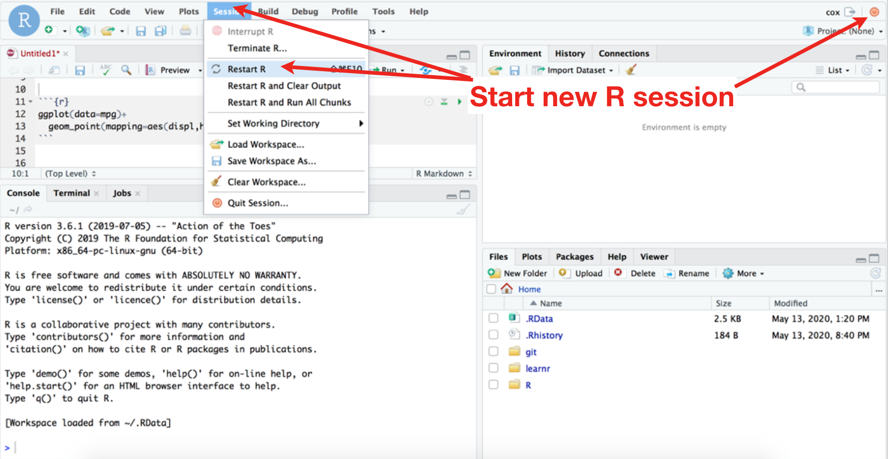
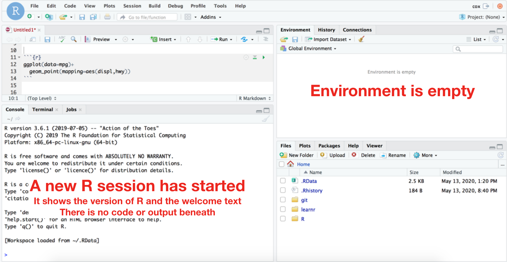
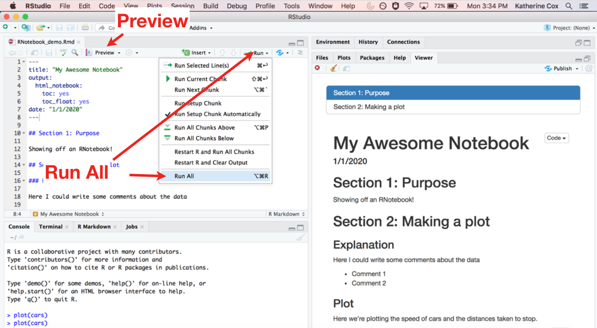
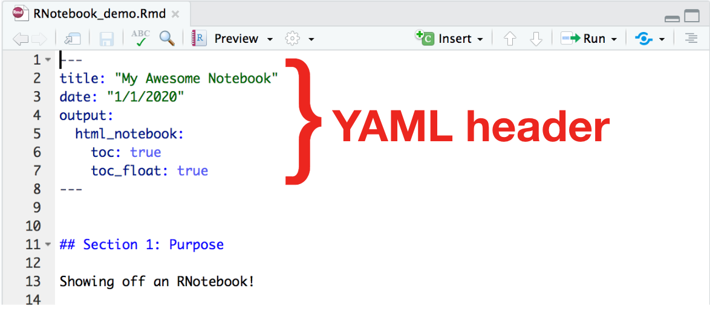

```{r setup, include=FALSE}
library(learnr)
library( "tidyverse" )

knitr::opts_chunk$set(echo = FALSE)
```


<!---
Don't edit the Welcome page, it will be filled in automatically using the information from the YAML header
Edit the rest of the document as you like
There are some suggested sections to provide a standard order across our tutorials, but they may not all be needed/appropriate for all tutorials.
Section 1. Content 1 has example quizes and exercises
-->

## Welcome {.splashpage}

### `r rmarkdown::metadata$title`

<div class="splashpage-container">
  <figure class="splashpage-image">
  `r rmarkdown::metadata$image`{width=100%}
  <figcaption class="caption">`r rmarkdown::metadata$image_caption`</figcaption>
  </figure>

  `r rmarkdown::metadata$summary`
  

</div>


#### Learning Goals

```{r}
# Extract learning goals from YAML and add HTML tags to make an ordered list
learningGoals <- rmarkdown::metadata$learning_goals
learningGoals <- paste("<li>", learningGoals, "</li>", sep="", collapse="")

```

<ol>
`r learningGoals`
</ol>

#### Authors:

```{r}
# Extract authors from YAML and add HTML tags to make a list
authorList <- rmarkdown::metadata$author
authorList <- paste("<li>", authorList, "</li>", sep="", collapse="")

```

<ul>
`r authorList`
</ul>


```{r}
# Extract the tutorial version from the YAML data and store it so we can print it using inline r code below.  This can't be done directly inline because the code for extracting the YAML data uses backticks
tv <- rmarkdown::metadata$output$`learnr::tutorial`$version
```

#### Version: `r tv`

## Managing R Sessions

### R Sessions (1/3): Why worry about R sessions?

It's a good idea to start a new R session every time you start or open an R Notebook.

R sessions store information, like datasets and packages you've loaded, and variables you've created.

If you want to be able to reproduce your work (share it with others, run it on a different computer, or even make sure it still runs correctly if you come back to it a few weeks later), it's important to "start clean".  Starting a new R session gives you a clean slate.

* If you're working on multiple projects, then you don't want them getting all cluttered together and confusing
* If you're trying to get help or advice from someone, it's much easier for them to be able to recreate the analysis on their own computer if you both can "start clean"
* If you come back to this notebook weeks later, you will be much less confused and your code is less likely to break because you forgot about something in your R environment

For example, if you start an R Notebook now, without starting a new R session, you will probably be able to use `ggplot2` commands without any errors, since you've previously run the `library(ggplot2)`.  But, if you send your .Rmd file
to another computer and try to run those same commands, you will get error messages saying "could not find function".  This will be frustrating for you and your collaborators.

**NOTE**: Starting and stopping an R session **is not the same thing as logging in and out of RStudio Server**  If you log out (or lose your connection), the R session can keep running - if you log back in you can get back to the same session you were working with before.

### R Sessions (2/3): How to start a clean R session

There are two categories that you need to pay attention to for a "clean" R session:

+ **Attached packages**: the packages you made available to R by running the `library()` command.
    + You can see your attached packages using the `sessionInfo()` command
+ **Environment**: dataframes, vectors, etc. that you have created and named (generally using the `<-` assignment operator).
    + You can see objects in your environment in the top right panel of R Studio.  You can also print a list of them using the `ls()` command.
    
{width=75%}

You can start a new R session by clicking **Session > New Session** or, if you're working on RStudio Server, by clicking the red power button on the top right.

**When it asks if you want to "save workspace" SAY NO!!**  This is exactly what we *don't* want.  If you say yes, it will put everything back in your environment when you restart R.

+ You should should think of your environment as "temporary".  If there's anything important that you want to keep, you should have the code to create it saved in your R Notebook.  Then when you "Run" your R Notebook those important dataframes, vectors, etc. will be recreated.  This helps ensure that you have a record of how they were generated, and that your work is reproducible - your code will run on anyone's computer.

#### What does a clean R session look like?

{width=75%}

If, after restarting, your environment it **not** empty, ask for help on Discourse or Slack.  You probably previously clicked "Save" when it asked you whether or not to save your workspace.

### R Sessions (3/3): When to start a new R session

Once you've finished a working on a section of your R Notebook (this can be more than one code chunk - when you come to a good stopping point), it's a good idea to make sure it's reproducible - you've cleaned up any intermediate steps, and are loading any necessary packages and data.  This will make future sharing, extension or reuse of your work much easier.

To make sure it's self-sufficient and reproducible:

1. Start a new R session
    + Take a look - is your environment empty?
2. Open the R Notebook
3. "Run all"
    + This runs each code chunk one after the other.  If you don't do this, the code won't run and the output (e.g. plots) won't show up in the final `.nb.html` document.
4. "Preview"

{width=75%}


Then check to see:

* No errors come up when you try to Run and Preview
* The output .nb.html document looks the way you expect

## Organizing your R Notebook

Now that you know a little more about R Notebooks, here are some guidelines for setting up a new R Notebook.  These aren't required for your R Notebook to work, but will make it easier to share and reuse your code.

### Setup

It's often a good idea to have a "setup" section at the beginning of the R Notebook that shows:

* The data you'll be working with
* The R packages you'll be using
* A short description of the goal of the notebook

That way anyone can clearly see what packages and data are needed to run the R Notebook, rather than trying to run the code and then have to hunt down missing packages and data every time an error comes up.

This section will probably be a combination of prose and code:

* The code will load the data (e.g. `read.csv(mydata.csv)`) and packages (e.g. `library(myfavoritepackage)`)
* The prose will provide some context (e.g. a brief description of the data)

You will probably expand and edit the setup section as you work on your R Notebook and realize you need other packages and data.  You don't have to have all this (or any of this) figured out up front!  But it's useful to set up a single location to collect all this information as you figure it out, and to at least start out with a brief explanation of what the R Notebook is for.  Your future self (and any collaborators) will thank you!

### sessionInfo()

Likewise, it is useful to add a codeblock at the very end of the R Notebook and run `sessionInfo()`.  This is an easy way to document the packages (and their versions!) that were used to run the Notebook.  It won't solve all problems, but it's a useful place to start troubleshooting if your code won't run on another computer.

```{r example-sessionInfo, exercise=TRUE, exercise.eval=FALSE}
sessionInfo()
```

### YAML Header

As a reminder, an R Notebook starts with a YAML header that specifies some details about the document, including the output format (`html_notebook`). The three dashes (\-\-\-) mark the beginning and end of the YAML header.

{width=50%}

By default, the YAML header in a new R Notebook only has the title and the output format.  The R Notebook will work just fine with the default header (although you should give it an informative title), but it can be useful to add a few features:

* `date` is useful, especially for "lab notebook" R Notebooks - this will be printed at the top of the output `.nb.html` file
* `toc: true` adds a clickable table of contents which automatically includes all of your `h2` and `h3` level headers
* `toc_float: true` means the table of contents will "float" and stay visible along the left side of the screen while you scroll through the document, rather than just printing at the top of the document

YAML is very picky about how things are spaced out and indented, so if you're having trouble getting something to work (e.g. adding a table of contents), make sure you're copying the code *exactly*, including spaces.

As you get more comfortable with R Markdown you may choose to learn more about how to use the YAML header to control the output of your document.  Here is a useful header that adds a date and a floating table of contents.

```{}
---
title: "My Awesome Notebook"
date: "1/1/2020"
output: 
  html_notebook:
    toc: true
    toc_float: true
---
```

## Reproducing an Analysis

You rerun an existing R Notebook to reproduce an analysis on RStudio Server.  This is a great way to re-use code that someone else shared!

Once you have an `.Rmd` file, you should be able to run the code (and edit it if you like), and use Preview to recreate the `.nb.html` output.  Remember that you will need to Run the code before any results will show up in the output `.nb.html`.  When opening an existing R Notebook, the easiest way to do this is to **Run All**:

{width=75%}

Note that, for the R Notebook to run properly...

+ Any packages that it uses must be installed
    + If not, contact the R Notebook author for help
+ Any data that it imports must be available
    + If the data is available online, this is easy!
    + If the data is on RStudio Server, this should also work fine.  You may need to double check the path to the data.
    + Otherwise, you may need to do some work to make the data available for the R Notebook - ask on Discourse or Slack if you need help!

## A Complete R Notebook Workflow

Pulling it all together, here is an updated R Notebook workflow, including starting new R sessions:

1. **Start a new R session**
2. Create a new R Notebook (or open an existing R Notebook)
3. **Set up your document** (title, table of contents, setup block, `sessionInfo()`, etc.)
4. Run and Preview your document
5. Insert code chunk(s), Run and Preview (edit code until you're happy, add some explanations)
6. **Restart your R session, Run and Preview your whole document**
7. Repeat steps 5-6 until you're done
8. Share your document

